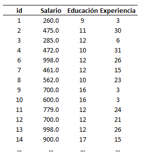
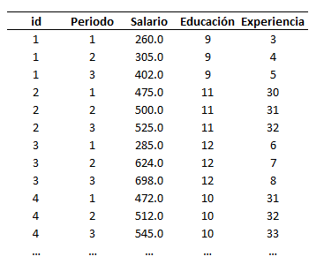
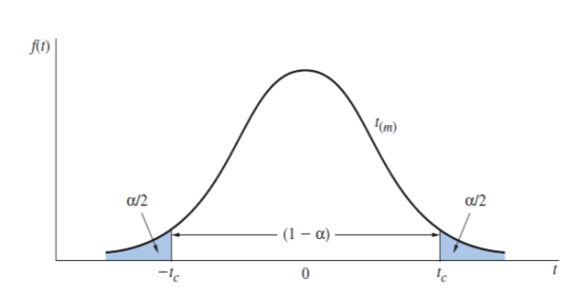
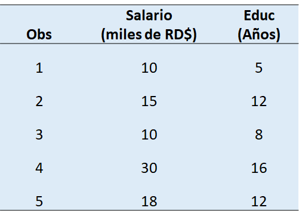
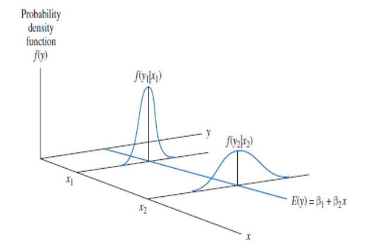

```{r setup, include=FALSE}
knitr::opts_chunk$set(echo = TRUE, fig.pos='h')
```

# Advertencias:

1.  Estas notas no sustituyen las lecturas asignadas en la clase de los libros de referencia.

2.  Estarán siendo continuamente revisadas y se agradece cualquier observación de errores y mejoras explicativas de las demostraciones.

3.  Cualquier error es de mi responsabilidad.

# I. Introducción:

## 1.1. ¿De qué trata la econometría?

La econometría comprende un conjunto de herramientas estadísticas y conceptuales utilizadas en la evaluación empírica de las hipótesis provenientes de la teoría económica o en la estimación del impacto de la implementación de una política pública o privada. La existencia de este instrumental se debe a la necesidad de dotar de validación empírica a las relaciones causales que se deducen de los modelos económicos formulados con la teoría o a constatar si determinada política tiene o no el efecto esperado. En ese sentido, la econometría forma parte de la "caja de herramientas" del economista.

En términos formales, la econometría suele presentarse como la combinación de las herramientas estadísticas y matemáticas, con las hipótesis provenientes de la teoría económica.

```{r echo=FALSE,fig.cap="Econometría: Una combinación de conocimientos",fig.align='default',out.width='100%'}

knitr::include_graphics('Fig_1.png')

```

El presente documento tiene como objetivo introducir a los estudiantes de economía al mundo de los métodos empíricos utilizados en el proceso de investigación en economía. La estrategia didáctica consiste en presentar ejemplos y cuestionar sobre los elementos a tomar en cuenta para agotar de manera exitosa la etapa empírica de un proyecto de investigación. Esto requiere: a) establecer la relación causal de interés b) seleccionar el modelo apropiado, c) identificar la estrategia de estimacion apropiada al modelo seleccionado y d) seleccionar la estrategia de contraste adecuada y e) conocer el alcance y las limitaciones de los resultados obtenidos.

Todo comienza con una teoría (ya sea contable, económica o sociológica, por ejemplo). En economía, las teorías suelen estar expresadas en términos de funciones matemáticas, y representan la relación causal de interés. Por ejemplo:

$$Q=f(p,I)$$

Donde $f$ es una función real, $Q$ es la cantidad demandada de un bien, $p$ el precio e $I$ el ingreso.

En un curso de microeconomía se analiza el tipo de relación (positiva, negativa o nula) existente entre estas variables desde una perspectiva cualitativa. En la práctica, estamos interesados en saber "cuánto" se relacionan estas variables. Por lo que una definición de econometría es:

*el uso de la teoría y datos de la economía, negocios, y de las ciencias sociales, junto con las herramientas de la estadística, para responder preguntas del tipo "cuánto"*

Otros ejemplos de preguntas que expresan relación causal entre variables:

-   ¿Cuánto incrementa el desempleo si el salario mínimo es incrementado en x%?

-   ¿Cuánto sería el incremento de la inflación si el Banco Central decidiera incrementar la cantidad de dinero en 10%?

-   ¿En cuánto se incrementarían las ventas de cemento si el precio fuese reducido en 3% y el gasto en publicidad aumentara en 2%?

-   ¿Cuánto se reduciría la tasa de inasistencia escolar a nivel de primaria si se implementaran cuatro campañas de desparasitación en las escuelas públicas de X región?

-   ¿Cuánto se reducirían los crímenes de calle (asaltos) si se duplicara el salario a los policías?

Entre otras preguntas muy interesantes.

## 1.2. Pasando del modelo económico al modelo econométrico:

En esta sección se sintetiza el proceso de especificación del modelo econométrico, con el propósito de mostrar las etapas involucradas en el mismo.

Son múltiples los factores que pueden incidir en una variable sobre la cuál se tenga interés. Como recuerdan, los modelos económicos son una simplificación de la realidad. La teoría económica describe el comportamiento 'promedio' o 'sistemático' del agente de interés.

Una forma de pensar el paso del modelos económico al modelo econométrico es proponiendo que el comportamiento observado en los datos es la suma de ese componente sistemático y un componente impredecible y aleatorio. Es decir,

$$C=f(p,I)+e$$

¿Qué representa $e$?

-   Todos los factores omitidos del modelo simple

-   Incertidumbre

Para terminar de obtener (*especificar*) el modelo econométrico, hay que proponer una forma funcional para $f$. La propuesta mas común es una función lineal:

$$f(p,I)=\beta_0+\beta_1p+\beta_2 I$$

Por lo que el modelo econométrico que vamos a estudiar es del tipo

$$C=\beta_0+\beta_1p+\beta_2I+e$$

Donde $\beta_0$, $\beta_1$ y $\beta_2$ son parámetros desconocidos que estimaremos usando datos económicos y una técnica econométrico.

La forma funcional representa una hipótesis acerca de la relación entre las variables y hay que determinar si es compatible con la teoría económica y los datos. Con el uso del modelo econométrico y los datos, se hace inferencias acerca del mundo real y se aprende acerca del mismo en este proceso.

A este proceso de aprendizaje usando los elementos mencionados se le denomina Inferencia Estadística e incluye:

-   Estimación de los parámetros económicos

-   Predicción de los resultados económicos

-   Contraste (testing) de hipótesis económicas.

## 1.3. Importancia:

Si la economía es considerada una ciencia (social) es debido a que los fenómenos que estudia son abordados desde la perspectiva del método científico, el cual considera como parte fundamental el contraste con la evidencia empírica de las hipótesis sobre las relaciones causales que caracterizan el fenómeno de interés, ya sea directamente a través de un experimento que reproduzca el fenómeno o indirectamente a través de su análisis a partir de información compilada relativa al fenómeno. La econometría es el conjunto de métodos y herramientras para realizar de manera sistemática dicho contraste y forma parte fundamental de la formación de un economista. Es la que en parte conecta lo que se aprende en los cursos de economía con lo que se aplica en la práctica.

## 1.4. Alcance:

No se limita a economía, sino a otras áreas: análisis de negocios, mercadeo, finanzas, así como al resto de las ciencias sociales.

# 2. Estructura de los datos económicos

## 2.1. Fuentes de los datos económicos:

Los datos provienen de dos fuentes:

**1. Datos experimentales**

Provienen de experimentos controlados. Escasos en economía. El valor de las variables independientes es fijo en muestras repetidas, permitiendo la repetición del fenómeno de interés bajo las mismas condiciones.

**2. Datos no experimentales u observacionales**

Provienen de encuestas. Datos de todas las variables son colectadas simultáneamente.

## 2.2. Características de los datos económicos:

Dependiendo del nivel de agregación:

-   Micro-datos: individuos, hogares y firmas.

-   Macro-datos: agregación de individuos, hogares y firmas a nivel local o nacional.

Pueden representar un acervo o un flujo:

-   Flujo: resultado medido en un periodo de tiempo.

-   Acervo: medido en un punto particular del tiempo.

Puede ser cuantitativa o cualitativa

-   Cuantitativa: en términos numéricos.

-   Cualitativos: en términos de clasificación o características.

\newpage

## 2.3. Tipos de datos en economía:

**Series de tiempo**: datos recolectados en un intervalo discreto de tiempo.

El intervalo de tiempo varía acorde con la recurrencia en que se registran los datos. A esta variación se le denomina frecuencia. Existen los datos de "alta frecuencia o frecuencia alta" como datos semanales, diarios, por hora, y así sucesivamente. Asimismo, los datos de "baja frecuencia o frecuencia baja", tales como trimestrales, semestrales, anuales, bianuales y así sucesivamente.

La figura 2.2 muestra ejempl(os para series económicas de distinta frecuencia para el caso de la República Dominicana.

Como veremos en la sección de modelos para datos de series de tiempo, el comportamiento de este tipo de variables varía acorde con sus características: tendencia, estacionalidad, entre otras.

```{r echo=FALSE,fig.cap="Ejemplo de datos de series de tiempo para distintas frecuencias",fig.align='center',out.width='80%', fig.pos='h', warning=FALSE, message=FALSE}
library(tseries)
library(forecast)
library(ggplot2)
library(tstools)
library(tidyverse)
library(gridExtra)
library(readxl)
series_tiempo <- read_xlsx("series_tiempo.xlsx")
inflacion <- ts(series_tiempo$Inflacion, freq=12, start=1985, end = c(2019,1) )
pib <- ts(series_tiempo$PIB, freq=4, start=1991, end= 2018 )
desempleo <- ts(series_tiempo$desempleo, freq=2, start=2000, end= 2016 )
petrol <-ts(series_tiempo$DCOILWTICO, freq=365, start=2015 )
regular <- ts(series_tiempo$regular, freq=52, start=c(2002,13), end=c(2019,8)) 

a<- autoplot(petrol)+
  ggtitle("Precio Petróleo")+
  xlab("Freq. Diaria")+
  ylab("US$/Barril")+
  theme_light()

b<- autoplot(regular)+
  ggtitle("Gasolina Regular")+
  xlab("Freq. Semanal")+
  ylab("RD$/Galón")+
  theme_light()

c<- autoplot(inflacion)+
  ggtitle("Inflación")+
  xlab("Freq. Mensual")+
  ylab("Porcentaje")+
  theme_light()

d<- autoplot(pib)+
  ggtitle("PIB Real")+
  xlab("Freq. Trimestral")+
  ylab("Indice")+
  theme_light()

grid.arrange(a,b,c,d, ncol=2, nrow=2)

```

\newpage

**Corte transversal**: datos recolectados a partir de un número determinado de unidades en un periodo de tiempo.

```{r echo=FALSE,fig.cap="Ejemplo de corte transversal",fig.align='center',out.width='45%',fig.pos='h'}



```

**Panel o longitudinales**: datos recolectados a partir de un número de unidades en intervalos discretos de tiempo.

```{r echo=FALSE,fig.cap="Ejemplo de datos de panel",fig.align='center',out.width='45%',fig.pos='h'}



```

# El Modelo de Regresión Lineal.

El análisis empírico de la relación causal propuesta por la teoría es realizado a partir de la especificación del modelo de regresión lineal (MRL). Los supuestos en los que se basa el MRL permiten la obtención de la denominada función de esperanza condicional, que especifica el comportamiento del valor promedio o esperado de nuestra variable de interés en función de nuestra variable causal y nuestros controles. Los supuestos son los siguientes:

**Supuesto 1:** Cada observación $y_i$ es explicada por el componente sistemático $E(y_i|x_{i1},...,x_{ik},\beta)$ y el componente sistemático $\varepsilon_i$:

$$
y_i=E(y_i|x_{i1},...,x_{ik},\beta)+\varepsilon_i
$$

donde $E(y_i|x_{i1},...,x_{ik},\beta)$ se conoce como la *función de regresión* o *esperanza condicional* , la cual se asume que es lineal:

$E(y_i|x_{i1},...,x_{ik},\beta)=\beta_0+\beta_1x_{i1}+\beta_2x_{i2}+...+\beta_k x_{ik}$

Por esta razón, este supuesto suele estar presentado como: *la forma funcional es lineal en los parámetros y el término error entra de manera aditiva, por lo que cada observación viene descrita por:*

$$
y_i = \beta_0+\beta_1x_{i1}+...+\beta_k x_{ik}+\varepsilon_i
$$

+------------------------------------------------------------------------------------------------------------------------------------------------------------------------------------------------------------------------------------------------------------------------------------------------------+
| **Ejemplo** ¿Existe relación entre acceso a un seguro de salud y las condiciones de salud?\                                                                                                                                                                                                          |
+------------------------------------------------------------------------------------------------------------------------------------------------------------------------------------------------------------------------------------------------------------------------------------------------------+
| En este caso, la pregunta de investigación establece una relación causal del tipo $seguro \rightarrow salud$, donde $seguro$ es una variable explicativa relativa a la información de tenencia de algun tipo de afiliación de seguro de salud y $salud$ algún indicador de bienestar del individuo.\ |
+------------------------------------------------------------------------------------------------------------------------------------------------------------------------------------------------------------------------------------------------------------------------------------------------------+
| De acuerdo al supuesto 1, la relación causal puede ser especificada como:\                                                                                                                                                                                                                           |
+------------------------------------------------------------------------------------------------------------------------------------------------------------------------------------------------------------------------------------------------------------------------------------------------------+
| $$salud_i=\beta_0+\beta_1 seguro_i+\varepsilon_i$$                                                                                                                                                                                                                                                   |
+------------------------------------------------------------------------------------------------------------------------------------------------------------------------------------------------------------------------------------------------------------------------------------------------------+

**Supuesto 2: Supuesto de Identificación.**

Para cada observación $i$,

$$
E[\varepsilon_i|x_{i1},...,x_{ik}]=0
$$

Este supuesto permite la identificación del efecto causal, es decir, garantiza la exogeneidad de las variables explicativas respecto al error del modelo. Es decir, tomando derivada parcial respecto a la variable $x_{ij}$

$$
\frac{\partial E[y_i|x_{i1}],...,x_{ik}}{\partial x_{ij}}=\beta_j+\frac{\partial E[\varepsilon _i|x_{ij},...,x_{ik}]}{\partial x_{ij}}=\beta_j+0=\beta_j
$$
Es decir, la información contenida en el error del modelo no esta correlacionada con $x_{ij}$. En ese sentido es que se dice que esta es exógena (respecto al $\varepsilon_i$). Sin este supuesto note que no es posible identificar el efecto causal, puesto que el segundo término no sería igual a cero. Un caso se muestra en el siguiente ejemplo.


------------------------------------------------------------------
\textcolor{blue}{**Ejemplo**} \textcolor{blue}{¿Existe relación entre acceso a un seguro de salud y las condiciones de salud?}\    

\textcolor{blue}{En nuestro ejemplo de la relación entre seguro y condiciones de salud, suponga que un tercer factor no observable tiene un efecto causal sobre la salud:}\

\textcolor{blue}{$$factor X \rightarrow salud$$ y que a la vez tiene se correlaciona con la demanda de seguros $$factor X \rightarrow seguro$$} \

\textcolor{blue}{Como esta variable ($factor X$) no es observable, está implícitamente considerada en $\varepsilon$, por lo tanto, se deduce que en este caso}\

\textcolor{blue}{$$E[\varepsilon_i|x_{i1},...,x_{ik}]\neq0 $$}

\textcolor{blue}{Es decir},\

\textcolor{blue}{$$\frac{\partial E[salud_i|seguro_i}{\partial seguro_{i}}=\beta_1+\frac{\partial E[\varepsilon _i|seguro_i]}{\partial seguro_{i}}\neq\beta_1$$}


\textcolor{blue}{No se cumple el supuesto 2.} \


------------------------------------------------------------------


**Supuesto 3 Homocedasticidad**

Para cada observación $i$,

$$var(\varepsilon_i|x_{i1},...,x_{ik})=\sigma^2$$

Este supuesto establece que la varianza del error es constante para todas las combinaciones de los valores de las variables explicativas. Es decir, que la varianza de la distribución condicional de $\varepsilon_i$ no depende de las $x_i$. Imponer este supuesto permite: 1) simplificar las fórmulas de varianza del modelo y 2) otorga al método de estimación de mínimos cuadrados ordinarios la propiedad de eficiencia. 

```{r}
sigma <- 1
eps <- rnorm(1000,mean=0,sd=sigma)
x1 <- rnorm(100,mean=2,sigma=)
x2 <- 4

```


Usualmente, los economistas quieren más que solo encontrar la mejor aproximación lineal de una variable, dado el conjunto de regresores. Ellos quieren relacionaes económicas que son generalmente más válidas que la muestra de donde provengan. Ellos quieren extraer conclusiones acerca de qué pasaría si una de las variables cambia. Esto es, ellos quieren decir algo acerca de los valores que no están incluidos en la muestra. Por ejemplo, se quisiera predecir el salario de un individuo sobre la base de sus antecedendes y características y determinar cómo sería diferente si esta persona tiene más años de educación. En este caso, se quiere que la relación encontrada sea más que una concidencia histórica: es decir, refleje una relación fundamental. Para hacer esto se asume que hay una relación general que es válida para todas las posibles observaciones de una población bien definida (ejemplo, todos los individuos con un trabajo pagado en una fecha determinada, o todas las empresas de una industria.). Restringiendo la atención en relacionaes lineales, se especifica un **modelo estadístico** como:

$$\tag{3.34}
y_i=\beta_1+\beta_2x_2+...+\beta_Kx_{iK}+\epsilon_i$$

o

$$\tag{3.35} y_i=x_i'\beta+\epsilon_i$$

donde $y_i$ y $x_i$ son variables observables y $\epsilon_i$ es no observable y se refiere al **término error** o término de perturbación. En este contexto, $y_i$ se refiere a la variable dependiente y las variables en $x_i$ son llamadas variables independientes, variables explicativas, regresores u, ocasionalmente, covariantes. Los elementos en $\beta$ son los parámetros poblacionales desconocidos. La igualdad en (3.35) se supone que se cumple para cada una de las posibles observaciones, mientres nosotros solo observamos una **muestra** de $N$ observaciones. Se considera esta muestra como una realización de todas las muestras potenciales de tamaño $N$ que pueden ser extraídas de la misma población. En este sentido, $y_i$ y $\epsilon_i$ (y con frecuencia $x_i$) se consideran como **variables aleatorias**. Cada observación corresponde a una realización de estas variables aleatorias. De nuevo, se puede usar notación matricial y crear un vector con todas las observaciones para escribir:

$$\tag{3.36} y=X\beta+\epsilon$$

donde $y$ y $\epsilon$ son vectores N-dimensionales, y $X$, como antes es de dimensióm $N\times K$. Note la diferencia entre esta ecuación y la (3.29).

En contraste con (3.15) y (3.29), (3.35) y (3.36) son relaciones poblacionales, donde $\beta$ es un vector de parámetros desconocidos que caracterizan la población. El **proceso de muestreo** describe como la muestra fue tomada. En una primera aproximación, las $x_i$ son consideradas como fijas y no estocásticas, que significa que cada nueva muestra tiene la misma matriz $X$. En este caso se dice que las $x_i$ son **determinísticas**. Una nueva muestra solo implica nuevos valores para $\epsilon_i$, o de manera equivalente para $y_i$. El caso donde esta condición es interesante es en un laboratorio, donde un investigador puede fijar las condiciones de un experimento específico (por ejemplo, temperatura, presión del aire). En economía se trabaja típicamente con datos no experimentales. A pesar de esto, es conveniente y en casos particulares apropiada en un contexto económico actual como si las $x_i$ son determinísticas. En este caso, se tienen que hacer supuestos sobre la distribución muestral de $\epsilon_i$ . Uno conveniente corresponde a **muestreo aleatorio**, donde cada error $\epsilon_i$ es una extracción aleatoria de una distribución de la población, independiente de los otros términos de error.

En una segunda mirada, una nueva muestra implica nuevos valores para ambos $x_i$ y $\epsilon_i$, de tal manera que en cada momento un nuevo conjunto de $N$ para $(y_i,x_i)$ es extraído. En este caso muestreo aleatorio significa que cada conjunto ($y_i$,$x_i$) es una extracción aleatoria de la distribución de la población. En este contexto, resulta importante hacer supuestos acerca de la distribución conjunta de $x_i$ y $\epsilon_i$, en particular relativo al grado en que la distribución de $\epsilon_i$ depende de $X$. La idea de muestra aleatoria es más entendible en el contexto de corte transversal, donde el interés recae en una población grande y fija. Por ejemplo, todos los hogares dominicanos en Enero de 2015. En el contexto de series de tiempo, diferentes observaciones se refieren a diferentes periodos, y no hace sentido tener una muestra aleatoria de periodos. En su lugar, se puede tomar una visión que la muestra que se tiene es una realización de lo que hubiese pasado en un momento dado y la aleatoriedad se refiere a estados alternativos del mundo. En ese caso se puede hacer supuestos acerca de la forma en que los datos han sido generados (en lugar de la forma en que los datos han sido muestreados).

Es importante darse cuenta que sin supuestos adicionales el modelo estadístico (3.35) es una tautología: para cualquier valor de $\beta$ se puede definir un conjunto de $\epsilon_i$ tal que (3.35) se cumpla para cada observación. Se necesita imponer algunos supuestos para darle al modelo un significado. Un supuesto común es que el valor esperado de $\epsilon_i$ dadas todas las variables explicativas en $x_i$ es cero, esto es:

$$ \tag{3.37} E\{\epsilon_i|x_i\}=0$$

Usualmente, las personas se refieren a este supuesto diciendo que las variables son **exógenas**. Bajo este supuesto:

$$ \tag{3.38} E\{y_i|x_i\}=x_i\beta$$

de tal manera que la línea de regresión (poblacional) $x_i\beta$ descibe la expectativa condicional de $y_i$ dado los valores para $x_i$. Los coeficientes $\beta_k$ mide como el valor esperado de $y_i$ es afectado si el valor de $x_{ik}$ cambia, manteniendo los demas elementos en $x_i$ constantes (la condición de **ceteris paribus**). La teoría económica, sin embargo, con frecuencia sugiere que el modelo (3.35) describe una relación causal, en la cual los coeficientes $\beta$ miden los cambios en $y_i$ causados por un cambio ceteris paribus en $x_{ik}$. En esos casos, $\epsilon_i$ tiene una interpretación económica (no solamente estadística) e imponer que esta no está correlacionada con $x_i$, como se impone $E\{\epsilon_i|x_i\}=0$, puede no estar justificado. Debido que en muchas aplicaciones se puede argumentar que las variables no observables en el término error están relacionadas con las observables en $x_i$, se debe ser cauteloso interpretando los coeficientes de regresión como midiendo efectos causales.

Ahora que los coeficientes $\beta$ tienen significado, se puede tratar de usar la muestra $(y_i,x_i),~i=1,...,N$, para decir algo acerca de ellos. La regla que dice como una muestra dada es traducida en un valor apropiado para $\beta$ es lo que se llama un **estimador**. El resultado para un muestra es llamado un **estimado**. El estimador es un vector de variables aleatorias, debido a que la muestra puede cambiar. El estimado es un vector de números. El estimador más utilizado en econometría es el estimador de **mínimos cuadrados ordinarios**. Este es la regla de mínimos cuadrados descrito en la sección anterior aplicado a una muestra disponible. El estimador de MCO para $\beta$ esta dado por:

$$\tag{3.39} b=\Big(\sum_{i=1}^N x_ix_i'\Big)^{-1}\sum_{i=1}^Nx_iy_i$$

Dado que hemos asumido un modelo subyacente "verdadero" (3.35), combinado con una muestra, $b$ es ahora un vector de variables aleatorias. Nuestro interés recae en el vector $\beta$ de parámetros verdaderos pero desconocidos, y $b$ es considerado una aproximación a este. Mientras una muestra dada solo produce un estimador puntual, se evalua la calidad de este a través de las propiedades subyacentes del estimador. El estimador $b$ tiene una distribución muestral debido a que su valor depende de la muestra que ha sido extraída aleatoriamente de la población.

Es extremadamente importante entender la diferencia entre el estimador $b$ y los valores poblacionales $\beta$. El primero es un vector de variables aleatorias, el resultado depende de la muestra que se empleó. El segundo es un conjunto de números fijos desconocidos, que caracteriza el modelo poblacional. Asimismo, la distinción entre el término error $\epsilon_i$ y los residuales $e_i$ es importante. Los términos de error son no observables, y supuestos sobre su distribución acerca de estos son necesarios para derivar las propiedades muestrales de los estimados de $\beta$. Los residuales se obtienen despues de la estimación, y los valores dependen del estimado de $\beta$ y en consecuencia depende de la muestra y el método de estimación. Las propiedades del término error $\epsilon_i$ y los residuos $e_i$ no son las mismas y ocasionalmente son muy distintas.

El modelo de regresión lineal en combinación con el método de mínimos cuadrados ordinarios(MCO) es uno de los pilares de la econometría. En la primera parte de estos apuntes se revisa el modelo de regresión lineal y sus supuestos, cómo este puede ser estimado, evaluado e interpretado y cómo puede ser utilizado para generar predicciones para contrastar hipótesis económicas.

El capítulo empieza introduciendo el método de mínimos cuadrados ordinarios como herramienta algebraica, en lugar de estadística. Esto es debido a que MCO tiene la propiedad atractiva de proveer la mejor aproximación lineal, independientemente de como los datos han sido generados, o los supuestos considerados. El Modelo de Regresión Lineal (MRL) es introducido en la sección XX mientras la sección XX discute las propiedades del estimador de MCO en este modelo bajo los supuestos de Gauss-Markov (GM). La sección XX discute medidas de bondad de ajuste para el modelo lineal, y el contraste de hipótesis es tratado en la sección XX. En la sección XX nos movemos a los casos donde los supuestos de GM no necesariamente se satisfacen y las propiedades de muestra pequeña del estimador de MCO son desconocidas. En dichos casos, el comportamiento limitado del estimador de MCO cuando - hipotéticamente- el tamaño de muestra se vuelve infinitamente grande comúnmente utilizadas para aproximar las propiedades de muestra pequeña. La sección XX provee un ejemplo. En las secciones XX y XX se discuten los problemas de datos relativos a la multicolinealidad, valores atípicos y valores no observados, mientras que en la sección XX se da atención a la predicción usando el modelo de regresión lineal. Se proveen ejemplos para interpretar los coeficientes del MRL, como contrastar los supuestos del modelo etc.

## Algebra de Mínimos Cuadrados

### Mínimos cuadrados ordinarios

Suponga que tiene una muestra con $N$ observaciones de salarios de individuos y un número de características de estos individuos, tales como género, años de educación y experiencia. El interés principal recae en la pregunta de cómo en esta muestra los salarios están relacionados a las otras variables observables. Denote los salarios por $y$ ( el regresando) y las demás K-1 características por $x_2,...,x_K$ (los regresores). Más abajo se aclara por qué esta numeración de las variables es conveniente. Ahora se hace la pregunta: ¿cuál es la combinación lineal de $x_2,...x_N$ y una constante que da una buena aproximación de $y$? Para responder esta pregunta, primero considere una combinación lineal arbitraria, incluyendo una constante, que puede ser escrita como:

$$\tag{3.1}
\hat{\beta}_1+\hat{\beta}_2x_2+...+\hat{\beta}_Kx_K
$$

donde $\hat{\beta}_1,...,\hat{\beta}_K$ son constante por ser seleccionadas. Ahora indexe las observaciones por $i$, tal que $i=1,\cdots,N$. Ahora la diferencia entre los valores observado de $y_i$ y su aproximación lineal es

$$\tag{3.2} 
y_i-[\hat{\beta}_1+\hat{\beta}_2x_{i2}+...+\hat{\beta}_Kx_{iK}]
$$

Para simplificar las derivaciones se introduce una notación mas resumida. En el Capítulo 1 se proveen detalles para los lectores no familiarizados con notación de vector. El caso especial es cuando $K=2$ que discutiremos en la siguiente sección. Para un K general se coleccionan los valores $x$ para los individuos $i$ en un vector $x_i$, que incluye una constante. Esto es,

$$\tag{3.3}
x_i=\left(\begin{array}{ccccc} 1 & x_{i2} &x_{i3} & \cdots &x_{iK} \end{array}\right)'
$$

donde ' es usado para denotar la transpuesta. Coleccionado los coeficientes $\hat{\beta}$ en un vector K dimensional $\hat{\beta}=\left(\begin{array}{cccc} \hat{\beta}_1 & \hat{\beta}_2 & \cdots &\hat{\beta}_K \end{array}\right)'$ se puede brevemente reescribir como:

$$\tag{3.4}
y_i-x_i'\hat{\beta}
$$

Se desea elegir los valores para $\hat{\beta}_1,\cdots,\hat{\beta}_K$ tal que las diferencias son pequeñas. A pesar de que distintas medidas se pueden usar para definir por lo que significa "pequeñas", la más común es elegir los $\hat{\beta}$ tal que la suma de las diferencias al cuadrado es lo mas pequeña posible. En este caso, se determina $\hat{\beta}$ tal que minimice la siguiente función objetivo:

$$\tag{3.5}
S(\hat{\beta})\equiv \sum_{i=1}^N (y_i-x_i'\hat{\beta})^2
$$

Esto es, se minimiza la suma de los errores al cuadrado aproximados. Este enfoque es definido como mínimos cuadrados ordinarios. Tomando cuadrados se asegura de que desviaciones positivas y negativas no se cancelen entre sí cuando se tome la sumatoria.

Para resolver el problema de minimización, considere las condiciones de primer orden, obtenidas diferenciando $S(\hat{\beta})$ respecto al vector $\hat{\beta}$.

$$\tag{3.6} 
\min{S(\hat{\beta})\equiv \sum_{i=1}^N (y_i-x_i'\hat{\beta})^2}
$$

Esto da las siguientes K condiciones

$$\tag{3.7}
-2\sum_{i=1}^Nx_i(y_i-x_i'\hat{\beta})=0
$$

Dividiendo de ambos lados por $-2$:

$$
\tag{3.8}
\sum_{i=1}^Nx_i(y_i-x_i'\hat{\beta})=0
$$

Resolviendo la sumatoria:

$$\tag{3.9}
\sum_{i=1}^Nx_iy_i-\Big(\sum_{i=1}^Nx_ix_i'\Big)\hat{\beta}=0
$$

Despejando:

$$\tag{3.10}
\left(\sum_{i=1}^Nx_ix_i'\right)\hat{\beta}=\sum_{i=1}^Nx_iy_i
$$

donde:

$$\tag{3.11}
\left(\sum_{i=1}^Nx_ix_i'\right) =\sum_{i=1}^N \Big\{\left(\begin{array}{c} 1 \\ x_{i2} \\ x_{i3} \\ \cdots \\x_{iK} \end{array}\right) \left(\begin{array}{ccccc} 1 & x_{i2} &x_{i3} & \cdots &x_{iK} \end{array}\right)\Big\}
$$

$$= \sum_{i=1}^N \Big\{\left(\begin{array}{cccccc} 1 & x_{i2} & x_{i3} & \cdots & x_{iK} \\
x_{i2} & x_{i2}^2 & x_{i2}x_{i3} & \cdots & x_{i2}x_{iK} \\
x_{i3} & x_{i3}x_{i2} & x_{i3}^2 & \cdots & x_{i3}x_{iK} \\
\vdots & \vdots &  \vdots & \ddots & \vdots & \\
x_{iK} & x_{iK}x_{i2} & x_{iK}x_{i3} & \cdots & x_{iK}^2 
\end{array}\right)\Big\} $$

$$= \left(\begin{array}{cccccc} N & \sum_{i=1}^Nx_{i2} & \sum_{i=1}^Nx_{i3} & \cdots & \sum_{i=1}^Nx_{iK} \\
\sum_{i=1}^Nx_{i2} & \sum_{i=1}^Nx_{i2}^2 & \sum_{i=1}^Nx_{i2}x_{i3} & \cdots & \sum_{i=1}^Nx_{i2}x_{iK} \\
\sum_{i=1}^Nx_{i3} & \sum_{i=1}^Nx_{i3}x_{i2} & \sum_{i=1}^Nx_{i3}^2 & \cdots & \sum_{i=1}^Nx_{i3}x_{iK} \\
\vdots & \vdots &  \vdots & \ddots & \vdots & \\
\sum_{i=1}^Nx_{iK} & \sum_{i=1}^Nx_{iK}x_{i2} & \sum_{i=1}^Nx_{iK}x_{i3} & \cdots &\sum_{i=1}^Nx_{iK}^2 
\end{array}\right) $$

Asimismo,

$$\sum_{i=1}^Nx_iy_i = \sum_{i=1}^N \Big\{\left(\begin{array}{c}1 \\ x_{i2} \\ x_{i3} \\ \cdots \\x_{iK} \end{array}\right)y_i\Big\}=
\sum_{i=1}^N \left(\begin{array}{c} y_i \\ y_ix_{i2} \\ y_ix_{i3} \\ \cdots \\ y_ix_{iK} \end{array}\right)
=\left(\begin{array}{c} \sum_{i=1}^Ny_i \\ \sum_{i=1}^Ny_ix_{i2} \\ \sum_{i=1}^Ny_ix_{i3} \\ \cdots \\\sum_{i=1}^N y_ix_{iK} \end{array}\right)$$

Estas ecuaciones son a veces llamadas **ecuaciones normales**. Como este sistema tienen $K$ incógnitas (el número de parámetros desconocidos), se puede obtener una solución única para $\hat{\beta}$ provisto que la matriz simétrica $\sum_{i=1}^Nx_ix_i'$, que contiene la suma de las sumas de cuadrados y productos cruzados de los regresores $x_i$ pueda ser invertible. Por el momento, se asume que es el caso. La solución del problema de minimización, que puede ser denotada por $b$, esta dada por:

$$\tag{3.12}
b=\left(\sum_{i=1}^Nx_ix_i'\right)^{-1}\sum_{i=1}^Nx_iy_i
$$

Revisando las condiciones de segundo orden, se verifica que $b$ corresponde a un mínimo. Derivando las condiciones de primero orden respecto a $\hat{\beta}$:

$$\tag{3.13} 
\frac{{\partial}^{2} S}{\partial \hat{\beta}^{2}}=\Big(\sum_{i=1}^Nx_ix_i'\Big)
$$

que es una matriz positiva-definida.

La combinación lineal resultante de $x_i$ esta dada por:

$$\tag{3.14}
\hat{y}_i=x_i'b
$$

que es la **mejor aproximación lineal** de $y$ con $x_2,\cdots,x_K$ y una constante. La frase "mejor" refiere al hecho de que la suma de diferencias al cuadrado entre los valores observados $y_i$ y valores ajustados $\hat{y}_i$ es mínima para solución de mínimos cuadrados $b$.

Derivando la aproximación lineal, no se ha usado ninguna teoría económica o estadística. Es simplemente una herramienta algebraica, y se cumple irrespectivamente la forma en que los datos fueron generados. Esto es, dado un conjunto de variables se puede determinar la mejor aproximación lineal de una variable usando las otras variables. El único supuesto que se hizo (que es directamente verificable en los datos) es que la matriz $KxK$ $\sum_{i=1}^Nx_ix_i'$ es invertible.

Esto significa que ninguna de las $x_{ik}$ es una combinación lineal exacta de las otras y por tanto redundante. Esto es usualmente como el supuesto de **no-multicolinealidad**. Puede estresarse que la aproximación lineal es un resultado dentro de muestra (esto es, en principio no da información acerca de las observaciones (individuos) que no están incluidos en la muestra), y en general, no hay una interpretación directa de los coeficientes.

A pesar de estas limitaciones, los resultados algebraicos sobre e método de mínimos cuadrados son muy útiles. Definiendo un **residuo** $e_i$ como la diferencia entre el valor observado y el aproximado, $e_i=y_i-\hat{y}_i=y_i-x_i'b$ se puede descomponer la observable $y_i$ como:

$$\tag{3.15}
y_i=\hat{y}_i+e_i=x_i'b+e_i
$$

Esto permite escribir el valor mínimo para la función objetivo como:

$$\tag{3.16}
S(b)=\sum_{i=1}^Ne_i^2
$$

la cual es conocida como la **suma de residuos al cuadrado**. Se puede mostrar que el valor aproximado $x_i'b$ y el residuo $e_i$ satisfacen ciertas propiedades por construcción. Por ejemplo, si se reescribe (3.8), sustituyendo la solución de MCO para b, se obtiene

$$\tag{3.17}
\sum_{i=1}^N x_i(y_i-x_ib)=\sum_{i=1}^Nx_ie_i=0
$$

Esto significa que el vector $e=(e_1,...,e_N)$ es ortogonal a cada vector de observaciones de la variable $x$. Por ejemplo, si $x_i$ contiene una constante, implica que $\sum_{i=1}^Ne_i=0$. Esto es, el promedio del residuo es cero. Este es un resultado atractivo. Si el promedio de los residuos no fuera cero, esto significa que se puede mejorar la aproximación añadiendo o substrayendo la misma constante para cada observación, esto es, cambiando $b_1$. En consecuencia, para la observación promedio se tiene

$$\tag{3.18}
\bar{y}=\bar{x}'b
$$

donde $\bar{y}=(1/N)\sum_{i=1}^Ny_i$ y $\bar{x}=(1/N)\sum_{i=1}^Nx_i$ un vector K dimensional de medidas muestrales. Esto muestra que para la observación promedio hay un error de aproximación. Interpretación similar existe para otros regresores: si la derivada de la suma al cuadrado de los errores aproximados respecto a $\hat{\beta}$ es positivo, esto es si $\sum_{i=1}^Nx_{ik}e_i>0$, significa que se puede mejorar la función objetivo bajando a $\hat{\beta}$. La ecuación (3.15) descompone los valores observados de $y_i$ entre dos componentes ortogonales: el valor ajustado (relacionado a $x_i$) y el residuo.

### Regresión Lineal Simple

En el caso de $K=2$ solo tenemos un regresor y una constante. En este caso las observaciones $(y_i,x_i)$ se pueden mostrar en un gráfico bidimensional con los valores de $x$ en el eje horizontal y los valores de $y$ en el eje vertical. Esto es presentado en la Figura 1 para una base de datos hipotética

```{r}
x <- rnorm(100)
e <- rnorm(100)
y <- 0.1 + 0.5*x+e
plot(x,y,main="Figura 1: Regresión Lineal Simple")
abline(lm(y~x),col="red")
```

La mejor aproximacion lineal de $y$ con $x$ y una constante es obtenida minimizando la suma de residuos al cuadrado, la cual - en este caso bidimensional - es igual a la distancia vertical entre una observacion y el valor ajustado. Todos los valores ajustradao estan sobre la linea recta, la **linea de regresión**.

Debido a que una matriz 2x2 puede ser invertida analíticamente, se puede derivar soluciones para $b_1$ y $b_2$ en este caso especial de la expresión general ya vista. Equivalentemente, podemos minizar la suma de residuos al cuadrado respecto a las incógnitas directamente. Entonces, se tiene:

$$\tag{3.19}
S(\hat{\beta}_1,\hat{\beta}_2)=\sum_{i=1}^N(y_i-\hat{\beta}_1-\hat{\beta}_2x_i)^2
$$

Las condiciones de primer orden son:

$$\tag{3.20}
\frac{\partial S(\hat{\beta}_1,\hat{\beta_2})}{\partial \hat{\beta}_1}=-2\sum_{i=1}^N(y_i-\hat{\beta}_1-\hat{\beta}_2x_i)=0
$$

$$\tag{3.21}
\frac{\partial S(\hat{\beta}_1,\hat{\beta_2})}{\partial \hat{\beta}_2}=-2\sum_{i=1}^Nx_i(y_i-\hat{\beta}_1-\hat{\beta}_2x_i)=0
$$

De las expresiones anteriores se obtiene

$$\tag{3.22}
b_1=\frac{1}{N}\sum_{i=1}^Ny_i-b_2\frac{1}{N}\sum_{i=1}^Nx_i=\bar{y}-b_2\bar{x}
$$

Resolviendo para $b_2$

$$\tag{3.23}
\sum_{i=1}^Nx_iy_i-b_1\sum_{i=1}^Nx_i-\left(\sum_{i=1}^Nx_i^2\right)b_2=0
$$

Sustituyendo:

$$\tag{3.24} 
\sum_{i=1}^Nx_iy_i-N\bar{x}{y}-\left(\sum_{i=1}^Nx_i^2-N\bar{x}^2\right)b_2=0
$$

Despejando:

$$\tag{3.25}
b_2=\frac{\sum_{i=1}^N(x_i-\bar{x})(y_i-\bar{y})}{\sum_{i=1}^N(x_i-\bar{x})^2}
$$

Dividiendo el numerador y el denominado por $N-1$ se tiene que la solucion de MCO $b_2$ es la razón de la covarianza muestral entre $y$ y $x$ y la varianza muestral de $x$. De (3.22), el intercepto es determinado tal que el promedio de errores de proximacion es igual a cero.

### Notación Matricial

Debido a que los econometristas hacen uso frecuente de expresiones con matrices para notación resumida, alguna familiaridad con el lenguaje de matrices es un prerequisito para leer literatura econométrica. En estos apuntes, se rehacen los resultados usando notación matricial y ocasionalmente, cuando la alternativa es complicada, se restringe la atención a expresiones con matrices solamente. Usando matrices, derivando la solucion de mínimos cuadrados es mas rápida, pero requiere algún conocimiento de cálculo diferencial matricial. Se introduce la siguiente notación:

$$X=\left(\begin{array}{cccc} 1 & x_{12} & \cdots & x_{1K} \\
                              \vdots & \vdots & & \vdots   \\
                              1 & x_{N2} & \cdots & x_{NK}
\end{array}\right)
=\left(\begin{array}{c} x_1' \\ \vdots \\ x_N'
\end{array}\right),~~~ y= \left(\begin{array}{c} y_1 \\ \vdots \\ y_N
\end{array}\right)$$

En la matriz $X$, una matriz $N \times K$ la fila $i$ se refiere a la observación $i$, y la columna $k$ se refiere al regresor o variable explicativa $k$. El criterio a minimizar puede ser reescrito en notación matricial usando el hecho que el producto interno de un vector $a$ con el mismo $(a'a)$ es la suma de sus elementos al cuadrado. Esto es:

$$ \tag{3.26} 
S(\widetilde{\beta})=(y-X\widetilde{\beta})'(y-X\widetilde{\beta})=y'y-2y'X\widetilde{\beta}+\widetilde{\beta}'X'X\widetilde{\beta}
$$

de donde la solución se deriva diferenciando respecto a $\widetilde{\beta}$ e igualando a cero:

$$\tag{3.27} \frac{\partial S(\widetilde{\beta})}{\partial \widetilde{\beta}}=-2(X'y-X'X\widetilde{\beta})=0$$

-   Resolviendo se obtienen la solución de MCO:

$$\tag{3.28} b=(X'X)^{-1}X'y$$ que es exactamente igual a la definición en sumatorias, pero ahora en notación matricial.

Note que hay que asumir que $X'X=\sum_{i=1}^N x_ix_i'$ es invertible, esto es, que no hay multicolinealidad exacta (o perfecta).

Como antes, se puede descomponer $y$ como:

$$\tag{3.29} y=Xb+e$$

donde $e$ es un vector n-dimensional de residuos. Las condiciones de primer orden implican que

$$ \tag{3.30} X'(y-Xb)=0$$

o

$$\tag{3.31} X'e=0$$

que significa que cada columna de la matriz $X$ es ortogonal al vector de residuos.

De (3.28) se puede escribir (3.29) como:

$$\tag{3.32} y=Xb+e=X(X'X)^{-1}X'y+e=\hat{y}+e$$

Donde el valor predicho para $y$ está dado por:

$$\tag{3.33} \hat{y}=Xb=X(X'X)^{-1}X'y=P_X y$$

En álgebra lineal, la matriz $P_X=X(X'X)^{-1}X'$ es conocida como una matriz de proyección. Proyecta el vector $y$ sobre las columnas de $X$ (espacio columna de $X$). Esta es justamente la translación geométrica de encontrar la mejor aproximación lineal de $y$ a partir de las columnas (regresores) en $X$. La matriz $P_X$ es tambien conocida como la "matriz sombrero" debido a que transforma $y$ en $\hat{y}$. El vector de residuos de la proyección $e=y-Xb=(I-P_X)y=M_X$, es el complemento ortogonal. Es una proyección de $y$ sobre el espacio ortogonal al espacio creado por las columnas de $X$. Esta intrepetación es usualmente útil. Por ejemplo, proyectando dos veces sobre el mismo espacio deja el resultado inalterado, tal que se cumple que $P_XP_X=P_X$ y $M_XM_X=M_X$. Más imortante, se tiene que $P_XM_X=0$ debido a que el espacio columna de $X$ y su complemento ortogonal no tienen algo en común (excepto el vector nulo). Esta es una forma alternativa para interpretar el resultado que $\hat{y}$ y $e$, y también $X$ y $e$ son ortogonales.

## Propiedades de muestra pequeña

### Los supuestos de Gauss-Markov

Si el estimador de MCO $b$ provee una buena aproximación del vector de parámetros desconocidos $\beta$ depende de manera crucial de los supuestos que se hacen sobre la distribución de $\epsilon_i$ y su relación con $x_i$. Un caso estándar en el que MCO tiene buenas propiedades es caracterizado por las condiciones de Gauss-Markov. Más adelante, en otros capítulos, se consideran condiciones más débiles bajo las cuales MCO aun tiene alguunas propiedades atractivas . Por ahora, es importante darse cuenta que las condiciones Gauss-Markov no son todas estrictamente necesarias para justificar el uso del estimador de MCO. Solo constituyen un caso simple en el cual las propiedades de muestra pequeña de $b$ se derivan facílmente.

Dado el modelo de regresion lineal

$$y_i=x_i'\beta+\epsilon_i$$

Las condicones de Gauss - Markov son:

$$\tag{S1} E\{\epsilon_i\}=0$$ $$\tag{S2} \{\epsilon_i,...,\epsilon_N\}~~y~~\{x_1,...,x_N\}~~ son~independientes$$

$$\tag{S3} V\{\epsilon_i\}=\sigma^2,~~~~~~i=1,...,N$$

$$\tag{S4} cov\{\epsilon_i,\epsilon_j\}=0,~~~~~~~~~~~ i,j=1,..,N, i\ne j.$$

El supuesto $S1$ dice que el valor esperado del término error es cero, lo que significa que, en promedio, la linea de regresión es la correcta. El supuesto $S3$ establece que todos los términos error tienen la misma varianza, el cual es también llamado **homocedasticidad**, mientras que el supuesto $S4$ impone correlación cero entre los diferentes términos de error. Este excluye cualquier forma de **autocorrelación**.Juntos, los supuestos $S1$, $S3$ y $S4$ implican que el término error son extracciones no correlacionadas de una distribución con expectativa cero y varianza constante $\sigma^2$. Usando notación matricial, es posible reescribir estas tres condiciones como:

$$E\{\epsilon_i\}=0$$ $$V\{\epsilon_i\}=\sigma^2I_N$$

Donde $I_N$ es la matriz identidad de dimensión $N\times N$. Esto dice que la matriz de covarianza del vector de errores es una matriz diagonal con $\sigma^2$ sobre la diagonal. El supuesto $S2$ implica que $X$ y $\epsilon$ son independientes. Esto significa que conocer $X$ no informa nada acerca de la distribución del término error. Este supuesto es fuerte e implica que:

$$\tag{3.40} E\{\epsilon_i|X\}=E\{\epsilon_i\}=0$$

y

$$\tag{3.41} V\{\epsilon_i|X\}=V\{\epsilon\}=\sigma^2 I_N$$

Esto es, la matriz de valores de los regresores $X$ no provee ninguna información acerca de los valores esperados de los términos de error o su covarianza. Las condiones (3.39) y (3.40) combinan los elementos necesarios de los supuestos de Gauss-Markov necesarios para que los resultados que sigue sean válidos. Condicionando en $X$, se puede tomar a $X$ como un vector no estocástico. La razón para esto, es que los resultados en la matriz $X$ puede ser tomado como dada sin afectar las propiedades de $\epsilon$, esto es, se pueden derivar todas las proiedades condicional a $X$. Por simplicidad, se toma este enfoque. Bajo las condiciones de Gauss Markov $S1$ y $S2$, el modelo lineal puede ser interpreado como la expectativa condicional de $y_i$ dado $x_i$, esto es, $E\{y_i|x_i\}=x_i'\beta$. Esta es una implicación directa de (3.39)

### Propiedades del estimador de MCO

Bajo los supuestos $S1$-$S4$, el estimador de MCO de $b$ para $\beta$ tiene algunas propiedades deseables. Primero que todo, es **insesgado**. Esto significa que, en muestreo repetido, se puede espera que el estimador de MCO es en promedio igual al valor verdadero de $\beta$. Esto es: $E\{b\}=\beta$.

Demostración:

$$\tag{3.42} E\{b\}=\{(X'X)^{-1}X'y\}=E\{\beta+(X'X)^{-1}X'\epsilon\}$$

$$\tag{3.43} = \beta+E\{(X'X)^{-1}X'\epsilon\}=\beta$$

Este último paso es:

$$\tag{3.44} E\{(X'X)^{-1}X'\epsilon\}=E\{(X'X)^{-1}X'\}E\{\epsilon\}=0$$

debido al supuesto $S2$, $X$ y $\epsilon$ son independientes y, de $S1$, $E\{\epsilon\}=0$

Note que no se usaron los supuestos $S3$ y $S4$ en la demostración. Esto muestra que el estimador de MCO es insesgado en la medida que los términos de error tengan media cero y sean independientes de todas las variables explicativas, aun si están presentes la heteocedasticidad o la autocorrelación. Si un estimador es insesgado, esto siginifica que su distribución de probabilidad tiene un valor esperado igual al verdadero parámetro que se está estimando.

En adición de saber que en promedio se tiene una estimación correcta, también se desea saber qué tan probable o improbable es estar lejos del verdadero parámetro en una muestra dada. Esto significa que se desea conocer la distribución de $b$ (alrededor de su media $\beta$). Primero que todo, la varianza de $b$ condicional en $X$ esta dada por:

$$\tag{3.45} V\{b|X\}=\sigma^2(X'X)^{-1}=\sigma^2\Big(\sum_{i-1}^Nx_ix_i'\Big)^{-1}$$

que, por simplicidad, se denota como $V\{b\}$. La matriz $K\times K$ $V\{b\}$ es una matriz de varianza convarianzas, que contiene las varianzas de $b_1,b_2,..., b_K$ en la diagonal, y sus covarianzas como elementos fuera de la diagonal.

Demostración

$$\tag{3.46} V\{b\}=E\{(b-\beta)(b-\beta)'\}=E\{(X'X)^{-1}X'\epsilon \epsilon'X(X'X)^{-1}\}$$

$$\tag{3.47} =(X'X)^{-1}X'(\sigma^2 I_N)X(X'X)^{-1}=\sigma^2(X'X)^{-1}$$

Sin usar notacion matricial la demostración es como sigue:

$$\tag{3.48} V\{b\}=V\Big\{\Big(\sum_ix_ix_i'\Big)^{-1}\sum_ix_i\epsilon_i\Big\}=\Big(\sum_ix_ix_i'\Big)^{-1}V\Big\{\sum_ix_i\epsilon_i\Big\}\Big(\sum_ix_ix_i'\Big)^{-1}$$

$$\tag{3.49} =\Big(\sum_ix_ix_i'\Big)^{-1}\sigma^2\Big(\sum_ix_ix_i'\Big)\Big(\sum_ix_ix_i'\Big)^{-1}=\sigma^2\Big(\sum_ix_ix_i'\Big)^{-1}$$

Esto requiere los supuestos $S1$-$S4$.

Un último resultado se obtiene del teorema de Gauss Markov, que dice que bajo los supuestos $S1$-$S4$ el estimador de MCO $b$ es el **mejor estimador lineal e insesgado** para $\beta$. Se suele decir que $b$ es **MELI** para $\beta$. Para apreciar este resultado, considere la clases de estimadores lineales e insesgados. Un estimador lineal es una función lineal de los elementos de $y$ y puede ser reescrito como $b=Ay$, donde $A$ es una matriz $K\times K$. El estimador es insesgado si $E\{Ay\}=\beta$. (Note que el estimador de MCO es obtenido para $A=(X'X)^{-1}X'$). Entonces el teorema establece que la diferencias de matrices de covarianzas de $\tilde{b}=Ay$ y el de MCO es siempre positiva semi definida. ¿Qué esto significa? Suponga que estamos interesados en una combinación lineal de los coeficientes de $\beta$, dado por $d'\beta$, donde $\beta$ es un vector K-dimensional. Entonces, el resultado de Gauss Markov implica que la varianza del estimador de MCO $d'b$ para $d'\beta$ no es mayor que la varianza de otro estimador lineal e insesgado $d'\tilde{b}$, esto es:

$$\tag{3.50} V\{d'\tilde{b}\}\ge V\{d'b\}$$

para cualquier vector $d$.

Como un caso especial esto se cumple para el elemento $k$ y se tiene

$$\tag{3.51} V\{\tilde{b}_k\}\ge V\{b_k\}$$

Entonces, bajo los supuestos de Gauss Markov, el estimador de MCO es el estimador más preciso, lineal e insesgado para $\beta$.

Para estimar la varianza de $b$ se necesita reemplazar la varianza desconocida del error $\sigma^2$ con un estimado. Un candidato obvio es la varianza muestral de los residuos $e_i=y0-x_i'b$, esto es:

$$\tag{3.52} \tilde{S}^2=\frac{1}{N-1}\sum_{i=1}^Ne_i^2$$

Sin embargo, dado que $e_i$ es diferente para $\epsilon_i$, se puede mostrar que es un estimador sesgado para $\sigma^2$. Un estimador insesgado esta dado por:

$$\tag{3.53} s^2=\frac{1}{N-K}\sum_{i=1}^Ne_i^2$$

Este estimador tiene una corrección de grados de libertad al dividir por el número de observaciones menos el número de regresores (incluyendo el intercepto). Un argumento intuitivo para esto es que los K parámetros fueron elegidos para minimizar la suma de residuos al cuadrado y por tanto minimizar la varianza muestral de los residuos. Consecuentemente, se espera que $\tilde{s}$ subestime la varianza del término de error $\sigma^2$. El estimador $s^2$, con corrección por grados de libertad, es insesgado bajo los supuestos $S1$-$S4$. La varianza de $b$ puede ser estimada por:

$$\tag{3.54} V\{b\}= s^2(X'X)^{-1}=s^2\Big(\sum_{i=1}^N x_ix_i'\Big)^{-1}$$

La varianza estimada de un elemento $b_k$ está dada por $s^2c_{kk}$, donde $c_{kk}$ es el elemento ($k,k$) en $(\Sigma_ix_ix_i')^{-1}$. La raíz cuadrada de esta varianza estimada se conoce usualmente como el **error estándar** de $b_k$. Se puede denotar como $se(b_k)$. Es la desviacián estándar estimada de $b_k$ y es una medida de la precisión del estimador. Bajo los supuestos $S1$-$S4$, se tiene que $se(b_k)=s\sqrt{c_{kk}}$. Cuando los términos de error no son homocedásticos o exhiben autocorrelación, el error estándar del estimador de MCO $b_k$ puede ser computado en una forma diferente.

En general, la expresión para estimar la matriz de covarianza en (3.54) no admite derivación de expresiones analíticas para el error estándar de un solo elemento $b_k$. Como una ilustración, sin embargo, considerese el modelo de regresión con dos variables explicativas y una constante:

$$y_i=\beta_1+\beta_2x_{i2}+\beta_3x_{i3}+\epsilon_i$$

En este caso es posible derivar la varianza del estimador $b_2$ para $\beta_2$ esta dada por:

$$V\{b_2\}=\frac{\sigma^2}{1-r^2_{23}}\Big[\sum_{i=1}^N(x_{i2}-\bar{x}_2)^2\Big]^{-1}$$

donde $r_{23}$ es el coeficiente de correlacion muestral entre $x_{i2}$ y $x_{i3}$, y $\bar{x}_2$ es el promedio muestral de $x_{i2}$. Se puede reeescribir como:

$$V\{b_2\}=\frac{\sigma^2}{1-r^2_{23}}\frac{1}{N}\Big[\frac{1}{N}\sum_{i=1}^N(x_{i2}-\bar{x}_2)^2\Big]^{-1}$$

Esto muestra que la varianza de $b_2$ se determina por 4 elementos. Primero, el término en paréntesis al cuadrado denota la varianza muestral de $x_2$: Mayor variación en los valores de los regresores llevan a un estimador más preciso. Segundo, el término $\frac{1}{N}$ esta relacionado de manera inversa al tamaño de muestra: más observaciones incrementan la precisión. Tercero, mientras mayor es la varianza del error $\sigma^2$, mayor la varianza del estimador. Un valor bajo de $\sigma^2$ implica que observaciones cercanas a la línea de regresión, son más faciles de estimar. Finalmente, la varianza es determinada por la correlación entre los regresores. La varianza de $b_2$ está inflada por la correlación entre $x_{i2}$ y $x_{i3}$ es alta (positiva o negativa). En el extremo cuando $r_{23}=1$ o $-1$, $x_{i2}$ y $x_{i3}$ están perfectamente correlacionadas y la varianza se vuelve infinitamente grande. Este es el caso de perfecta colinealidad, y el estimador de MCO no puede ser computado.

Los supuestos $S1$-$S4$ establecen que los términos de error $\epsilon$ están mutuamente no correlacinados, son independientes de $X$, tienen media cero y tienen varianza constante, pero no especifican la forma de la distribución. Para la inferencia estadística exacta de una muestra dada de $N$ observaciones, se tienen que hacer supuestos explícitos sobre la distribución. El supuesto más común es que los errores se distribuyen como una normal conjunta. En este caso la no correlación es equivalente a la independencia de todos los términos de error. El supuesto preciso es:

$$\tag{S5} \epsilon \sim N(0,\sigma^2I_N)$$

que dice que el vector de términos de error $\epsilon$ sigue una distribución normal N-variada con vector de medias 0 y matriz de varianza covarianza $\sigma^2 I_N$. El supuesto $S5$ reemplaza $S1$, $S3$ y $S4$. Una forma alternativa de formamular a $S5$ es:

$$\epsilon_i \sim NID(0,\sigma^2)$$

que es una abreviación de decir que los términos de error son extracciones independientes de una distribucióon normal (normal e independientemente distribuidos, o NID) con media cero y varianza $\sigma^2$. A pesar que los términos error son no observados, esto no significa que se esta libre de hacer el supuesto que se quiera. Por ejemplo, si los términos de error se asumen que siguen una distribución normal, esto significa que $y_i$ (para valores dados de $x_i$) también sigue una distibrución normal. Claramente, se puede pensar en muchas variables cuya distribución no es normal, en cuyo caso el supuesto de términos de error normal es inapropiado. Afortunadamente, no todos los supuestos no son igualmente cruciales para la validez de los resultados que siguen y, más a un, la mayoría de los supuestos pueden ser contrastados empiíicamente.

Para hacer las cosas mas simple, considerese la matriz $X$ como fija y determinística o, alternativamente, condicional en $X$. Entonces el siguiente resultado se cumple. Bajo los supuestos $S2$ y $S5$ el estimador de MCO $b$ se distribuye normalmente con media $\beta$ y matriz de covarianzas $\sigma^2(X'X)^{-1}$, esto es,

$$b\sim N(\beta, \sigma^2(X'X)^{-1})$$

Demostración:

Este resultado implica que cada elemento de $b$ esta normalmente distirbuido, por ejemplo:

$$b_k \sim N(\beta_k,\sigma^2 c_{kk})$$ Estos resultados proveen la base para los contrastes estadisticos basados en el estimador de MCO $b$.

## Ejemplo

# El problema de Inferencia

## Introducción

En este capítulo abordamos el denominado **problema de inferencia**. En el campo de la estadística este abarca tres dimensiones:

1.  Estimación de los parámetros desconocidos.

2.  Contraste o (testing) de hipótesis económicas

3.  Predicción de los resultados del modelo.

En clases anteriores se trató la primera de estas dimensiones, en lo que denominamos el problema de estimación, utilizando los estimadores de mínimos cuadrados para generar estimaciones puntuales de los parámetros del MRL.

Estas estimaciones representan una **inferencia** acerca de la función de regresión:

$$E(y)=X'\beta$$

Comprender el concepto de inferencia es clave para entender del objetivo y el alcance de la econometría. En particular, al *inferir* se están extrayendo por razonamiento conclusiones de algo en base a supuestos y conocimiento.

En nuestro caso, se establecen supuestos acerca del modelo de regresión. Basados en estos supuestos, y dadas las estimaciones de los parámetros, se quieren hacer inferencias acerca de la población de donde provinieron los datos.

En lo que sigue, se evaluarán dos herramientas de inferencia estadísticas adicionales:

1.  Estimación de intervalos

2.  Contrastes de hipótesis

En el primer caso, se trata de una herramienta para crear rangos de valores, en los que el parámetro desconocido es probable que se encuentre. En el segundo, consiste en procedimientos para comparar conjeturas acerca de los parámetros de regresión, utilizando datos. Ambos procedimientos dependen del supuesto de normalidad.

## Estimación de intervalos.

En nuestro ejemplo sobre los determinantes del salario, la estimación de la función de regresión fue:

$$salario=-2.2+1.8~educ$$

Donde $b_1=-2.2$ y $b_2=1.8$ son **estimaciones puntuales** de los parámetros poblacionales desconocidos $\beta_1$ y $\beta_2$.

Recordemos que si se cumplen los supuestos para el MRL, los estimadores tenían una distribución normal. Por ejemplo, para el caso de $b_2$,

$$b_2\sim N\Bigg(\beta_2,\frac{\sigma^2}{\sum(x_i-\bar{x})^2}\Bigg)$$

Sustrayendo la media y dividiendo por la desviación estándar, se puede transformar en una variable normal estándar:

$$Z=\frac{b_2-\beta_2}{\sqrt{\frac{\sigma^2}{\sum(x_i-\bar{x})^2}}}\sim N(0,1)$$

Utilizando la tabla de probabilidades normales, sabemos que

$$P(-1.96\le Z\le 1.96)=0.95$$

Es decir, la probabilidad de que $Z$ se encuentre en dicho rango es 95%. Susituyendo a $Z$:

$$P\Bigg(-1.96\le \frac{b_2-\beta_2}{\sqrt{\frac{\sigma^2}{\sum(x_i-\bar{x})^2}}}\le 1.96\Bigg)=0.95$$

Reorganizando,

$$P\Bigg(b_2-\frac{1.96\sqrt{\sigma^2}}{\sum(x_i-\bar{x})^2}\le\beta_2\leq b_2+\frac{1.96\sqrt{\sigma^2}}{\sum(x_i-\bar{x})^2}\Bigg)$$

Esta expresión define un intervalo que tiene, probabilidad de 0.95 de contener el parámetro $\beta_2$. Los dos puntos definen un estimador del intervalo. Dados los supuestos, si se toman múltiples muestras y se estiman los intervalos para cada una de estas muestras, 95% de estos intervalos contendrían el valor del verdadero parámetro.

Note que la derivación depende la varianza del error. En la práctica se trabaja con el estimador de esta que derivamos en el capítulo anterior.

$$\hat{\sigma}^2=\frac{\sum \hat{e}_i}{N-2}$$

donde: $\hat{e}_i=y_i-b_1-b_2x_i$

Reemplazado $\sigma^2$ por $\hat{\sigma}^2$ en la definición de la variable $Z$, genera una variable aleatoria con distribución $t$ con $N-2$ grados de libertad,

$$t=\frac{b_2-\beta_2}{\sqrt{\frac{\hat{\sigma}^2}{\sum(x_i-\bar{x})^2}}}=\frac{b_2-\beta_2}{\sqrt{\hat{var(b_2)}}}=\frac{b_2-\beta_2}{se(b_2)}\sim t_{N-2}$$

Este resultado también aplica para $b_1$, por lo que en general,

$$t=\frac{b_k-\beta_k}{se(b_k)}\sim t_{N-K}$$

Donde $K$ es el número de parámetros estimados. Para el caso de m-grados de libertad, el percentil 95 de la distribución $t$ se denota

$$t_{0.95,m}$$

A los valores de "tabla" se les conoce como "valores críticos" o $t_c$. Provienen de una distribución $t$ tal que sirven para evaluar:

$$P(t\ge t_c)$$

Como la distribucion es simétrica

$$P(t\le -t_c)$$

Lo que se trata de buscar es el valor crítico tal que:

$$P(t\ge t_c)=P(t\leq t_c)=\frac{\alpha}{2}$$

Donde $\alpha$ es la probabilidad, por lo general es 0.01 ó 0.05. La figura 1 muestra los valores críticos.

```{r echo=FALSE,fig.cap="",fig.align='default',out.width='100%'}



```

El intervalo de confianza del modelo de regresión lineal con $m=N-2$ grados de libertad es,

$$P(-t_{(0.975,N-2)}\le t \le t_{(0.975,N-2)})$$

Sustituyendo la definición de $t$ en el intervalo de confianza:

$$P\Bigg(-t_c\le \frac{b_k-\beta_k}{se(b_k)}\le t_c\Bigg)$$

Reorganizando, se obtiene una expresión para estimar el intervalo:

$$P\Bigg(b_k-t_cse(b_k)\le \beta_k\le b_k+t_cse(b_k)\Bigg)=1-\alpha$$

Los extremos del intervalo, $b_k-t_c se(b_k)$ y $b_k+t_c se(b_k)$ son aleatorios, pues cambian de muestra en muestra. Define un **estimador de intervalo** para $\beta_k$. Cuando se calcula con una muestra en particular se denomina **estimado del intervalo** de $\beta_k$. Otra manera de llamarlo es **intervalo de confianza**.

**Interpretación**:

Si seleccionan muchas muestras de tamaño N, donde para cada una de estas se computa $b_k$ y $se(b_k)$, y luego la estimación del intervalo $b_k \pm t_c se(b_k)$, entonces $100(1-\alpha)$% de todos los intervalos construidos pueden contener el verdadero $\beta_k$. Un intervalo en particular puede contener o no a $\beta_k$ siendo esto desconocido por la naturaleza de $\beta_k$. Luego, el término **intervalo de confianza** se refiere al procedimiento parsa construir el intervalo y no a una estimación particular del intervalo.

Retomando el ejemplo anterior, supongamos que disponemos de los siguientes datos para estimar la relación entre el salario y la educación. Nos piden estimar el siguiente modelo de regresión:

$$salario_i=\beta_1+\beta_2 educ_i+\epsilon_i$$

```{r echo=FALSE,fig.cap="",fig.align='default',out.width='60%'}



```

Aplicando las fórmulas, los resultados son: $b_1=-2.2$ y $b_2=1.8$. Una forma conveniente de presentar los resultados es en términos de la función de regresión muestral:

$$\hat{y}_i=-2.2+1.8x_i$$

En este caso $N=5$, por lo que los grados de libertad ($gl$) son:

$$gl=N-2=5-2=3$$

Para un intervalo de confianza de 95%, $\alpha=0.05$. El valor crítico $t_c=t_{(1-\frac{\alpha}{2},N-2)}=t_{0.975,3}=3.182$

AQUI TABLA VALORES CRITICOS

Por lo que para el caso de la pendiente $\beta_2$,

$$P\Big(b_2-3.182se(b_2)\leq \beta\leq b_2+3.182se(b_2)\Big)$$

Para computar $se(b_2)$:

$$se(b_2)=\sqrt{var(b_2)}=\sqrt{\frac{\hat{\sigma}^2}{\sum(x_i-\bar{x})^2}}=\sqrt{\frac{15.8}{71.2}}=0.4711$$

Donde:

$$\hat{\sigma}^2=\frac{\sum\hat{e}^2}{N-2}=15.8$$

$$\sum(x_i-\bar{x})^2=71.2$$

Sustituyendo se obtiene el estimado del intervalo de confianza al 95% para $\beta_2$

$$b_2\pm t_c se(b_2)=1.8\pm3.182(0.4711)=[0.30,3.30]$$

Es decir, con un "95% de confianza" por cada año de educación adicional, el salario promedio incrementa entre 300 y 3300 pesos.

Una nota final. No sabemos si $\beta_2$ está en este intervalo, y nunca lo sabremos. Lo que si sabemos es que cuando el procedimento sea utilizado en muchas muestras aleatorias de la misma población, en 95% de todos los intervalos construidos contendrán el verdadero parámetro. Lo que se puede decir de este intervalo, es que estaríamos sorprendidos si el parámetro no estuviera en él.

Cuál es la ventaja de este procedimiento en comparación a la estimación puntual?

1.  La estimación puntual no provee información sobre su viabilidad. Por lo que hay que reportar su intervalo.

2.  Incorpora tanto la estimación puntual como la desviación estándar.

3.  Incorpora el impacto del tamaño de muestra. Mientras menor la muestra, más ancho es el intervalo y más impreciso la inferencia acerca de $\beta_2$.

4.  Si el intervalo es muy ancho, sirve para tomar la decisión de si es necesaria una nueva muestra o más datos para ser concluyente acerca de los resultados.

## Contraste de hipótesis

El propósito del contraste de hipótesis consiste en verificar:

1.  Si las proposiciones de la teoría son avaladas por un conjunto de datos específicos.

2.  Si un determinado parámetro es un valor específico.

Formalmente, los procedimientos de contraste de hipótesis comparan una conjetura acerca de una población con la información contenida en una muestra.

Los componentes de los contrastes (test) de hipótesis son:

1.  Una hipótesis nula $H_0$

2.  Una hipótesis alternativa $H_1$

3.  Un contraste estadístico

4.  Una región de rechazo

5.  Una conclusión

### Hipótesis Nula ($H_0$)

Es la creencia que se mantiene hasta que la evidencia muestral arroja que es falsa. Cuando eso sucede, se dice que se rechaza. Es especifica el valor para un parámetro de la regresión. Se formula como:

$$H_0:\beta_k=c$$

donde $c$ es una constante.

### Hipótesis alternativa ($H_1$)

Es la hipótesis a aceptar cuando la nula es rechazada y depende de la teoría económica. Para $H_0:\beta_k=c$, hay tres posibles hipótesis alternativas:

1.  $H_1:\beta_k>c$: rechazar la $H_0$ resulta en aceptar la alternativa que $\beta_k>c$. En economía se utiliza mucho la desigualdad en la hipótesis alternativa, pues la teoría suele solo sugerir el signo.

2.  $H_1:\beta_k<c$: rechazar la $H_0$ resulta en aceptar la alternativa que $\beta_k<c$.

3.  $H_1:\beta_k\ne c$: rechazar la $H_0$ resulta en aceptar la alternativa que $\beta_k$ toma un valor mayor o menor que $c$.

### Estadístico de contraste

La información muestral acerca de la $H_0$ est\| incluida en el valor muestral de un contraste estadístico. Basado en este estadístico, se decide si rechazar o no la hipótesis nula.

Una característica del contraste estadístico es que la distribución de probabilidad es conocida si la $H_0$ es verdadera, mientras que si no es verdadera no se conoce.

Si la $H_0:\beta_k=c$ es cierta, entonces se utiliza el estadístico $t$ que vimos:

$$t=\frac{b_k-c}{se(b_k)}\sim t_{N-2}$$

Si la nula no es cierta, entonces $t$ no tiene una distribución $t$ con $N-2$ grados de libertad.

### La zona o región de rechazo

Es el rango de valores del contraste estadístico que lleva al rechazo de la hipótesis nula. Se construye a partir de la siguiente información:

1.  Un contraste estadístico cuya distribución es conocida cuando la nula es cierta.

2.  Una hipótesis alternativa

3.  Un nivel de significancia o probabilidad de rechazar la nula cuando es cierta.

Esta zona consiste en valores que son poco probables o tienen poca probabilidad de ocurrir cuando la nula es cierta. Es decir, si el valor del estadístico de contraste se ubica en dicha zona, es poco probable que esa sea la distribución de este estadístico, y en consecuencia que la $H_0$ sea cierta.

Otra forma de verlo, es que si la $H_1$ es cierta entonces el valor del test estadístico va a ser "muy grande" o "muy pequeño". Donde el nivel de significancia es que determina cuán grande o pequeño sea un valor.

Obviamente, cuando rechazamos una $H_0$ existe una probabilidad mayor a cero que sea cierta. En ese caso estamos cometiendo Error Tipo I. Este error es medible y está representado por $\alpha$. Es decir, se puede escoger el grado de Error Tipo I.

El otro tipo de error es el Error Tipo II. Este surge cuando no rechazamos una $H_0$ que es falsa. No es medible, pues depende del parámetro desconocido $\beta_k$.

La zona o región de rechazo para distintas alternativas:

1.  Contraste de una cola cuando la alternativa es "mayor a (\>)":

En este caso el $t$ calculado tiene que ser mayor que el $t$ crítico (de tabla). Por lo que se rechaza la nula dado un nivel de significancia.

AQUI FIG

2.  Contraste de una cola cuando la alternativa es "menor a (\<)":

En este caso el $t$ calculado tiene que ser menor que el $t$ crítico (de tabla). Por lo que se rechaza la nula dado un nivel de significancia.

AQUI FIG

3.  Contraste de una cola cuando la alternativa es "no igual a ($\neq$)"

En este caso el $t$ calculado tiene que ser menor o mayor que el $t$ crítico (de tabla). Por lo que se rechaza la nula dado un nivel de significancia $\alpha/2$.

AQUI FIG

### Procedimiento para contraste de hipótesis

1.  Determine la $H_0$ y las hipótesis alternativas.

2.  Especifique el contraste estadístico y su distribución si la nula es verdadera.

3.  Seleccione $\alpha$ y determine la zona de rechazo.

4.  Calcule el valor muestral del estadístico.

5.  Establezca la conclusión.

## Valor p o p-value

Se refiere al **valor de la probabilidad** de obtener un resultado al menos tan extremo como el que realmente se ha obtenido, suponiendo que la $H_0$ es cierta. Por ejemplo, en el caso de un contraste de cola derecha:

$$p=P(t_m\ge t)$$

Para fines de determinar el resultado de un contraste, el valor - p se compara con el nivel de significancia escogido. Si $p<\alpha$ se rechaza la $H_0$. Si $p>\alpha$ no se rechaza la $H_0$.

## Ejemplos

## Contraste de hipótesis en el MRL múltiple

En adición al contraste de hipótesis para un solo parámetro, otros contrastes son frecuentes en las aplicaciones econométricas. Estas son las llamdas pruebas de restricciones lineales múltiples, las cuales se basan en la prueba F.

Estas pruebas consisten en evaluar la hipótesis de si un conjunto de variables independientes no tiene efecto parcial sobre la variable dependiente. Se pueden clasificar en:

1.  Pruebas de restricciones de exclusión

2.  Prueba de significancia general de una regresión

3.  Prueba de restricciones generales lineales

### Pruebas de restricciones de exclusión.

Se desea probar si un grupo de variables no tiene efecto sobre la variable dependiente. Considere el siguiente modelo:

$$y=\beta_0+\beta_1x_1+\beta_2x_2+\beta_3x_3+\beta_4x_4+\beta_5x_5+\epsilon$$

Suponga que se tiene interés en evaluar si $x_3,x_4$ y $x_5$ no tienen efectos sobre $y$. La hipótesis nula es:

$$H_0: \beta_3=0,\beta_4=0,\beta_5=0$$

Las cuales se denominan **restricciones de exclusión**. En este ejemplo se dice que se están evaluando 3 restricciones de exclusión. También se conocen como **restricciones múltiples**.

A las pruebas de hipótesis de este tipo se les denomina **prueba de hipótesis múltiple o conjunta**.

La hipótesis alternativa es:

$H_1: H_0$ no es verdadera.

Es decir, se satisface para algún $\beta_j$ en la $H_0$ que sea diferente de cero.

Cómo probar estas hipótesis?

Pasos:

1.  Estime el modelo sin las restricciones. Este modelo le denominamos **modelo no restringido (MNR)**. Guarde la suma de residuos al cuadrado de este modelo como $SRC_{MNR}$.

2.  Estime el modelo con las restricciones: **modelo restringido (MR)**. Guarde la suma de residuos al cuadrado de este modelo como $SRC_{MR}$.

3.  Compute el siguiente estadístico de prueba:

$$F=\frac{(SRC_{MR}-SRC_{MNR})/q}{SRC_{MNR}/(N-K)}$$

Donde $q=gl_{MR}-gl_{MNR}$

La distribución de este estadístico es:

$$F\sim F_{q,N-K}$$

También se puede computar usando las $R^2$ de ambos modelos:

$$F=\frac{(R^2_{MNR}-R^2_{MR})/q}{(1-R^2_{MNR})/(N-K)}$$

### Prueba de significancia general de una regresión

En este caso la hipótesis es que las variables del modelo no explican a la variable dependiente:

$$H_0:\beta_1=\beta_2=...=\beta_K$$

Note que sería como imponer las K restricciones lineals. Por lo que el modelo restringido es:

$$y=\beta_0+\epsilon$$

El estadístico $F$ en este caso es:

$$F=\frac{R^2/K}{(1-R^2)/(N-K)}$$

Donde $R^2$ es la relativa al modelo no restringido, es decir, al que tiene todos los regresores. A este estadístico también se le conoce como **significancia conjunta de la regresión**.

### Prueba de restricciones generales lineales

El estadístico $F$ discutido, sirve también para probar hipótesis relativas a una teoría. Por ejemplo, la teoría de la producción sugiere que el nivel de producto en una industria depende del trabajo y el capital físico:

$$y=\beta_0+\beta_1l+\beta_2k+\epsilon$$

Donde $y$ es el nivel de producción, $l$ es el nivel de trabajo contratado y $k$ es el nivel de capital físico contratado.

Una hipótesis usual es la de rendimientos constantes a escala. Es decir,

$$H_0:\beta_1+\beta_2=1$$

En este caso el modelo restringido es:

$$y=\beta_0+\beta_1l+(1-\beta_1)k+v$$

Y la prueba es una F que compara las $SRC$ entre el modelo restringido y no restringido.

# Forma funcional

## Introducción

Hasta ahora hemos asumido una forma funcional lineal para la función de regresión poblacional. Sin embargo, en la práctica las relaciones entre las variables de interés pueden ser o no lineales. Incluso, hay situaciones donde la teoría puede sugerir relaciones no lineales. Por ejemplo, la existencia de rendimientos crecientes (o decrecientes).

```{r,echo=FALSE}
library(readxl)
desempleo_simulado <- read_excel("desempleo_simulado.xlsx")

plot(desempleo_simulado$Desempleo,desempleo_simulado$inflacion, main="Inflación versus Desempleo", ylab="Inflación", xlab="Desempleo", sub="(Datos Simulados)")
abline(lm(desempleo_simulado$inflacion~desempleo_simulado$Desempleo))

```

La figura anterior muestra la relación entre la inflación y desempleo. De acuerdo a la teoría macroeconómica se espera que mayor desempleo menores niveles de inflación, es decir, una relación negativa. La linea con pendiente negativa corresponde a la especificación de dicha relación a través del modelo de regresión lineal:

$$inflacion_i=\beta_0+\beta_1desempleo_i+\epsilon_i$$

Se puede apreciar que el ajuste que hace dicho modelo de los datos es mediocre, en el sentido que para niveles bajos de desempleo, el modelo genera sistamáticamente predicciones por debajo de los datos observados y para niveles altos lo contrario. Es decir, la función de regresión muestral no representa de manera adecuada la relación entre estas variables. Para subsanar este problema, se requiere una especificación que permita que el efecto de la tasa de desempleo sobre la inflación cambie con el nivel de desempleo. Es decir, un modelo que capture ese comportamiento no lineal destacado. Una especificación que cumplen dicho propósito son:

$$inflacion_i=\beta_0+\beta_1desempleo_i+\beta_2desempleo^2_i+\epsilon_i$$ con $\beta_1>0$ y $\beta_2<0$.

El efecto parcial es:

$$\frac{\partial inflacion_i}{\partial desempleo}=\beta_1+2\beta_2 desempleo$$

Note que, dado los signos mencionados, el efecto marginal del desempleo depende (negativamente) del nivel de desempleo. Más aún, a medida que el desempleo aumenta, menor es la respuesta de la inflación.

Este ejemplo ilustra que el modelo de regresión lineal puede acomodar relaciones no lineales para capturar mejor el comportamiento de las variables bajo análisis. Esto es así, porque el supuesto de linealidad se refiere a que el modelo sea lineal en los parámetros, de tal manera que la función de regresión poblacional pueda ser estimada por el método de mínimos cuadrados ordinarios.

Asimismo, existen situaciones donde la relación sugerida por la teoría es no lineal (en los parámetros), pero bajo una transformación adecuada, el modelo pueda ser reescrito como un modelo lineal en los parámetros. Por ejemplo, considere la siguiente función de producción Cobb-Douglas:

$$Y_i=A_iK_i^{\beta_1}L_i^{\beta_2}$$ Donde $A_i=\bar{A}exp(\epsilon_i)$ es la denominada productividad total de factores.

Este modelo es no lineal ni en los parámetros, por lo que no puede estimarse por MCO. Sin embargo, aplicando logarimo (natural):

$$\ln{Y_i}=\ln{A_i}+\beta_1\ln{K_i}+\beta_2\ln{L_i}$$

$$ \ln{Y_i}=\ln{\bar{A}}+\beta_1\ln{K_i}+\beta_2\ln{L_i}+\epsilon_i $$

$$\ln{Y_i}=\beta_0+\beta_1\ln{K_i}+\beta_2\ln{L_i} +\epsilon_i $$

Se obtiene una especificación cuyos parámetros pueden ser estimados por MCO.

Por otro lado, algunos modelos no lineales no pueden ser transformados en lineales. Por ejemplo, el modelo:

$$y_i=\beta_0+x^{\beta_1}_i+\epsilon_i$$

es obvio que no puede ser transformado y no estimable por MCO pues el parámetro $\beta_1$ entra de manera no lineal en la especificación.

Otros ejemplos serían:

a)  $y_i=\beta_0 k_i^{\beta_1}l_i^{\beta_2}+\epsilon_i$

b)  $y_i=(\beta_0+\beta_1 x_{1i}+\beta_2x_{2i})\epsilon_i$

## Formas funcionales útiles

Algunas forms funcionales no lineales son utilizadas de manera recuerrente en las aplicaciones econométricas (las cuales se ilustran con el modelo de regresión simple por fines de conveniencia expositiva) son las siguientes:

1.  Modelo log-log

$$\ln{y_i}=\beta_0+\beta_1\ln{x_i}+\epsilon_i$$

2.  Modelo log-lin

$$\ln{y_i}=\beta_0+\beta_1{x_i}+\epsilon_i$$

3.  Modelo lin-log

$${y_i}=\beta_0+\beta_1\ln{x_i}+\epsilon_i$$

4.  Cuadrático

$$y_i=\beta_0+\beta_1x_i+\beta_2x_i^2+\epsilon_i$$

5.  Cúbica

$$y_i=\beta_0+\beta_1x_i+\beta_2x_i^2+\beta_3 x_i^3+\epsilon_i$$

6.  Recíproca

$$y_i=\beta_0+\beta_1\frac{1}{x_i}+\epsilon_i$$

Note que todos son lineales en los parámetros y por tanto estimables por MCO.

## Interpretación de los efectos parciales como elasticidades

Una forma conveniente de interpretar los efectos parciales es como elasticidades y semi-elasticidades, puesto que su comunicación es independiente de las unidades de las variables del modelo y además se pueden estimar directamente de algunas de las especificaciones arriba mencionadas.

El concepto de elasticidad se refiere al cambio porcentual de una variable $Y$ respecto como resultado del cambio porcentual de una variable $X$. Por ejemplo, en los cursos de introducción a la economía suele estudiarse la denominada elasticidad precio de la demanda, definida como:

$$\eta_{QP}=\frac{\Delta Q}{\Delta P}\frac{P}{Q} \approx\frac{\Delta\ln{Q}}{\Delta\ln{P}}$$

usualmente multiplicada por 100, para su interpretación en términos porcentuales.

Partiendo de esa definición podemos obtener en términos de elasticidades los efectos parciales de algunas de las especificaciones para el MRL:

a)  Modelo lineal: $y_i=\beta_0+\beta_1 x_i+\epsilon_i$

-   Efecto parcial:

$$\frac{\Delta y_i}{\Delta x_i}=\beta_1$$

-   Elasticidad: multiplicar el efecto parcial por $\frac{x_i}{y_i}$

$$\frac{\Delta y_i}{\Delta x_i}\frac{x_i}{y_i}=\beta_1\frac{x_i}{y_i}$$

b)  Modelo log-log: $\ln{y_i}=\beta_0+\beta_1\ln{x_i}+\epsilon_i$

-   Efecto parcial:

$$\frac{\Delta \ln y_i}{\Delta \ln x_i}=\beta_1$$

-   Elasticidad:

$$\frac{\Delta \ln y_i}{\Delta \ln x_i}=\beta_1$$

c.  Modelo log-lin: $\ln{y_i}=\beta_0+\beta_1{x_i}+\epsilon_i$

-   Efecto parcial:

$$\frac{\Delta \ln y_i}{\Delta x_i}=\beta_1$$

-   Elasticidad:

$$\frac{\Delta \ln y_i}{\Delta  x_i}x_i=\beta_1  x_i$$

c.  Modelo lin-log: $y_i=\beta_0+\beta_1\ln{x_i}+\epsilon_i$

-   Efecto parcial:

$$\frac{\Delta  y_i}{\Delta \ln x_i}=\beta_1$$

-   Elasticidad:

$$\frac{\Delta  y_i}{\Delta \ln x_i}\frac{1}{y_i}=\beta_1 \frac{1}{y_i}$$

Note que la elasticidad en estas especificaciones (excepto el modelo log-log) no son constantes, sino que varía para cada individuo. Para obtener una sola estimación de la elasticidad de interés se pueden calcular el efecto parcial promedio (EPP) como el valor promedio de la variable y sustituirlo en el efecto de interés. Por ejemplo, en el modelo log-lin es: $EPP=\beta_1 \bar{x}$, donde $\bar{x}$ es la media muestral de $x_i$.

# Violación de Supuestos del MRL

## Introducción

La caracterización empírica de la relación causal sugerida por la teoría económica, fue plasmada en el modelo de regresión lineal. La especificación de este modelo se produjo estableciendo supuestos sobre los distintos elementos que lo componen: las variables observables (dependiente y explicativas), su relación y el componente no observable o término error. Estos supuestos eran:

1.  El modelo es lineal en los parámetros y el error entra de forma aditiva.

$$y_i=x_i'\beta+\epsilon_i$$

2.  $E(\epsilon_i|x_i)=0$

3.  Homocedasticidad: $var(\epsilon_i|x_i)=E[\epsilon_i^2|x_i]=\sigma^2$

4.  No correlación serial (no autocorrelación): $E[\epsilon_i\epsilon_j|x_i]=0$

5.  No multicolinealidad: $x_{ik}$ no son funciones exactas de otras variables

6.  $\epsilon_i\sim N(0,\sigma^2)$

Estos supuestos permitían la especificación de la función de regresión poblacional como una función lineal del conjunto de variables explicativas, la obtención de un estimador de los parámetros desconocidos cuyas propiedades incluyen insesgamiento y varianza mínima (expresadas en el teorema Gauss-Markov) y la posibilidad de hacer inferencia sobre los coeficientes estimados.

En esta sección se analiza el impacto que tiene sobre la estimación e inferencia de los parámetros del MRL, la violación de los supuestos sobre los cuales se formuló el MRL. En particular, el análisis se realiza alrededor de tres preguntas:

1.  Cuáles son las consecuencias de la violación de un determinado supuesto sobre las propiedades del estimador de MCO?

2.  Cómo se puede detectar la inviabilidad o la violación de un supuesto?

3.  Cuáles alternativas existen para subsanar los efectos de la violación de uno de los supuestos del MRL?

## Heterocedásticidad

Hasta ahora hemos asumido que el valor promedio de la variable $y$ es explicado por $x$ a través de una función lineal

$$E(y_i|x_i)=x_i'\beta$$

Para reconocer el impacto de otras variables no considerada, se incluye la variable $\epsilon_i$ para tomar encuenta esos factores:

$$\epsilon_i=y_i-E(y_i|x_i)=y_i-x_i'\beta$$

Por lo que el modelo para describir el comportamiento de $y_i$ es:

$$y_i=x_i'\beta+\epsilon_i$$

Entre los supuestos en torno al modelo esta el de **homocedasticidad** o igual varianza para todos los $\epsilon_i$. Es decir, que la probabilidad de observar un valor muy grande (o muy pequeño) de $\epsilon_i$ es casi la misma entre todos los individuos y submuestras. Un resultado es que se obtiene un estimador de la varianza de los errores, asumiento que es representativo para todos los individuos. Sin embargo, hay situaciones donde este supuesto no es conveniente, pues puede llevar a conclusiones errada de la relación entre las variables. El gráfico siguiente muestra un ejemplo donde este supuesto es válido (izquierda) y uno donde no es válido (derecha).

```{r,echo=FALSE}
u <- rnorm(250)
x <- rnorm(250,mean=10,sd=5)
eps1 <- u
eps2 <-u*x
y1 <- 10 + 0.9*x + eps1
y2 <- 10 + 0.9*x + eps2
par(mfrow=c(1,2))
plot(x,y1,col="blue")
abline(lm(y1~x),col="red")

plot(x,y2,col="blue")
abline(lm(y2~x),col="red")

```

Note que (en el gráfico de la derecha) se distinguen dos grupos de datos en esta muestra. El primer grupo tiene una dispersion menor que el segundo. En esta situación el supuesto de heterocedasticidad es inadecuado. Los errores del modelo se dice que en este caso son **heterocedásticos**.

Gráficamente, lo que destaca es que la probabilidad de observar errores relativamente extremos es mayor entre distinto grupo de observaciones. En este gráfico ilustra el modelo de regresión lineal en presencia de heterocedasticidad.

```{r echo=FALSE, fig.align='default', fig.cap="Ejemplo: Distribución Heterocedástica", out.width='100%'}



```

Se procede a reemplazar el supuesto:

$$var(\epsilon_i|x_i)=\sigma^2$$

por

$$var(\epsilon_i|x_i)=h(x_i)$$

Donde $h(x_i)$ refleja que la varianza de $\epsilon_i$ es una función de $x_i$.

Es importante destacar que la heterocedásticidad es un problema encontrado comunmente cuando se utilizan datos de corte transversal.

#### Consecuencias de la heterocedasticidad

Los estimadores de MCO siguen siendo lineales e insesgados. Para ver esto note que:

$$b=(X'X)^{-1}Xy=\beta+(X'X)^{-1}X\epsilon$$

Aplicando valor esperado:

$$E(b|X)=\beta+(X'X)^{-1}X'E(\epsilon|X)$$

Dado el supuesto de exogeneidad, se tiene que:

$$E(b|X)=\beta$$

Es decir, el insesgamiento no se ve afectado por la presencia de heterocedásticidad.

Sin embargo, la matriz de covarianzas (y por tanto los errores estándar), $var[b|X]=\sigma^2(X'X)^{-1}$ es la incorrecta. Para ver esto note que:

$$var[b|X]=E[(b-\beta)(b-\beta)'|X]=E\{[(X'X)^{-1}X'\epsilon][(X'X)^{-1}X'\epsilon]'|X)$$ $$=E\{[(X'X)^{-1}X'\epsilon][\epsilon' X(X'X)^{-1}]'|X)$$

$$=(X'X)^{-1}X'E(\epsilon \epsilon'|X) X(X'X)^{-1}$$

Definiendo como $E(\epsilon \epsilon'|X)=\Omega_\epsilon$ como la matriz de covarianzas, que tienen sobre la diagonal $\sigma^2_i$ (heterocedásticidad) para $i=1,...,N$ y ceros fuera de la diagonal (no correlación serial), se tiene que la matriz de varianzas de $b$ es distinta al caso homocedástico.

La implicancia es que los errores estándar usandos en la etapa de inferencia, es decir, en las pruebas de hipotesis e intervalos de confianza estan sesgados y toda la inferencia no es válida.

En el caso del modelo de regresión simple, puede apreciarse mejor el impacto de este problema. Como se vio en capítulos pasados la varianza para el caso de la pendiente se obtiene de:

$$b_2=\frac{\sum_i(y_i-\bar{y})(x_i-\bar{x})}{\sum_i(x_i-\bar{x})^2}$$

$$var(b_2|x_i)=E[(b_2-\beta_2)^2|x_i]=E\Bigg[\Bigg(\frac{\sum_i(x_i-\bar{x})\epsilon_i}{\sum_i(x_i-\bar{x})^2}\Bigg)^2\Bigg|x_i\Bigg]$$

$$var(b_2|x_i)=E\Bigg[\frac{\Big(\sum_i(x_i-\bar{x})\epsilon_i\Big)^2}{\Big(\sum_i(x_i-\bar{x})^2\Big)^2}\Bigg|x_i\Bigg]$$

Analizando el numerador, tenemos:

$$E\Bigg[\Big(\sum_i(x_i-\bar{x})\epsilon_i\Big)^2\Bigg|x_i\Bigg]=E\{[(x_1-\bar{x})\epsilon_1+...+(x_N-\bar{x})\epsilon_N]^2|x_i\}$$

$$=E\{[(x_1-\bar{x})^2\epsilon_1^2+...+(x_N-\bar{x})^2\epsilon_N^2+terminos~cruzados]|x_i\}$$

Donde no se desarrollan los términos cruzados, que dado el supuesto de no correlación serial, son todos igual a cero cuando se aplica la esperanza matemática. Por tanto,

$$=(x_1-\bar{x})^2E(\epsilon_1^2|x_1)+...+(x_N-\bar{x})^2E(\epsilon_N^2|x_N)=\sum_i(x_i-\bar{x})^2E(\epsilon_i^2|x_i)$$

Reemplazando se tiene que:

$$var(b_2|x_i)=\frac{\sum_i(x_i-\bar{x})^2E(\epsilon_i^2|x_i)}{\Big(\sum_i(x_i-\bar{x})^2\Big)^2}$$

$$var(b_2|x_i)=\frac{\sum_i(x_i-\bar{x})^2\sigma_i^2}{\Big(\sum_i(x_i-\bar{x})^2\Big)^2}\neq \frac{\sigma^2}{\sum_i(x_i-\bar{x})^2}$$

### Detectando la heterocedasticidad

**Método 1**: Análisis visual de residuos.

Una forma preliminar de indagar sobre la existencia de heterocedasticidad es a través de la inspección visual de los residuos.

```{r,echo=FALSE}
u <- rnorm(250)
x <- rnorm(250,mean=10,sd=10)
eps1 <- u
eps2 <-u*x
y1 <- 10 + 0.9*x + eps1
y2 <- 10 + 0.9*x + eps2

par(mfrow=c(1,2))
plot(x,eps1,col="blue",main="Residuos Homocedásticos",ylab="Residuos")
plot(x,eps2,col="blue",main="Residuos Heterocedásticos",ylab="Residuos")
```

**Método 2**: Contrastes de Hipótesis

**Contraste de Multiplicador de Lagrange o Contraste de Breusch - Pagan**

Defínase a la función de varianza de $y_i$ como:

$$var(y_i|x_i)=\sigma^2_i=E(\epsilon_i^2|x_i)=h(\alpha_0+\alpha_1z_{i1}+...++\alpha_sz_{is})$$

Donde $z_i$ puede ser igual o diferente que las $x_i$.

Dos formas funcionales muy utilizadas para $h(.)$ son:

$$h(\alpha_0+\alpha_1z_{i1}+...++\alpha_sz_{is})=exp(\alpha_0+\alpha_1z_{i1}+...++\alpha_sz_{is})$$

$$h(\alpha_0+\alpha_1z_{i1}+...++\alpha_sz_{is})=\alpha_0+\alpha_1z_{i1}+...++\alpha_sz_{is}$$

Cuando la varianza no depende de variable alguna, se obtiene el caso de varianza homocedástica:

$$h(\alpha_0+\alpha_1z_{i1}+...++\alpha_sz_{is})=h(\alpha_0)$$

En consecuencia, las hipótesis nula y alternativas para un contraste de heterocedásticidad basado en la función de varianza es:

$$H_0:\alpha_1=\alpha_2=...=\alpha_s=0$$

$H_1:$No todos los $\alpha_j$ en $H_0$ son cero.

Para construir el estadistico de contraste, defina:

$$v_i=\epsilon_i^2-E(\epsilon_i|x_i)$$

De tal manera que

$$\epsilon^2_i=E(\epsilon_i|x_i)+v_i=\alpha_0+\alpha_1z_{1i}+...+\alpha_sz_{si}+v_i$$

Como $\epsilon^2_i$ es no observable, se sustituye por su estimado, el residuo:

$$e^2_i=\alpha_0+\alpha_1z_{1i}+...+\alpha_sz_{si}+v_i$$

Estimando por MCO esta ecuación, se evalúa si las variables consideradas explican las variaciones en $e^2_i$. Utilizando el $R^2$ para medir la proporción de la varianza de $\epsilon_i$ explicada por las $z_s$, se tiene que si la $H_0$ es cierta el contraste se distribuye:

$$\chi^2=N\times R^2\sim \chi_{s-1}^2$$

**Contraste de White**

Un problema con el contraste anterior es que presupone conocimiento de las variables en la función de varianza si la hipótesis alternativa es cierta. La propuesta de White es sustituir las $z_s$ con las $x_i$, sus cuadrados y productos cruzados. Bajo las mismas hipótesis, el contraste de White es hecho bajo la prueba Chi cuadrada utilizando el contraste sobre el estadístico $\chi^2=N\times R^2$.

## Corrigiendo la heterocedásticidad.

Como se observó anteriormente, la heterocedásticidad afecta la inferencia a través de su impacto sobre los errores estándar del los estimadores de MCO. La solución por lo tanto pasa por corregir dichos errores estándar para poder realizar la inferencia. Existen dos situaciones bajo las cuales dicha corrección puede ser implimentada:

a)  la forma de la heterocedásticidad es conocida.

b)  la forma de la heterocedásticidad es desconocida.

En el primero de los casos el estimador resultante es conocido como Mínimos Cuadrados Generalizados o MCG, mientras que en el segundo como Mínimos Cuadrados Generalizados Factibles.

**Estimador de MCG**

Cuando la forma de la heterocedásticidad es conocida la matriz de covarianzas de $\epsilon$, $E(\epsilon \epsilon'|X)=\Omega_\epsilon$, es conocida. En ese caso, se transforma el modelo premultiplicando por $\Omega_\epsilon^{-1/2}$

$$\Omega_\epsilon^{-1/2}y=\Omega_\epsilon^{-1/2}X\beta+\Omega_\epsilon^{-1/2}\epsilon$$

Definiendo: $y^*=\Omega_\epsilon^{-1/2}y$; $X^*=\Omega_\epsilon^{-1/2}X$ y $\epsilon^*=\Omega_\epsilon^{-1/2}\epsilon$, el MRL es:

$$y^*=X^*\beta+\epsilon^*$$

El estimador de $\beta$ es:

$$b_{MCG}=({X^*}'X^*)^{-1} {X^*}'y^*=(X'{\Omega_\epsilon^{-1/2}}'\Omega_\epsilon^{-1/2}X)^{-1}X'{\Omega_\epsilon^{-1/2}}'\Omega_\epsilon^{-1/2}y$$

Dado que $\Omega_\epsilon^{1/2}$ es una matriz cuadrada y simétrica, se tiene que ${\Omega_\epsilon^{-1/2}}\Omega_\epsilon^{-1/2}=\Omega_\epsilon$ y que ${\Omega_\epsilon^{-1/2}}'=\Omega_\epsilon^{-1/2}$, se tiene que:

$$b_{MCG}=(X'\Omega_\epsilon^{-1} X)^{-1}X\Omega_\epsilon^{-1}y$$

Note que en este modelo transformado:

$E(\epsilon^*{\epsilon^*}' |X)=E(\Omega_\epsilon^{-1/2}\epsilon{\epsilon}'{\Omega_\epsilon^{-1/2}}' |X)=\Omega_\epsilon^{-1/2}E(\epsilon{\epsilon}'|X){\Omega_\epsilon^{-1/2}}'=\Omega_\epsilon^{-1/2}\Omega_\epsilon{\Omega_\epsilon^{-1/2}}' =I$

Es homocedástica.

Para fines ilustrativos, considere el siguiente modelo de regresión simple con heterocedásticidad:

$$y_i=\beta_0+\beta_1x_i+\epsilon_i$$

donde $E(\epsilon_i|x_i)=0$, $var(\epsilon_i|x_i)=\sigma^2_i$ , $E(\epsilon_i\epsilon_j|x_i)=0$ para ($i\neq j$).

Donde se asume que:

$$var(\epsilon_i|x_i)=\sigma^2_i=\sigma^2 x_i$$

Como la varianza es conocida, se puede realizar una transformación del modelo:

$$\frac{y_i}{\sqrt{x_i}}=\beta_0\frac{1}{\sqrt{x_i}}+\beta_1\frac{x_i}{\sqrt{x_i}}+\frac{\epsilon_i}{\sqrt{x_i}}$$

$$y_i^*=\beta_0x_{1i}^*+\beta_1x_{i2}^*+\epsilon_i^*$$

Para mostrar que $\frac{1}{\sqrt{x_i}}$ es la transformación adecuada, note que:

$$var(\epsilon_i^*|x_i)=E({\epsilon_i^*}^2|x_i)=E\Bigg[\Bigg(\frac{1}{\sqrt{x_i}}\epsilon_i\Bigg)^2\Bigg|x_i\Bigg]=\frac{1}{x_i}E(\epsilon_i^2|x_i)=\frac{1}{x_i}\sigma^2x_i=\sigma^2$$

Es decir, es homocedástica.

**Estimador de MCGF**

En este caso se desconoce la forma exacta de la forma funcional de la varianza heterocedástica. Se parte asumiendo que la varianza depende de una o un conjunto de variables que explican el fenómeno.

Se requiere una estimación de la matriz de covarianzas, $\hat{\Omega}_\epsilon$

Para ilustrar este estimador, cosidere el caso del MRL simple. En este caso, asumiendo que la varianza depende de una o un conjunto de variables que explican el fenómeno, por ejemplo:

$$\sigma_i^2=\exp(\alpha_1+\alpha_2z_i)$$

Donde se utiliza la función exponencial para garantizar que la varianza es siempre positiva. Aplicando logatirmo natural:

$$\ln(\sigma^2_i)=\alpha_1+\alpha_2z_i$$

Para la estimación de $\alpha_1$ y $\alpha_2$, se utiliza $e_i^2$ y se reescribe:

$$\ln(e_i^2)=\ln(\sigma^2_i)+v_i=\alpha_1+\alpha_2z_i+v_i$$

La cual se estima por MCO, para obtener:

$$\hat{\sigma}^2_i=exp(a_1+a_2z_i)$$ donde $a_1$ y $a_2$ son los valores estimados de $\alpha_1$ y $\alpha_2$.

Dividiendo el modelo por la varianza estimada:

$$y_i^*=\beta_1 x_{i1}^*+\beta_2 x_{i2}^*+\epsilon^*_i$$

donde $y_i^*=\frac{y_i}{\hat{\sigma}_i}$; $x_{i1}^*$; $x_i^*=\frac{x_i}{\hat{\sigma}_i}$.

# Error de Especificación en el MRL

## Contenido

-   Error de Especificación en la Forma Funcional

-   Variables Proxy variables explicativas no observadas

-   Modelos de pendientes aleatorias

-   Propiedades MCO con Errores de Medición

-   Datos Faltantes y Muestras no Aleatorias

## Introducción

Un supuesto de identificación del MRL es:

$$E(\varepsilon_i|x_i)=0$$

Es decir, que las $x_i$ son variables exógenas. Cuando este supuesto no se cumple, se dice que $x_i$ es una variable explicativa endógena. La implicancia es que los estimadores de MCO están segados:

$$E[b|x]=\beta + E\left[\frac{\sum(x_i-\bar{x})\varepsilon_i}{(x_i-\bar{x})^2}|x_i\right]\neq \beta$$

Hay varias situaciones que pueden generar este resultado:

-   Omisión de una variable relevante del modelo.

-   Error de medición de una variable explicativa.

-   Diseóo de muestras endógenas.

-   Forma funcional incorrecta.

## Error de Especificación en la Forma Funcional

En lo que sigue nos concentramos en el problema generado por forma funcional incorrecta. Suponga que el modelo verdadero es:

$$log(wage)=\beta_0+\beta_1 educ + \beta_2 exper+ \beta_3 exper^2 + beta_4 educ \times female + u$$

El error de especificación en este caso podría darse porque:

a.  se omite la forma funcional correcta en que debe introducirse experiencia: $exper^2$

b.  se omite el término de interacción: $educ \times female$

c.  se usa $wage$ en lugar $log(wage)$

## Prueba RESET para especificación incorrecta de formas funcionales

RESET: Prueba de Error de Especificaci?n de la Regresión (RESET).

Si el modelo correcto es:

$$y=\beta_0+\beta_1x_1+...+\beta_kx_k+u$$

entonces, al añadir formas funcionales de las variables explicativas ninguna será significativa.

La prueba se basa en estimar:

$$y=\beta_0+\beta_1x_1+...+\beta_kx_k+\delta_1 \hat{y}^2+\delta_2 \hat{y}^3+error$$

Con $H_o:\delta_1=0,\delta_2=0$, es decir, la forma funcional del modelo es la correcta.

Se usa una prueba F de restricciones lineales con $n-k-3$ grados de libertad.

### Ejemplo: Ecuación para el precio de las viviendas

-   Modelo 1:

$$price = \beta_0+\beta_1 lotsize+\beta_2 sqrft+\beta_3 bdrms+u$$

-   Modelo 2: $$log(price) = \beta_0+\beta_1 log(lotsize)+\beta_2 log(sqrft)+\beta_3 bdrms+u$$

-   donde: $price$: Precio de la vivienda, \$1000s $lotsize$: tamaño del lote (solar) en pies cuadrados $sqrft$: tamaño de la casa en pies cuadrados $bdrms$: número de habitaciones

### Ejemplo: Ecuación para el precio de las viviendas

\footnotesize

```{r,message=FALSE,warning=FALSE}
library(lmtest)
library(stargazer)
library(wooldridge)
data("hprice1")
attach(hprice1)
#Modelo lin-lin
mod.lin <-lm(price~lotsize+sqrft+bdrms)
#Modelo log-log
mod.log <-lm(lprice~llotsize+lsqrft+bdrms)
```

\footnotesize

```{r,echo=FALSE,message=FALSE,warning=FALSE,results='asis',header=FALSE}
stargazer(mod.lin,mod.log,type="latex",header=FALSE,font.size = "tiny",title="Resultado Estimaciones")
```

### Ejemplo: Ecuación para el precio de las viviendas

\footnotesize

```{r,message=FALSE,warning=FALSE}
library(lmtest)

#Modelo lin-lin
resettest(mod.lin,power=2:3)

#Modelo log - log
resettest(mod.log,power=2:3)

```

### Observaciones sobre la Prueba RESET

-   No provee indicación sobre cómo proceder si se rechaza el modelo.

-   No se puede usar para problemas de especificación relativos a omisi?n de variables no observadas.

-   Es solo una prueba para forma funcionales.

## Variables proxy para variables explicativas no observadas

-   Hay situaciones en las que no se observa una o un grupo de las variables explicativas.

-   Estimar el modelo con las observables deriva en estimadores sesgados, si alguna de estas variables está correlacionada con la omitida.

-   El uso de variables proxy de la omitida puede resolver o atenuar el problema.

## Variables proxy para variables explicativas no observadas

-   Sea el modelo verdadero:

$$y=\beta_0+\beta_1 x_1+\beta_2 x_2+\beta_3 x_3^*+u$$

-Suponga que no se observa $x_3^*$, pero se tiene una proxy $x_3$ tal que:

$$x_3^*=\delta_0+\delta_1x_3+v_3$$

La solución al problema de variables omitidas consiste en usar $x_3$ en el modelo en lugar de $x_3^*$. Para que esta estrategia funcione, es decir, proporcione estimadores consistentes de $\beta_1$ y $\beta_2$, tienen que cumplirse los siguientes supuestos:

1.  $u$ no está correlacionado con $x_1$, $x_2$ y $x_3^*$.

2.  $u$ no está correlacionada con $x_3$. Es decir, incluidas $x_1$,$x_2$ y$x_3^*$ en el modelo $x_3$ es irrelvante.

3.  $v_3$ no está correlacionado con $x_1$, $x_2$ y $x_3$.

El supuesto 3 es:

$$E(x_3^*|x_1,x_2,x_3)=E(x_3^*|x_3)=\delta_0+\delta_1x_3$$

Es decir, $x_3^*$ tiene correlaci?n cero con $x_1$ y $x_2$ una vez descontados los efectos parciales de $x_3$.

Estos supuestos son suficientes para que esta estrategia funcione. Sustituyendo:

$$y=(\beta_0+\beta_3\delta_0)+\beta_1x_1+\beta_2x_2+\beta_3\delta_3x_3+u+\beta_3v_3$$

Defínase el error compuesto:

$$e=u+\delta_3v_3$$

Dado $E(u|x_1,x_2,x_3)=E(v_3|x_1,x_2,x_3)=0$ entonces $E(e|x_1,x_2,x_3)=0$.

Así el modelo es:

$$y=\alpha_0+\beta_1x_1+\beta_2x_2+\alpha_3x_3+e$$

Por lo que obtenemos estimados insesgados de $\beta_1$ y $\beta_2$. As? como de $\alpha_0$ y $\alpha_3$.

```{r,echo=FALSE,message=FALSE,warning=FALSE,results='asis',header=FALSE}
library(stargazer)
data("wage2")
lsalario=wage2$lwage
educ=wage2$educ
exper=wage2$exper
antig = wage2$tenure
casado=wage2$married
sur = wage2$south
urbano =wage2$urban
afro =wage2$black
IQ = wage2$IQ
#Modelo sin IQ
mod1 <-lm(lsalario~educ+exper+antig+casado+sur+urbano+afro)
#Modelo con IQ
mod2 <-lm(lsalario~educ+exper+antig+casado+sur+urbano+afro+IQ)
#Modelo con IQ*Educ
mod3 <-lm(lsalario~educ+exper+antig+casado+sur+urbano+afro+IQ+I(IQ*educ))

stargazer(mod1,mod2,type="latex",header=FALSE,font.size = "tiny",title="Resultado Estimaciones")
detach(hprice1)
```

## Modelos con pendientes aleatorias

Hasta ahora el supuesto ha sido de que los coeficientes de las pendientes es el mismo para todos los individuos. O si varían lo hace en características medibles: sexo, estado civil, etc. Una especificaciín alternativa es el modelo de coeficiente aleatorio:

$$y_i=a_i+b_ix_i$$

donde $b_i$ se considera como una observación muestreada aleatoriamente de la población. Donde el modelo visto supone que $a_i=u_i$ y $b_i=\beta$. Con una muestra de N datos, es imposible estimar este modelo, sino esperar estimar la pendiente e intercepto promedios.

$$\alpha=E(a_i)$$ y $\beta=E(b_i)$.

Es decir, $\beta$ es el promedio del efecto parcial de $x$ sobre $y$, es decir el *efecto parcial promedio (EPP)*. Escribiendo

$$a_i=\alpha+c_i$$ $$b_i=\beta+d_i$$

Por construcción $E(d_i)=E(c_i)=0$. Sustituyendo

$$y_i=\alpha+\beta x_i+c_i+d_ix_i=\alpha+\beta x_i+u_i$$

donde $u_i=c_i+d_ix_i$

Dados los supuestos sobre $c_i$ y $d_i$ MCO producirá estimadores insesgados. No obstante, el error contendrá heterocedásticidad

$$var(u_i|x_i)=\sigma_c^2+\sigma_d^2 x_i^2$$

A menos que $\sigma^2_d=0$, que en ese caso $b_i=\beta$ para toda $i$.

## Propiedades de MCO bajo error de medición

Existe la posibilidad que la variable económica de interés pueda ser medida con error. Este error de medición estará contenido en el modelo. A diferencia del caso de variable omitida, el interés puede ser sobre el coeficiente de la variable que contiene el error.

Tipos de errores de medición:

1.  en las variables dependientes

2.  en las variables explicativas

Considere el siguiente modelo

$$y^*=\beta_0+\beta_1x_1+u$$

donde $y^*$ es la variable de interés, se asume que hay una variable $y$ con un ligero error de medidción, definido como:

$$e_0=y-y^*$$

El modelo estimable es:

$$y=\beta_0+\beta_1 x_1+u + e_0$$

Si $e_0$ no está correlacionado con $x_i$, MCO es insesgado y consistente.

Lo que si es cierto, bajo esos supuestos

$$var(u+e_0)=\sigma_u^2+\sigma_0^2>\sigma_u^2.$$

## Error de Medición en las Variables Explicativas

Suponga el siguiente modelo:

$$y=\beta_0+\beta_1x^*+u$$

donde se cumplen los supuestos de Gauss Markov, pero $x^*$ es una variable no observda, con una medición con error.

$$e_1=x_1-x_1^*$$.

Se supone que en la poblacion $E(e_1)=0$.

Las propiedades de MCO dependen de los supuestos que se hagan sobre el error una vez se sustituya la variable del modelo por la variable medida con error:

$$y=\beta_0+\beta_1x_1+(u-\beta_1e_1)$$ este error compuesto, tiene media cero, por qué?

La varianza es:

$$var(u-\beta_1 e_1)=\sigma_u^2+\beta_1^2\sigma_e^2$$

Es decir, el error de medición hace que aumente la varianza del error. El supuesto de errores cl?sicos en las variables (ECV), dice que:

$$cov(x_1^*,e)=0$$

La medición observada es:

$$x_1=x_1^*+e_1$$

Asimismo,

$$cov(x_1e_1)=E(x_1e_1)=E(x_1^*e_1)+E(e_1)=0+\sigma_{e_1}^2=\sigma_{e_1}^2$$

Respecto al modelo con el error compuesto:

$$cov(x_1,u-\beta_1e_1)=-\beta cov(x_1e_1)=-\beta \sigma^2_{e_1}$$

Por tanto, en el caso de ECV, al regresi?n de MCO ofrece estrimados sesgados e inconsistentes.

En particular,

$$plim(b_1)=\beta_1 + \frac{cov(x_1,u-\beta_1 e)}{var(x_1)}$$

$$= \beta_1 - \frac{\beta_1\sigma^2_{e_1}}{var(x_1)}$$

$$=\beta_1 (1-\frac{\sigma_{e_1}^2}{\sigma_{x_1^*}^2+\sigma_{e_1}^2})$$

$$=\beta_1(\frac{\sigma_{x_1^*}^2}{\sigma_{x_1^*}^2+\sigma_{e_1}^2})<\beta_1$$

A esto se le llama sesgo de atenuación.

## Datos Faltantes

En ocasiones los datos que disponemos padecen de datos faltantes en algunas de las variables clave del modelo. El efecto estadístico sobre la estimación depende de la razón de los datos faltantes:

1.  Datos faltantes al azar: la estimación es insesgada, aunque menos eficiente.

2.  Datos faltantes por muestreo no aleatorio

### Muestras no aletorias

En este caso significa que algunas observaciones tienen menos probabilidad de ser muestreadas.

Tipos de selección muestral:

1.  selección muestral exógena: elección de la muestra en base a las variables exógenas. No causa sesgo en el estimador de MCO.

2.  selección muestral endógena: elección muestral basada en la variable dependiente. Causa sesgo en MCO.

# Regresores endógenos y Variables Instrumentales

## Introducción

En el modelo de regresión lineal (MRL):

$$y=\beta_0+\beta_1 x_1+\beta_2 x_2+...+\beta_k x_k +u$$

El supuesto de exogeneidad de las explicativas implica que

$$cov(x_i,u)=0$$ para todo $i=1,...,k$

Se dice que un regresor es endógeno cuando este supuesto es violado. Es decir,

$$\frac{\partial E[y|X]}{\partial x_j}=\beta_j+\frac{\partial E[u|X]}{\partial x_j}$$

## ¿Cómo surge la endogeneidad?

**Ejemplo 1: Sesgo por variables omitidas**

Suponga que el verdadero modelo de demanda de gasolina es:

$$ln(G)=\beta_1+\beta_2 ln(Precio) + \beta_3 ln(Ingreso) + u$$

Suponga que no se incluye el ingreso y se estima:

$$ln(G) =\beta_1 +\beta_2 ln(Precio)+w$$

donde $w=\beta_2 ln(Ingreso)+u$

Si Ingreso está relacionada con Precio, $\beta_1$ y $\beta_2$ no se pueden estimar de manera consistente.

Este sesgo se denomina **Sesgo por variable omitida**

**Ejemplo 2: Efecto tratamiento endógeno**

Suponga que desea analizar el efecto de programas de becas sobre la probabilidad de encontrar empleo. Sea U una dummy igual a 1 si tuvo beca y 0 si no. El modelo a estimar es:

$$lnY=\beta X +\delta U + v$$

La estimación por MCO genera una estimación sesgada, debido a su correlación con factores no observables presentes en $v$.

**Ejemplo 3: Ecuaciones Simultáneas**

Considere el siguiente modelo de oferta y demanda de un producto:

$$D = \alpha_0 +\alpha_1 Precio +\alpha_2 Ingreso +\varepsilon_d$$

$$O=\beta_0+\beta_1 Precio+\beta_2 Costos+\varepsilon_o$$

$$O=D$$

Considere una estimación de los parámetros de la función de demanda usando los valores observados de precios y cantidades de equilibrio.

Usando las condiciones de equilibrio y despejando para el precio, tenemos:

$$Precio=(\alpha_0-\beta_0+\alpha_2Ingreso-\beta_2 Costo+\varepsilon_d - \varepsilon_o)/(\beta_1-\alpha_1)$$

Note que Precio está correlacionado con $\varepsilon_d$ y $\varepsilon_o$, por lo tanto la estimación por MCO de los parámetros de la demanda están sesgados.

Este es el sesgo de **Ecuaciones Simultáneas o de Simultaneidad**

**Ejemplo 4: Errores de Medición**

El modelo básico para analizar los efectos de la eduación sobre el ingreso de los individuos es la "ecuación de Mincer (1974)":

$$y=\beta_1+\beta_2Educacion + \varepsilon$$

La variable educación es no observable, y se aproxima usando los años de escolaridad.

$$Escolaridad = Educacion +u $$

Por lo tanto el modelo a estimar es:

$$y=\beta_1+\beta_2 Escolaridad + \varepsilon$$

donde $w=\varepsilon - \beta_2 u$. Por lo que escolaridad está correlacionada con el error

Este es el **Sesgo de Atenuación**.

**Ejemplo 5: Muestreo no aleatorio**

Suponga que se desea estimar la relación entre la riqueza y otros factores:

$$riqueza = \beta_0 + \beta_1educ + \beta_2 exper+\beta_3 age + u$$

Suponga que solo se incluyen personas cuya riqueza sea menor a RD\$1 millón de pesos.

Esta es una muestra no aleatoria de la población interés.

Este es el **Sesgo de Selección Muestral**

**Ejemplo 6: Abandono o "desgaste" (attrition)**

Suponga que desea analizar el impacto, en el tiempo, de un programa de entrenamiento sobre la productividad de un conjunto de empresas.

Al final del periodo, las observaciones existentes son un subconjunto de las de inicio del periodo, las m?s productivas.

Por lo que no son una muestra representativa de la población. A este se le conoce como **Sesgo de Supervivencia**

**Ejemplo 7: Abandono o "desgaste" (attrition)**

Suponga un análisis de los efectos de un medicamento para la colitis. En la medida que algunos individuos de la muestra muestren mejoria pueden dejar de asistir a los tratamientos dejando la muestra a un grupo no representativo de la población. A este se le conoce como **Sesgo por Abandono, Desgaste o 'Attrition'**

## Enfoques para solucionar el problema de la endogeneidad.

-   Especificación Estructural

-   Variables Instrumentales

## El Estimador de Variables Instrumentales

El método de variables instrumentales consiste en identificar una variable $z$ que satisfaga dos supuestos:

1.  Exogeneidad: $Cov(z,u)=0$

2.  Relevancia: $Cov(z,x) \neq 0$

Utilizar esta información para estimar de manera insesgada y consistente los parámetros del modelo.

El supuesto de exogeneidad se sustenta en base al comportamiento econ?mico o introspección.

El supuesto de relevancia se puede sustentar a través de:

$$x = \pi_0 + \pi_1 z + v $$

Entonces, dado que $\pi_1=Cov(z,x)/Var(z)$, el supuesto de relevancia se mantiene si y solo si $\pi_1\neq0$. Es decir, rechazar

$$H_0: \pi_1=0$$

versus

$$H_1: \pi_1 \neq 0$$

### Ejemplo: Retornos de la educación

Considere la siguiente ecuación de salarios:

$$log(salario)=\beta_0 + \beta_1 educ + \beta_2 habilidad + e$$

Suponga que la variable $habilidad$ no es observable, por lo que el modelo a estimar es:

$$log(salario) = \beta_0 + \beta_1 educ + u$$

Si $educ$ y $habilidad$ están correlacionadas, el estimador de MCO de $\beta_1$ está sesgado. ?Por qué?

El uso del método de Variables Instrumentales (VI) requiere disponer de un instrumento para $educ$ que:

1.  no está correlacionada con $habilidad$ y con ning?n otro factor que afecte el salario.

2.  está correlacionada con $educ$

**Propuestas**

1.  $z$ = último número de la cédula.

-   Cumple el supuesto de exogeneidad. ¿Por qué?

-   No cumple el supuesto de relevancia. ¿Por qué?

2.  $z$ = IQ (variable proxy)

-   Cumple el supuesto de relevancia. ¿Por qué?

-   No cumple el supuesto de exogeneidad. ¿Por qué?

3.  $z$ = educación de la madre

4.  $z$ = número de hermanos.

## El estimador de VI

VI permite estimar de manera consistente los parámetros del modelo. A este proceso se le denomina **identificación**. El punto de partida es la covarianza poblacional entre $z$ e $y$:

$$Cov(z,y)= E[(z-\bar{z})(y-\bar{y})]$$

$$=E[(z-\bar{z})(\beta_1(x-\bar{x})+u)]$$ $$=E[\beta_1(z-\bar{z})(x-\bar{x})]+E[(z-\bar{z})u]$$ $$=\beta_1Cov(z,x)+Cov(z,u)$$

Dados los supuestos $Cov(z,x)\neq 0$ y $Cov(z,u)=0$,

$$\beta_1=\frac{Cov(z,y)}{Cov(x,z)}$$

Sustiyendo por los valores muestrales:

$$b_1^{VI} = \frac{\sum_{i=1}^N(z_i-\bar{z})(y-\bar{y})}{\sum_{i=1}^N(z_i-\bar{z})(x-\bar{x})}$$

Este es el estimador de VI. MCO es un caso especial de VI cuando $z=x$.

Al igual que MCO, el estimador de VI tiene una distribución normal en muestras grandes.

Para computar el error estándar del estimador se supone homocedasticidad condicionando en $z$

$$E(u|z)=\sigma^2$$

Sin embargo la varianza asint?tica de $b_1^{VI}$ es:

$$\frac{\sigma^2}{n\sigma^2_x\rho_{x,z}^2}$$

donde $\sigma^2_x$ es la varianza poblacional de $x$, y $\rho_{x,z}$ es el cuadrado de la correlación poblacional entre $x$ y $z$.

Esta expresión nos permite obtener un error estándar para el $b_1^{VI}$. La versión muestral es:

$$\frac{\hat{\sigma}^2}{STC_x R^2_{x,z}}$$

Asimismo, nos permite comparar los errores estándar de los estimados de MCO y VI. Estas solo difieren por $R^2_{x,z}$ y como este está entre 0 y 1, entonces, cuando MCO es válido:

$$ee(\hat{b_1}^{VI})>ee(\hat{b_1}^{MCO})$$

-   Cuanto mayor es la relación entre $x$ y $z$, mayor $R^2_{x,z}$, menor la varianza del estimador de VI.

------------------------------------------------------------------------

```{r,echo=FALSE,message=FALSE,warning=FALSE,results='asis',header=FALSE}
library(stargazer)
library(AER)
datos<- read.csv("mroz.csv")
attach(datos)
lsalario=datos$lwage
educ=datos$educ
educ_padre <- datos$fatheduc

mco <- lm(lsalario~educ)
eq_educ <- lm(educ~educ_padre)
vi <-ivreg(lsalario~educ|educ_padre)
stargazer(mco,eq_educ,vi,type="latex",header=FALSE,font.size = "tiny",title="Resultado Estimaciones")
detach(datos)
```

------------------------------------------------------------------------

## Propiedades de VI con una variable instrumental deficiente.

-   La correlación débil entre $z$ y $x$ puede tener consecuencias serias:

$$plim~b_1^{VI}=\frac{Cov(z,y)}{Cov(z,x)}=\beta_1+\frac{Corr(z,u)}{Corr(z,x)}\times \frac{\sigma_u}{\sigma_x}$$

-   si $Corr(z,x)$ es pequeña la inconsistencia del estimador de VI puede ser muy grande.

-   A este tipo de problema pertenece el caso de los **instrumentos d?biles**.

## Estimación de VI del MRLM

-   Considere el siguiente MRLM

$$y_1 =\beta_0+\beta_1y_2+\beta_2z_1+u_1$$

-   Se denomina **ecuación estructural**, enfatizando que el interés es sobre las $\beta_j$ de la relación causal.

-   Suponga que $y_2$ es la variable explicativa endógena, mientras que $z_1$ es exógena.

-   Se necesita un instrumento $z_2$, debido a que $z_1$ ya está incorporada en la ecuación, tal que

$$E(u_1)=0; ~ Cov(z_1,u)=0; ~ Cov(z_2,u)=0$$

------------------------------------------------------------------------

-   desarrollando los momentos muestrales

$$\sum_{i=1}^N (y_{i1}-b_0-b_1y_{i2}-b_2z_{i1})=0$$

$$\sum_{i=1}^N z_{i,1}(y_{i1}-b_0-b_1y_{i2}-b_2z_{i1})=0$$

$$\sum_{i=1}^N z_{i2}(y_{i1}-b_0-b_1y_{i2}-b_2z_{i1})=0$$

Los estimadores resultantes son los de VI. Cuando se escribe la variable explicativa endógena, en t?rminos de las exógenas, se denomina **forma reducida**

$$y_2=\pi_0+\pi_1z_1+\pi_2z_2+v_2$$

## Mnimos Cuadrados en Dos Etapas

¿Qué sucede cuando tenemos más instrumentos que variables explicativas exógenas?

Suponga que en el modelo anterior tengamos dos instrumentos para la variable explicativa endógena.

Se conoce como *restricciones de exclusión* al supuesto de que los instrumentos no aparencen en la ecuación estructural.

En el caso de más de un instrumento por regresor endógeno, se estima la ecuación de forma reducida:

$$y_2 =\pi_0+\pi_1z_1+\pi_2z_2+\pi_3z_3+v_2$$

La mejor VI para $y_2$ es el valor ajustado de la regresión anterior.

A continuación se procede a estimar el modelo con los valores ajustados de y2 como regresor.

A este procedimiento se le denomina MC2E.

```{r,echo=FALSE,message=FALSE,warning=FALSE,results='asis',header=FALSE}
library(stargazer)
library(AER)
datos<- read.csv("mroz.csv")
attach(datos)
lsalario=datos$lwage
educ=datos$educ
exper=datos$exper
exper2<-datos$expersq
educ_padre <- datos$fatheduc
educ_madre <- datos$motheduc

mco <- lm(lsalario~educ+exper+exper2)
eq_educ <- lm(educ~exper+exper2+educ_padre+educ_madre)
vi <-ivreg(lsalario~educ+exper+exper2|exper+exper2+educ_padre+educ_madre)
stargazer(mco,eq_educ,vi,type="latex",header=FALSE,font.size = "tiny",title="Resultado Estimaciones")
```

## Multicolinealidad y MC2E

En el caso de MC2E la multicolinealidad puede ser un problema potencial.

Esto es debido a la relación de colinealidad que la variable explicativa endógena con las demás variables explicativas exógenas.

En el MRLM, la varianza de $\beta_1$ se aproxima con:

$$\frac{\sigma^2}{\hat{STC}_2(1-\hat{R}^2_2)}$$

donde $\hat{R}^2_2$ es la R cuadrada de una regresión de $\hat{y}_2$ sobre todas las demás exógenas que aparecen en la ecuación estructural.

## Múltiples variables explicativas endógenas

Considere el siguiente MRLM

$$y_1=\beta_0+\beta_1y_2+\beta_2y_3+\beta_3z_1+\beta_4z_2+\beta_5z_3+u_1$$

Suponga que $y_2$ y $y_3$ son variables explicativas endógenas.

Para estimar este modelo con MC2E, se necesitan *al menos* dos instrumentos: dos variables exógenas que no aparezcan en la ecuación estructural.

A esto se le denomina **Condición de Orden**: es solo una condición necesaria.

Hay otra condición conocida como **Condición de Rango**, la cual es una condición suficiente.

## Pruebas de Endogenidad

Al igual que los otros casos de violación de supuestos, una pregunta es ¿Cómo detecto la presencia de endogeneidad en mi modelo?

Muchas veces se puede inferir este problema mediante razonamiento econ?mico.

Sin embargo, Hausman (1978) provee un contraste de endogeneidad.

**Prueba de Endogeneidad de Hausman**

1.  Estime la forma reducida de la variable explicativa endógena mediante su regresión sobre todas las exógenas de la ecuación estructural y los instrumentos. Guarde los residuos($\hat{v}$).

2.  Agregue $\hat{v}$ en la ecuación estructural y evalue si el coeficiente de $\hat{v}$ es estadísticamente diferente de cero. Si es así, entonces se concluye que hay endogeneidad.

La $H_0$ es que no hay endogeneidad.

Utilice una prueba t robusta a la heterocedásticidad.

```{r,echo=FALSE,message=FALSE,warning=FALSE,results='asis',header=FALSE}
library(stargazer)
library(AER)
datos<- read.csv("mroz.csv")
attach(datos)
lsalario=datos$lwage
educ=datos$educ
exper=datos$exper
exper2<-datos$expersq
educ_padre <- datos$fatheduc
educ_madre <- datos$motheduc

mco <- lm(lsalario~educ+exper+exper2)
eq_educ <- lm(educ~exper+exper2+educ_padre+educ_madre)
v <-eq_educ$residuals
hausman <-lm(lsalario~educ+exper+exper2+v)
stargazer(mco,eq_educ,hausman,type="latex",header=FALSE,font.size = "tiny",title="Resultado Estimaciones")
```

Cuando existe más de un instrumento para la variable explicativa endógena, se corre el riesgo que la combinación lineal de estos generada en la primera etapa de MC2E se correlacione con el error del modelo estructural, ya sea por:

1.  Uno o más de las candidatas a instrumentos está correlacionada con el error.

2.  Los residuales de la ecuación estructural se relaciona con la combinaciones lineales de los instrumentos.

## Prueba de restricciones de sobreidentificación

La **Prueba de Restricciones de Sobreidentificación** compara las estimaciones de VI para un mismo parámetro.

1.  Se estima la ecuación estructural mediante MC2E y se obtienen los residuales, $\hat{u}_1$.

2.  Se realiza una regresión de $\hat{u}_1$, sobre todas las variables exógenas. Se guarda la R cuadrada: $\hat{R}_1^2$.

3.  Con base a la $H_0$ de que todas las VI no están correlacionadas con $u_1$, $n\hat{R}_1^2$ se distribuye como $\chi^2_q$, donde q es el número de VI instrumentales al modelo menos el número de variables explicativas endógenas.

Si $n\hat{R}_1^2$ excede el valor crítico de 5% en la distribución $\chi^2_q$, se rechaza la $H_0$ y se dice que las VI no son exógenas.

```{r,echo=FALSE,message=FALSE,warning=FALSE,results='asis',header=FALSE}
library(stargazer)
library(AER)
datos<- read.csv("mroz.csv")
attach(datos)
lsalario=datos$lwage[1:428]
educ=datos$educ[1:428]
exper=datos$exper[1:428]
exper2<-datos$expersq[1:428]
educ_padre <- datos$fatheduc[1:428]
educ_madre <- datos$motheduc[1:428]

mco <- lm(lsalario~educ+exper+exper2)
u <- mco$residuals
sobre_ident <- lm(u~exper+exper2+educ_padre+educ_madre)
stargazer(mco,sobre_ident,type="latex",header=FALSE,font.size = "tiny",title="Resultado Estimaciones")
detach(datos)
```

# Modelos para variables Dependientes Cualitativas y Limitadas

## Introducción

En el modelo de regresión lineal:

$$y=X\beta+\epsilon$$

La variable $y$ se suponía una variable continua con distribución

$$y\sim iid(X\beta,\sigma^2)$$

Esta característica cuantitativa permitía:

    - Deducir efectos marginales y parciales.

    - Realizar predicciones y construir intervalos de confianza.

Habíamos considerado la posibilidad de considerar variables discretas o de origen cualititativo como explicativas.

$$y=X\beta+\delta D+\epsilon$$

Donde

$$D=\Big\{\begin{array}{c} 1 \\ 0 \end{array}$$

Y el resultado era que no cambiaba el método de estimación y la interpretación del coeficiente era directa.

Ahora veremos el caso donde el objetivo es considerar modelos donde la variable dependiente es discreta o presenta una discontinuidad en algún tramo de su distribución.

En el caso discreto, estamos ante **información de naturaleza cualitiva**.

En el caso continuo con discontinuidad se dice que es una **variable dependiente limitada**.

Dependiendo el tipo de variable cualitativa o limitada tendremos un tipo o tipos de modelos apropiados para el análisis de sus determinantes y predicción.

Uno de los supuestos que tendremos que abandonar para dar paso a esta nueva familia de modelos, es el de linealidad.

Esto implica modificar el método de estimación por uno que considere la estimación de modelos no lineales.

## Variables dependientes cualitativas

Estas variables surgen al solo poder observar un fenómeno a traves de la captura de la elección o respuesta final.

En rigor, el interés es inferir el proceso subyacente, que no es observable.

En ese sentido parten la formulación de lo que se conoce como modelo de elección discreta.

El proceso subyacente se modela a partir de una variable continua y el componente observado, en términos de la probabilidad de que se alcance cierto umbral.

## Tipos de variables dependientes cualitativas

-   Elección binaria

    -   Modelos: MPL, Probit, Logit

-   Elección multiple

    -   Modelos: Logit y probit multinomiales, probit condicional

-   Conteo de eventos

    -   Modelos: Poisson

## Modelos para variables dependiente binaria

-   Muchas elecciones que hacen los indivisuos son del tipo "si o no", "esa o aquella".

-   Esas elecciones son representadas por un indicador binario.

-   Cuando es la variable dependiente, este hecho afecta nuestra elección de modelo estadístico.

-   Dando paso a los modelos de **elección binaria**.

### Modelo de probabilidad lineal

-   Se refiere al MRL cuando la variable dependiente es binaria.

$$y_i=x_i'\beta+\epsilon_i$$

-   donde

$$y_i=\Big\{\begin{array}{c} 1 \\ 0 \end{array}$$

-   Con $E\{\epsilon_i\}=0, E\{y_i|x_i\}=x_i'\beta$, entonces,

$$E\{y_i|x_i\}=p\{y_i=1|x_i\}\times1+p\{y_i=0|x_i\}\times0=p\{y_i=1|x_i\}$$

-   La distribución de probabilidad de $y$ y $\epsilon$ es:

| $y$ | $\epsilon$    | Probabilidad      |
|-----|---------------|-------------------|
| 1   | $1-x_i'\beta$ | $p=x_i'\beta$     |
| 0   | $-x_i'\beta$  | $1-p=1-x_i'\beta$ |

-   Un problema del MRL es que los errores son heterocedásticos.

-   La varianza es (demuestre):

$$var\{\epsilon_i\}=x_i'\beta(1-x_i'\beta)$$

-   Por lo que se puede utilizar MCGF para la estimación eficiente. La varianza estimada es:

$$\hat{\sigma}^2_i=\hat{var\{\epsilon_i\}}=x_i'b(1-x_i'b)$$

-   Por lo que el modelo puede ser estimado con los datos transformados:

$$y_i^*={x_i^*}'\beta+\epsilon_i^*$$

-   Con:

$$y_i^*=y_i/\hat{\sigma}_i$$

$$x_i^*=x_i/\hat{\sigma}_i$$

**Debilidades del MPL**

-   Varias dificultades surgen al implementar este modelo:

    -   Las probabilidades pueden ser mayores a uno o negativas.

    -   $x_i$ tiene un efecto constante sobre la probabilidad de elegir $y=1$

$$\frac{\partial p}{\partial x_i}=\beta$$

## Modelo de Elección Binaria

-   Una solución a las limitaciones del MPL es considerar una función $G(.)$, tal que:

$$p(y=1|X)=G(X\beta)$$ - donde $0\leq G(.) \leq 1$

-   Dependiendo de la especificación se tendrán distintos modelos.

-   El modelo logit surge cuando $G(.)$ es la función logística, $G(z)=\frac{e^z}{1+e^z}$

```{r}
pdf=function(x,mu,s){
  k=(x-mu)/s
  return(exp(-k)/(s*(1+exp(-k))^2))
}

cdf=function(x,mu,s){
  k=(x-mu)/s
  return(1/(1+exp(-k)))
}
x=seq(-5,5,0.01)

## PDF
layout(matrix(1:2,nrow=1))
plot(x,pdf(x,-1,1),type="l",ylab="PDF")

## CDF
plot(x,cdf(x,-1,1),type="l",ylab="CDF")

```

-   Cuando $G(.)$ es la distribución de probabilidad acumulada normal, el modelo se denomina probit: $G(.)=\Phi(z)=\int_{-\infty}^z\phi(v)dv$ y $\phi(z)=(2\pi)^{0.5}e^{-0.5z^2}$

```{r}

x=seq(-5,5,0.01)

## PDF
layout(matrix(1:2,nrow=1))
plot(x,dnorm(x,0,1),type="l",ylab="PDF")

## CDF
plot(x,pnorm(x,0,1),type="l",ylab="CDF")

```

## Especificación del modelo de elección binaria

-   Supongamos que tenemos el siguiente modelo sugerido por la teoría

$$y^*=X\beta+\epsilon$$

-   $y^*$: variable latente

-   Como $y^*$ es no observable sino que se observa su elección exp post, se construye la siguiente función índice.

$$y_i=\Big\{\begin{array}{c} 1~~~si~~~ y^*>0 \\ 0~~~ si~~~ y^*\leq0 \end{array}$$

-   Se supone que $E(\epsilon|X)=0$ y además $\epsilon\sim N(0,\sigma^2)$.

-   La probabilidad de respuesta es:

$$p(y=1|x)=p(y^*>0|x)=p(X\beta+\epsilon>X)=p(\epsilon>-X\beta|X)=$$

$$1-G(-X\beta)=G(X\beta)$$

-   El objetivo es explicar los efectos de las $X$ sobre la probabilidad de respuesta.

## Ejemplo: Determinantes de la fertilidad

-   Se quiere estudiar las desiciones de las mujeres para tener hijos en un país en desarrollo, bajo el conjetura de que la reducción de la fertilidad permite que las mujeres trabajen y reduce el número de dependientes en la economía.

-   El modelo sugerido viene dado por:

$$y^*=\beta_0+\beta_1~ edad+\beta_2~educación + \beta_3~casada +...$$ $$\beta_4~adultos+\beta_5~educ ~padre+\beta_6~educ~madre+\epsilon$$

-   Donde $y^*$ es la utilidad o ganancia latente de tener hijos.

-   Para estimar, se define $y=1$ si la mujer ha tenido hijos.

-   Por lo tanto, el modelo a estimar es:

$$p(y=1|X)=G(\beta_0+\beta_1~ edad+\beta_2~educación + \beta_3~casada +...$$ $$\beta_4~adultos+\beta_5~educ ~padre+\beta_6~educ~madre)$$

-   El mismo sera un logit o un probit según $G(.)$ sea una logística o una normal respectivamente.

## Interpretación de los efectos de las variables sobre la probabilidad de respuesta.

-   Lo que se busca es el efecto parcial, condicionado por la distribución de probabilidad:

$$p(X\beta)=G(X\beta)$$

$$\frac{\partial p(X\beta)}{\partial x_j}=g(X\beta)\beta_j$$

$$g(z)=\frac{\partial G(z)}{\partial z}$$

-   Esto indica que el efecto de $x_j$ sobre $p(X\beta)$ depende del resto de las variables independientes a través de la cantidad positiva $g()$ y el signo del efecto viene dado por $\beta_j$.

-   Si en el modelo existen variables explicativas binarias:

$$y=X\beta+\delta D+\epsilon$$

-   El efecto parcial se computa como:

$$G(X\beta+\delta)-G(X\beta)$$

-   Note que el efecto parcial sigue condicionado a los valores de las otras $X$'s.

## Estimación

-   Como son modelos no lineales, MCO no es aplicable.

-   Máxima verosimilitud es el método no lineal que se utiliza comunmente.

-   Una ventaja es que la heterocedasticidad es tomada en cuenta automáticamente.

-   Dada una muestra alaeatoria de tamaño $n$ y una distribución $G()$, la densidad de cada $y_i$ es:

$$f(y_i|x_i,\beta)=[G(x_i'\beta)]^{y_i}[1-G(x_i'\beta)]^{1-y_i}$$

-   Aplicando logaritmos:

$$l_i(\beta)=y_i\ln[G(x_i'\beta)]+(1-y_i)\ln[1-G(x_i'\beta)]$$

-   Para toda la muestra, la función de verosimilitud es:

$$lnL(\beta)=\sum_{i=1}^nli(\beta)$$

-   El estimador de $\beta$ que maximiza a $L(\beta)$ es el MV, que será el estimador logit si $G()$ es la fda de una logística y el estimador probit si es una fda normal.

-   El estimador es consistente, asintóticamente normal y asintóticamente eficiente.

-   Para contrastar hipótesis se utilizan los estidísticos de Wald, multiplicador de lagrange y el estadístico de razón de verosimilitud.

## Interpretación de las estimaciones

-   Los coeficientes dan los signos de los efectos parciales de cada $x_j$ sobre la probabilidad de respuesta.

-   Existen distintas medidas de bondad de ajuste.

    -   Porcentaje correctamente predicho: porcentaje de veces que $\hat{y}=y$

    -   Pseudo $R$ cuadrado: $pseudo-R^2=1-\frac{1}{1+2(logL_1-logL_0)/n}$

    -   $R^2 ~ de~ McFadden= 1-logL_1/logL_0$

-   Donde $logL_1$ es el valor de máxima verosimilitud del modelo y $logL_0$ el valor de máxima verosimilitud de un modelo solo con constante, con:

$$logL_0\leq logL_1<0$$

-   El efecto de $x_j$ sobre $p(y=1|x)$ es:

$$\frac{\partial\hat{p}(X)}{\partial x_j}=g(X\hat{\beta})\hat{\beta}_j$$

-   Donde $g()$ es un factor de escala que debe ser calculado. Dos factores son:

1.  Reemplazo de las variables explicativas por sus promedio muestrales

$$g(X\hat{\beta})=g(\bar{X}\hat{\beta})$$

-   Cuando se multiplica por $\beta_j$ se obtiene el llamado **efecto parcial en el promedio**.

-   Deficiencias

    a)  Se dificulta la interpretación cuando existen variables independientes discretas.

    b)  También se dificulta cuando aparecen variables en forma funcional no lineal.

2.  Promediar los efectos parciales individuales a traves de la muestra.

-   Cuando se multiplica por $\beta_j$ se obtiene el **efecto parcial promedio** (EPP)

$$n^{-1}\sum_{i=1}^ng(X\hat{\beta})$$

## Comparación de modelos logit, probit y MPL

-   En el modelo probit se tiene que: $g(0)\approx 0.4$

-   En el modelo logit se tiene que : $g(0)\approx 0.25$

-   Para comparar el probit y el logit: $1.6\beta_{probit}=\beta_{logit}$

-   Para comparaciones con el MPL:

$$\frac{\beta_{probit}}{2.5}=\beta_{MPL}$$

$$\frac{\beta_{logit}}{2.5}=\beta_{MPL}$$

## Ejemplo: Determinantes de la participación femenina en la fuerza de trabajo

-   Estime el siguiente modelo de participación en la fuerza de trabajo.

$$inlf_i=\beta_0+\beta_1~educ+\beta_2~inglab+\beta_3~kidslt6+\beta_4kidsge6+\epsilon$$

```{r,message=FALSE,warning=FALSE}
datos <- read.csv("mroz.csv")
attach(datos)


Y<- inlf
X = cbind(educ, nwifeinc,kidsge6,kidslt6)

stargazer(cbind(inlf,X),type="text",summary=TRUE,digits = 1,font.size = "footnotesize",header = FALSE,title="Estadísticas descriptivas")


#Modelo de Probabilidad Lineal
educ <- datos$educ

mpl <- lm(inlf ~ educ+ nwifeinc+kidsge6+kidslt6)

#Modelo Probit

mprobit <- glm(inlf~educ+ nwifeinc+kidsge6+kidslt6,family=binomial(link="probit"))

#Modelo Logit
mlogit <- glm(inlf~educ+ nwifeinc+kidsge6+kidslt6,family=binomial(link="logit"))

#Resumiendo Resultados

stargazer(mpl,mprobit,mlogit,type="text",digits = 2,font.size = "scriptsize", header=FALSE,no.space = TRUE)


## Probabilidades predichas


pred_mpl = predict(mpl)
pred_mlogit = predict(mlogit,type="response")
pred_mprobit = predict(mprobit,type="response")

summary(pred_mpl)
summary(pred_mprobit)
summary(pred_mlogit)

## Porcentaje correctamente predicho

table(true = inlf, pred = round(fitted(mpl)))
table(true = inlf, pred = round(fitted(mprobit)))
table(true = inlf, pred = round(fitted(mlogit))) 

## Porcentaje correctamente predicho

table(true = inlf, pred = round(fitted(mpl)))
table(true = inlf, pred = round(fitted(mprobit)))
table(true = inlf, pred = round(fitted(mlogit))) 

## Pseudo R cuadrado de MacFadden
mprobit0 = update(mprobit, formula= Y ~ 1)
McFadden_probit = 1-as.vector(logLik(mprobit)/logLik(mprobit0))
McFadden_probit

mlogit0 = update(mlogit, formula= Y ~ 1)
McFadden_logit = 1-as.vector(logLik(mlogit)/logLik(mlogit0))
McFadden_logit

## Efectos marginales

#MPL
coef(mpl)

#Probit
gprobit = mean(dnorm(predict(mprobit, type = "link")))
gprobit * coef(mprobit)

#Logit
glogit = mean(dnorm(predict(mlogit, type = "link")))
glogit * coef(mlogit)


## Evaluación de Ho: Hijos no tienen un efecto significativo sobre la participación

library(aod)
l =cbind(0,0,0,1,0)
wald.test(b=coef(mprobit), Sigma=vcov(mprobit), L=l)


## Simulando el impacto de cambios en la educacion sobre la participacion

nuevos_datos = data.frame(educ = seq(0,20,1),nwifeinc=rep(mean(nwifeinc),each=21)
                          ,kidsge6=rep(mean(kidsge6),each=21),kidslt6=rep(mean(kidslt6),each=21))

nuevos_datos[,c("probit")] = predict(mprobit, nuevos_datos,type="response")
nuevos_datos[,c("logit")] = predict(mlogit, nuevos_datos,type="response")
nuevos_datos[,c("mpl")] = predict(mpl, nuevos_datos,type="response")

library(ggplot2)
ggplot(data=nuevos_datos, aes(educ)) + geom_line(aes(y=probit,colour="Probit")) +
  geom_line(aes(y=logit,colour="Logit"))+geom_line(aes(y=mpl,colour="MPL"))
```

# Apendice

```{r child='II_Repaso_Estadistica.Rmd'}
```

```{r child='I_Repaso_Matrices.Rmd'}
```
