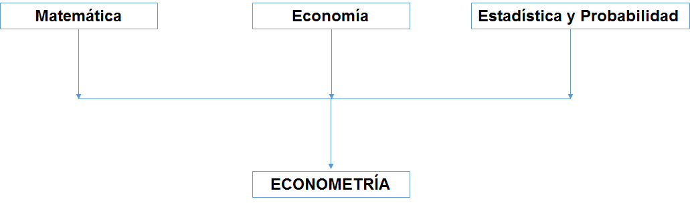
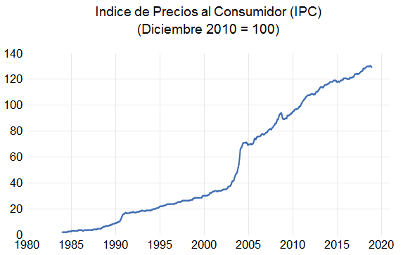
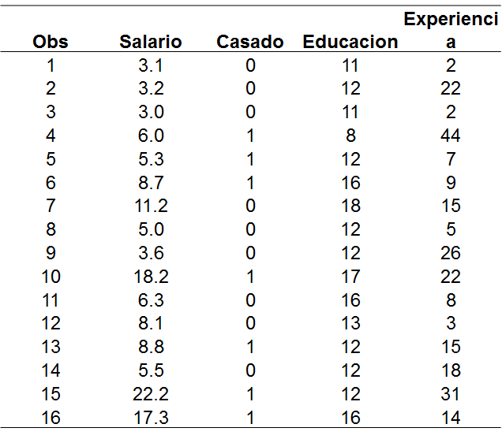

```{r global_options, include=FALSE}

knitr::opts_chunk$set(fig.pos = 'h')

```


# Advertencias:
1. Estas notas no sustituyen las lecturas asignadas en la clase de los libros de referencia.

2. La notación sigue de cerca a la del libro de cabecera (Wooldridge: Introducción a la Econometría) y son para propósitos didácticos.

3. Estarán siendo continuamente revisadas y se agradece cualquier observación de errores y mejoras explicativas de las demostraciones.

4. Cualquier error es de mi responsabilidad.


#Introducción: 

## ¿De qué trata la econometría?

La econometría comprende un conjunto de herramientas estadísticas y conceptuales utilizada en la evaluación empírica de las hipótesis provenientes de la teoría económica. La existencia de este instrumental se debe a la necesidad de dotar de validación empírica a las relaciones causales que se deducen de los modelos económicos construidos con la teoría. En ese sentido, la econometría al igual que otras herramientas en economía forma parte de la "caja de herramientas" del economista.

En términos formales, la econometría se presenta como la combinación de las herramientas estadísticas y matemáticas, con las hipótesis provenientes de la teoría económica. 

```{r echo=FALSE,fig.cap="",fig.align='default',out.width='100%'}



```


El presente documento tiene como objetivo introducir a los estudiantes de economía al mundo de los métodos empíricos utilizados en el proceso de investigación económica. La estrategia didáctica consiste en presentar ejemplos y cuestionar sobre los elementos a tomar en cuenta para agotar la etapa empirica de un proyecto de investigación de manera exitosa. Esto requiere: a) seleccionar el modelo apropiado, b) identificar la estrategia de estimacion apropiada al modelo seleccionado y c) seleccionar la estrategia de contraste adecuada y d) conocer el alcance y las limitaciones de los resultados obtenidos. 

Todo comienza con una teoría (ya sea contable, económica o sociológica, por ejemplo). En economía suelen estar expresadas en términos de funciones matemáticas.Por ejemplo:

$$C=f(p,I)$$
Donde $f$ es una función real, $C$ el consumo de un bien, $p$ el precio e $I$ el ingreso.

En algún curso de economía, se analizó el tipo de relación (positiva, negativa o nula) existente entre estas variables. En la práctica estamos interesados en saber "cuánto" se relacionan estas variables. Por lo que una definición de econometría es:

*el uso de la teoría y datos de la economía, negocios, y de las ciencias sociales, junto con las herramientas de la estadística, para responder preguntas del tipo "cuanto*

Otros ejemplos:

- ¿Cuándo incrementa el desempleo si el salario mínimo es incrementado en x%?

- ¿Cuándo sería el incremento de la inflación si el BC decidiera incrementar la cantidad de dinero en 10%?

- ¿En cuánto se incrementarían las ventas de cemento si el precio fuese reducido en x% y el gasto en publicidad aumentara en y%?

- ¿Cuánto se reduciría la tasa de inasistencia escolar a nivel de primaria si se implementaran cuatro campañas de desparasitación en las escuelas públicas de X región?

- ¿Cuánto se reducirían los crímenes de calle (asaltos) si se duplicara el salario a los policías?

Entre otras preguntas muy interesantes.


### Pasando del modelo económico al modelo econométrico:

Son múltiples los factores que pueden incidir en una variable sobre la cuál se tenga interés. Como recuerdan, los modelos económicos son una simplificación de la realidad. La teoría económica describe el comportamiento 'promedio' o 'sistemático' del agente de interés.

Una forma de pensar el paso del modelos económico al modelo econométrico es proponiendo que el comportamiento observado en los datos es la suma de ese componente sistemático y un componente impredecible y aleatorio. Es decir,

$$C=f(p,I)+e$$
Qué representa $e$?

- Todos los factores omitidos del modelo simple

- Incertidumbre 

Para terminar de obtener (*especificar*) el modelo econométrico, hay que proponer una forma funcional a $f$ ????. La propuesta mas común es una función lineal:

$$f(p,I)=\beta_0+\beta_1p+\beta_2 I$$

Por lo que el modelo econométrico que vamos a estudiar es del tipo

$$C=\beta_0+\beta_1p+\beta_2I+e$$
Donde $\beta_0$, $\beta_1$ y $\beta_2$ son parámetros desconocidos que estimaremos usando datos económicos y una técnica econométrico.
La forma funcional representa una hipótesis acerca de la relación entre las variables y hay que determinar si es compatible con la teoría económica y los datos. Con el uso del modelo econométrico y los datos, se hace inferencias acerca del mundo real y se aprende acerca del mismo en este proceso.

A este proceso de aprendizaje usando los elementos mencionados se le denomina Inferencia Estadística e incluye:

- Estimación de los parámetros económicos

- Predicción de los resultados económicos

- Contraste (testing) de hipótesis económicas.

### Importancia:

Forma parte fundamental de la formación de un economista.

Es la que en parte conecta lo que se aprende en los cursos de economía con lo que se aplica en la práctica.


###Alcance:

No se limita a economía, sino a otras áreas: análisis de negocios, mercadeo, finanzas, así como al resto de las ciencias sociales


## Estructura de los datos económicos

Los datos provienen de dos fuentes:

**1. Datos experimentales**

Provienen de experimentos controlados. Escasos en economía  El valor de las variables independientes es fijo en muestras repetidas.


**2. Datos no experimentales  u observacionales**

Provienen de encuestas. Datos de todas las variables son colectadas simultáneamente.

## Características de los datos económicos:

Dependiendo del nivel de agregación:

- micro-datos: individuos, hogares y firmas.

- macro-datos: agregación de individuos, hogares y firmas a nivel local o nacional.

Pueden representar un acervo o un flujo:

- Flujo: resultado medido en un periodo de tiempo.

- Acervo: medido en un punto particular del tiempo.

Puede ser cuantitativa o cualitativa

- Cuantitativa: en términos numéricos.

- Cualitativos: en términos de clasificación. 


## Tipos de datos en economía:

Series de tiempo: datos colectados en un intervalo discreto de tiempo.

```{r echo=FALSE,fig.cap="",fig.align='default',out.width='100%', fig.pos='h'}



```


Corte transversal: datos colectados  a partir de un número determinado de unidades en un periodo de tiempo.

```{r echo=FALSE,fig.cap="",fig.align='default',out.width='100%',fig.pos='h'}



```

Panel o longitudinales: datos colectados a partir de un número de unidades en intervalos discretos de tiempo.


## Diseño y elaboración de un proyecto empírico


# Instrumental Matemático - Estadístico

## 1. Instrumental matemático básico.

### 1.1.1	Operador de suma 

El operador de suma permite representar en poco espacio la suma de muchos términos de una misma categoría.

Si $\{x_i=1,...,n\}$ es una secuencia de n números, entonces la suma de esta serie se puede representa como:

$$x_1+x_2+...+x_n=\sum_{i=1}^nx_i$$

 
$\sum$ representa el operador de suma. La expresión $\sum_{i=1}^nx_i$ se lee: *súmense los valores de $x$ desde $x_1$ (primer valor de la secuencia) hasta $x_n$ (último valor de la secuencia).

Algunas propiedades del operador:

**Propiedad 1**: Para toda constante $k$:

$$\sum_{i=1}^n k=k+k+...+k=nk$$

**Propiedad 2**: Sea k una constante cualquiera, se cumple que:

$$\sum_{i=1}^n kx_i=kx_1+kx_2+...+kx_n=k(x_1+x_2+...+x_n)=k\sum_{i=1}^nx_i$$

 

**Propiedad 3**: Dado el siguiente conjunto de pares de números $\{(x_i,y_i):i=1,...,n\}$ y las constantes $a$ y $b$:

$$\sum_{i=1}^n(ax_i+by_i)=a\sum_{i=1}^nx_i+b\sum_{i=1}^ny_i$$
 

**Propiedad 4**: Sea a y b constantes y  $\{x_i=1,...,n\}$ una secuencia de $n$ números, se cumple que:

$$\sum_{i=1}^n(a+bx_i)=na+b\sum_{i=1}^nx_i$$

Los siguientes usos del operador de suma no son válidos:

1.	La suma de razones no es igual a la razón de las sumas:$\sum\frac{x_i}{y_i}\neq\frac{\sum x_i}{\sum y_i}$ (lo mismo aplica con el producto de dos series).

2.	Salvo en casos especiales, la suma de los cuadrados no es igual al cuadrado de las sumas: $\sum x_i^2\neq(\sum x_i)^2$ 


Algunos conceptos muy útiles surgen del empleo del operador de sumas, por ejemplo:


a)	*Promedio o media (describe la tendencia central de un conjunto de datos)*: dados $n$ números  $\{x_i=1,...,n\}$   este se obtiene sumándolos y después dividiendo entre n.

$$\bar{x}=\frac{1}{n}\sum_{i=1}^n x_i$$

 

b)	*Desviación*:  $d_i=x_i-\bar{x}$  Destacando que la suma de las desviaciones es siempre igual a cero. (Tarea: demuestre esa propiedad).

c)	Otras son: *la suma de desviaciones al cuadrado, etc*.


### 1.1.2	Funciones. Tipos y propiedades.

En la presente sección se repasa el concepto de función y sus propiedades. Se asume que el estudiante tiene conocimientos preliminares de análisis real y cálculo. Aunque lo presentado en estos apuntes  es suficiente para la discusión de la materia, se le motiva a revisar la literatura citada en la bibliografía del capitulo.

Se llama función (o mapeo) $f$ ) a una regla que relaciona el comportamiento de una determina variable al de otra u otras variables. 

Formalmente, *una función f  de un conjunto A en un conjunto B es una regla de correspondencia que asigna a cada elemento de x  en A un único elemento determinado en B.* 

En econometría, el concepto de función es esencial, porque la mayoría de los modelos (y todos los que veremos aquí) vienen representados como relaciones funcionales entre variables.

Existen diversos tipos de funciones. Para un detalle de la definición de función y los tipos de funciones ver  Knut, et. al. (Análisis Matemático para Economistas) y Chiang, A. (Métodos Fundamentales en Economía Matemática).

En el presente repaso, nuestro interés se concentra en dos tipos de funciones: lineales y no-lineales. Dentro de las no-lineales: cuadrática, logarítmica y exponencial.

1.1.2.1	Funciones lineales.

Este tipo de funciones son de mucha importancia en el análisis econométrico por su sencillez en la manipulación e interpretación de resultados. Constituyen la principal herramienta de casi todo el estudio de la econometría que realicemos en este curso introductorio.

La función lineal más sencilla viene dada por:

$$y=\beta_0+\beta_1x$$
 

La expresión anterior se lee: * y es una función lineal de x y $\beta_0$ y $\beta_1$ son los parámetros que describen la 'intensidad'  de esa relación*. $\beta_0$ es conocido como el intercepto y $\beta_1$ como la pendiente.

```{r}
x<-seq(0,100)
y<-10+0.5*x
plot(x,y,"l",main="y=10+0.5 x")
```

Una característica interesante de las funciones lineales que el cambio en $y$ es siempre $\beta_1$ veces el cambio en $x$:

$$\Delta y=\beta_1\Delta x$$

Donde $\Delta$ denota cambio. También se dice que $\beta_1$ es el *efecto marginal* de $x$ sobre $y$.


#### Ejemplo 1. Consumo de Gasolina

$$gasolina=100-0.23~precio$$
*La función anterior nos da la siguiente información:*

*1. Existe una relación lineal entre el consumo de gasolina y su precio.*

*2. Dicha relación es negativa, sugiriendo que si el precio de la gasolina se incrementa en 10$ el consumo de de gasolina caerá en promedio $0.23\times10=2.3$ galones diarios.*

*3. En el caso contingente de que el precio de este combustible fuera cero, el consumo alcanzaría un máximo de 100 galones por día.*


Existen casos donde la variable y (también conocida como "del lado izquierdo" o como "dependiente") se relaciona no solo contra la variable x, sino contra un conjunto de variables que determinan su comportamiento. 

En ese contexto, el efecto de una variable independiente (como se conoce a los componentes de x) sobre la dependiente suele llamarse efecto parcial, significando que se impone el supuesto de que el resto de las variables permanecen inalteradas (esto es: dejar los demás factores fijos o incorporar el supuesto de ceteris paribus).


#### Ejemplo: Oferta Laboral 

$$L_i=1.2+0.5~w_i-0.03~\tau_i$$

*Siendo L el número de horas de trabajo efectivo de un individuo, w el salario real y $\tau$ la tasa de impuesto marginal implícita a las horas trabajadas. *

*El efecto parcial de un incremento en el salario es analizado haciendo el supuesto que ?? se mantienen constante. De esta forma, un incremento de 10% en el salario real, manteniendo constante ??, incrementa el número de horas trabajadas en aproximadamente 5%. *

*Tarea: interprete un incremento en ??, manteniendo w constante.*


1.1.2.2	Funciones no -  lineales:

El otro grupo de funciones de nuestro interés es la familia de funciones no lineales. Nos concentraremos en tres de este tipo de funciones por ser las de mayor uso en la modelística econométrica: cuadrática, logarítmica y exponencial.

Función cuadrática: La principal característica, para nuestros propósitos, de este tipo de función es que ahora el efecto marginal o parcial de la variable dependiente va a depender de la condición inicial de esta. Esto es muy interesante porque nos va a permitir diferenciar el efecto, por ejemplo, de la educación sobre los ingresos futuros de individuos con diferentes características (por ejemplo, experiencia). 

Otro ejemplo que muestra la utilidad de esta función, es la llamada curva de Phillips o de disyuntiva entre inflación y desempleo: puesto que se observa un comportamiento "no lineal" en la inflación, esto es que un nivel de desempleo puede ser compatible con más de un nivel de inflación.

El análisis de dichas funciones requiere un uso de las técnicas de cálculo diferencial que veremos más adelante.

Un ejemplo de función cuadrática es:


$$y=\beta_0+\beta_1x+\beta_2x^2$$


En este caso el efecto marginal es una función del valor de x, esto es $\frac{\Delta y}{\Delta x}=\beta_1+2\beta_2 x$  , y por lo tanto el "estado" de la variable independiente influirá de forma "condicional" sobre $y$. 


Para ilustrar la forma de este tipo de funciones, en el siguiente grafico se muestra un ejemplo.

```{r}
x<-seq(-10,10)
y<-0.5+0.4*x+0.3*x^2
plot(x,y,"l",main=" Grafica de: y<-0.5+0.4*x+0.3*x^2")
```


#### Ejemplo: Modelo de Mincer, o de retornos de la educación.

En el estudio de los retornos económicos de la educación, suele utilizarse como punto de partida el modelo de Mincer (196xx). Este relaciona los retornos de la educación a variables como los años de escolaridad y el tipo de educación y controla los efectos de variables como la experiencia. La teoría sugiere que si bien la experiencia es una variable importante en la determinación del ingreso de los individuos, esta tiene un comportamiento no lineal, o de rendimientos decrecientes, debido a la existencia de factores de desgaste físico y obsolescencia. Formalmente, el modelo básico tendría la siguiente especificación.

$$ingresos_i=\beta_0+\beta_1educacion_i+\beta_2 experiencia+\beta_3 experiencia^2_i$$
 
El coeficiente $\beta_3$   captura el efecto mencionado.


*Función logarítmica natural*: Es la función lineal que desempeña el papel más importante en el análisis econométrico. Suele expresarse con las siguientes nomenclaturas:

$$y=\log(x)$$

$$y=\ln(x)$$
  
Esta función está definida solo para $x>0$. Para nuestros propósitos, siempre nos referiremos al logaritmo natural.

```{r}
x<-seq(1,35)
y<-log(x)
plot(x,y,"l",main=" Grafica de: y=ln(x)")
```


Algunas propiedades de la función logarítmica que son importantes de recordar son:

$$ln(x_1\times x_2)=ln(x_1)+ln(x_2),~~~x_1,x_2>0$$

$$ln(x_1/ x_2)=ln(x_1)-ln(x_2),~~~x_1,x_2>0$$


$$ln(x^c)=c~ln(x),~~~x>0, c ~ cualquier~~número$$
El diferencial logarítmico se puede utilizar como un aproximado de la variación porcentual, siendo un instrumento conveniente en el cómputo de tasas de crecimiento.

$$log(x_1)-log(x_0)=\frac{(x_1-x_0)}{x_0}=\frac{\Delta x}{x_0}$$

Esta propiedad resulta muy útil en cuanto nos permite representar la "sensibilidad" relativa de una variable respecto a los cambios pequeños en otra, lo que en los cursos de microeconomía conocieron por el nombre de "elasticidad". Formalmente se define como el cambio porcentual de y respecto a x cuando este último varía 1%. Esto es:

$$\frac{\Delta y}{x}\times\frac{x}{y}=\frac{\%\Delta y}{\%\Delta x}\approx \frac{\Delta \log(y)}{\Delta\log(x)}$$


Esto implica que un modelo econométrico, que adopte del modelo teórico que lo sustenta el supuesto de "elasticidad constante", el coeficiente estimado asociado puede interpretarse como una elasticidad.

$$log(y)=\beta_0+\beta_1 log(x)$$
Otra posibilidad es el modelo "log-lineal" por tener ambos componentes:

$$log(y)=\beta_0+\beta_1x$$
Se deja como ejercicio calcular la elasticidad de y respecto a x.


#### Ejemplo: Elasticidades en la función de producción:

En teoría del crecimiento suele utilizarse la función de producción de rendimientos constantes a escala, y suponerse elasticidades insumo - producto  constantes debido a sus propiedades analíticas. Una muy famosa es la función Coob-Douglas.

$$Y=AK^{\alpha}L^{1-\alpha}$$

En los estudios empíricos suele utilizarse como aproximación la transformación en un modelo logarítmico la ecuación anterior.

$$y=\beta_0+\beta_1k+\beta_2 l$$
 

Donde y es ln(Y), k el ln(K) y l el ln(L). En esta versión, los coeficientes asociados son interpretaos como las elasticidades del trabajo y el capital, y suelen interpretarse con el incremento porcentual del producto por un incremento de 1% en uno de los factores, manteniendo el resto constante. La constante se puede interpretar como una aproximación del crecimiento promedio de la productividad total de factores (PTF) durante un periodo determinado. Si en el modelo se supone rendimientos constantes a escala (i.e. el producto no incrementa más que proporcionalmente que el incremento de los factores), entonces es posible restringir el valor de los coeficientes a que sumen 1, o alternativamente testear la hipótesis conjunta con uno de los métodos de contraste de hipótesis que veremos, el supuesto de rendimientos constantes a escala. Un ejercicio interesante, que aprenderemos como realizarlo en el modulo de series de tiempo de este curso, es testear la estructura de los residuos de este modelo en busca que rendimiento crecientes a escala o la omisión de alguna variable que aporte información al proceso de determinación del crecimiento y nivel del producto en una economía determinada.


Función exponencial: Otro tipo de función es la exponencial. Gráficamente se puede observar su comportamiento


```{r}
x<-seq(1,35)
y<-exp(x)
plot(x,y,"l",main=" Grafica de: y=exp(x)")
```


Este tipo de funciones suelen tener la siguiente especificación:

$$y=exp(\beta_0+\beta_1 x) $$

$$y=e^{(\beta_0+\beta_1x)}$$$

Aunque son interesantes desde el punto de vista de representación de fenómenos económicos tales como demandas por "saldos reales", es posible simplificarlos mediante linealizaciones logarítmicas y facilitar su implementación empírica.


1.1.3	Proporciones y porcentajes

Estos conceptos son de importancia prima en nuestro curso de econometria, ya que muchos resultados, estadisticas y noticas son expresados en estos. Una proporcion viene definida como el peso o representacion relativo de elementos de la misma categoria dentro de un grupo determinado. Por ejemplo, en una canasta donde existen 10 frutas: 1 manzana, 3 mangos, 5 guayabas y 1 zapote, tenemos que el "grupo" es frutas y los elementos son cada una de estas. En terminos de proporciones las manzadas son 0.1 (=1/10) del total, los mangos 0.3 (3/10), 0.5 (=5/10=1/2) las guayabas y 0.1(=1/10) el zapote.

El porcentaje no es mas que la multiplicacion de una proporcion por 100. En el ejemplo se tendria que 10% (=0.1*100) del total de frutas es el porcentaje de manzanas en la canasta y asi sucesivamente.

Muchas cifras son expresadas en porcentajes: tasas de interes, desempleo, mujeres en la fuerza de trabajo, etcetera. 


Hay que tener cuidado a la hora de interpretar un porcentaje. Por ejemplo, en las estadisticas deportivas, suelen a aparecer enunciados como este "Alex Rodriguez está bateando con porcentaje de 0.375", cuando en realidad a lo que se refiere es que su bateo es de 37.5% del total de intentos que realiza en el diamante.


1.1.4	Nociones de cálculo diferencial.

En esta seccion repasaremos el concepto de derivada y su importancia en el analisis econometrico. Es solo un repasdo breve, ya que se asume que el estudiante ha cursado alguna materia de analisis real. Para los que deseen actualizarse y refrescar los detalles pueden encontrar una introduiccion apropiada en el texto de Alpha Chiang (XXXX), aunque cualquier libro de analisis real y calculo diferencial es de utilidad.


1.1.5	Nociones de algebra matricial.

En esta sección introducimos el concepto de matriz, sus propiedades y aplicaciones destacando la relevancia para el análisis econométrico de este instrumento matematico.
Básicamente, el algebra matricial facilita el análisis de modelos donde existen muchas variables independientes, de tal forma que la manipulación matematica sea casi tan fácil como en el caso del modelo bivariado. 
En términos practicos, se sugiere intuir el siginifcado de una matriz como un conjunto de datos, o matriz de datos que contiene información de interés para el investigador. Estos es, se puede colapsar un listado de variables en un solo objeto, llamado matriz y a través de las propiedades en términos operacionales obtener los mismos resultados que se obtendrían que en el caso de trabajar con un conjunto de sumatorias y ecuacuaciones que pueden hacer el trabajo computacional muy tedioso.
Otra importancia de incorporar y entender el algebra matricial orientada a nuestra materia, es que la mayoría de los software econométricos resuelven matricialmente la estimación de los modeos que se le introduzcan, muchas veces es algo que no se ve directamente ya que varios programas informaticos tienen menus que facilitan la entrada de datos,no onbstante basarse en la manipulación de la matriz de datos.


1.1.5.1	Definiciones básicas
Formalmente, una matriz puede definirse como un ordenamiento rectangular numérico, que en nuestro caso son datos e información. Una matriz contiene m  filas y n columnas y se dice que es de orden mxn. A m también se le conoce como la dimensión fila y a n dimensión columna.

Se utilizan letras mayúsculas para representar una matriz y minúsculas para los objetos de dicha matriz. Si $a_{ij}$  representa el elemento de la fila i-ésima  y la columna j-ésima, entonces una matriz nxm:

$$A=\Big[a_{ij}\Big]=\left[\begin{array}{ccc} a_{11} &\ldots&a_{1m} \\\vdots&\ddots&\vdots\\ a_{n1} &\ldots& a_{n,m} \end{array}\right]$$


Como ejemplo téngase la siguiente matriz 2x3:

$$A=\left[\begin{array}{ccc} 3&-1&2 \\8&5&1\end{array}\right]$$

De esta forma, el elemento $a_{23}=1$


Cuando la matriz tiene el mismo numero de filas y columnas, se denomina matriz cuadrada.
en el caso de que existan 1 fila y m columnas (1xm) se llama  vector fila, y cuando es n filas y 1 columna (nx1) es un vector columna, que se puede escribir como:


$$y=\left[\begin{array}{c}y_1\\y_2\\y_3\\ \vdots \\ y_n \end{array}\right]$$

Si la matriz es cuadrada y los elementos fuera de la diagonal son cero, entonces se dice que es una matriz diagonal 

$$A=\left[\begin{array}{cccc} a_{11} & 0 & \ldots & 0 \\ 0 & a_{22} & \ldots & 0 \\ \vdots & & \ddots & \\ 0 & 0 & \ldots & a_{nm} \end{array}\right]$$

Un caso especial es la matriz identidad, la cual tiene en la diagonal solo unos y en el resto ceros. Literalmente es elemento unitario en el mundo de las matrices suele representarse por I. La matriz cero es aquella cuyo todos elementos son cero y no necesariamente tiene que ser una matriz cuadrada.


1.1.5.2	Operaciones matriciales

Suma Matricial: Solo es posible entre matrices de igual dimensión (esto es filas y columnas). Sean A y B dos matrices de dimensión nxm, entonces:


$$A+B=\left[\begin{array}{cccc}
a_{11}+b_{11} & a_{12}+b_{12} & \ldots & a_{1n}+b_{1n} \\
a_{21}+b_{21} & a_{22}+b_{22} & \ldots & a_{2n}+b_{2n} \\
\vdots & \vdots  & \ddots  & \vdots  \\
a_{m1}+b_{m1} & a_{m2}+b_{m2} & \ldots & a_{mn}+b_{mn}
\end{array}\right]$$


Ejemplo.


Multiplicacion por un escalar: se multiplica cada elemento de la matriz por el escalar.


$$\alpha A=\left[\begin{array}{cccc}
\alpha a_{11} & \alpha a_{12} & \ldots & \alpha a_{1n}  \\
\alpha a_{21} & \alpha a_{22} & \ldots & \alpha a_{2n}  \\
\vdots & \vdots  & \ddots  & \vdots  \\
\alpha a_{m1} & \alpha a_{m2} & \ldots & \alpha a_{mn}
\end{array}\right]$$


Multiplicacion matricial: el requisito para poder aplicar la multiplicación entre matrices, es que la dimension columna de la matriz que premultiplica sea igual a la dimensión fila de la matriz que posmultiplica. La matriz resultante será de dimensión fila de la matriz que premultiplica y dimensión columna de la que posmultiplica.  Esto implica que cada elemento de la nueva matriz es la suma de productos de cada fila de la matriz que premultiplica por cada columna de la que posmultiplica.
Formalmente, sea A una matriz de orden nxp y B una de dimensión pxm. Si realizamos la multiplicación de AB obtendremos una matriz (digamos C) de roden nxm. Noteses que en este caso no es posible BA ya que no se cumple el requisito, no obstante si fuesen matrices cuadradas se cumple la ley conmutativa.


Esquemáticamente se puede ver lo anteriormente explicado:


Sea $A=\left[\begin{array}{cc} a_{11} & a_{12}\\ a_{21} & a_{22} \end{array}\right]$ una matriz $2\times 2$  y $B=\left[\begin{array}{cccc} b_{11} & b_{12} & b_{13}\\ b_{21} & b_{22} & b_{23} \end{array}\right]$ una matriz de orden 2x3. Estas matrices cumplen las condiciones para generar el producto AB que genera una matriz de orden 2x3.


$$AB=\left[\begin{array}{cc} a_{11} & a_{12}\\ a_{21} & a_{22} \end{array}\right] \left[\begin{array}{cccc} b_{11} & b_{12} & b_{13}\\ b_{21} & b_{22} & b_{23} \end{array}\right] =\left[\begin{array}{cccc} a_{11}b_{11}+a_{12}b_{12} & a_{11}b_{12}+a_{12}b_{22} & a_{11}b_{13}+a_{12}b_{23}\\ a_{21}b_{11}+a_{22}b_{12} & a_{21}b_{12}+a_{22}b_{22} & a_{21}b_{13}+a_{22}b_{23} \end{array}\right]$$

En general,


$$\left[\begin{array}{ccccc}a_{i1} & a_{i2} & a_{i_3}&\ldots & a_{in} \end{array}\right]\left[\begin{array}{ccccc}b_{i1} \\ b_{i2} \\ b_{i_3} \\ \vdots \\ b_{in} \end{array}\right]=\Big[\sum_{k=1}^na_{ik}b_{kj}\Big]$$

Algunas propiedades de la multiplicación matricial son: 

a) $(\alpha+\beta)A=\alpha A + \beta A$

b) $\alpha(A+B)=\alpha A + \alpha B$

c) $(\alpha \beta) A=\alpha(\beta A)$

d) $\alpha(AB)=(\alpha A)B$

e) $A+B=B+A$

f) $(A+B)+C=A+(B+C)$

g) $(AB)C=A(BC)$

h) $A(B+C)=AB+AC$

i) $(A+B)C=AC+BC$

j)	$IA=AI=A$, donde $I$ es la matriz identidad

k)	$A+0=0+A=A$

l)	$A-A=0$

m)	$A0=0A=0$

n)	$AB \neq BA$

- Transposicion: la transopuesta de la matriz $A$, representada por $A'$ ($A$ prima), es la matriz que resulta de intercambiar las filas y las columnas de $A$. Por ejemplo, 

$$A=\left[\begin{array}{ccc} b_{11}&b_{12}&b_{13}\\ b_{21}&b_{22}&b_{23}\end{array}\right]$$

$$A'=\left[\begin{array}{cc} b_{11} & b_{21}\\b_{12} & b_{22}\\b_{13} & b_{23}\end{array}\right]$$

- Propiedades de la transposición:

a)	$(A')'=A$

b)	$(\alpha A)'= \alpha A'$

c)	$(A+B)'= A'+B'$

d)	$(AB)'=B'A'$

e)	Si $x$ es un vector $nx1$, entonces $x'x=\sum_{i=1}^n x_i^2$

f)	Si $A$ es una matriz dada por los vectores $1 \times k$, $a_1,a_2,\ldots,a_n$, tal que:

$$A=\left[\begin{array}{c} a_1 \\a_2 \\ \vdots\\ a_n \end{array}\right]$$

- Entonces $A'=(a_1,a_2,\ldots,a_n)$


- Matriz simétrica. Es aquella cuya transpuesta es ella misma, $A'=A$.

- Traza. Es una operación solo para matrices cuadradas. La traza se obtiene simplemente sumando los elementos de la diagonal. Sea A una matriz cuadrada, entonces:

$$tr(A)=\sum_{i=1}^n a_{ii}$$

- Propiedades

a)	$tr(I)=n$

b)	$tr(A)=tr(A')$

c)	$tr(A+B)=tr(A)+tr(B)$

d)	$tr(\alpha A)=\alpha tr(A)$

e)	$tr(AB)=tr(BA)$


Inversa. Es una operación muy importante para nuestros propósitos. En el algebra matricial, es "casi" el equivalente a la división en el mundo de los escalares.  Sea $A$ una matriz cuadrada, entonces su inversa se denota por   Ademas se tiene que $AA-1=I$. Es equivalente decir matriz invertible que matriz no singular. Una matriz singular es aquella que no es invertible, es decir, que pueden existir filas o columnas que se puedan obtener de alguna combinación lineal del resto.

- Propiedades de la inversa:

a)	Si existe una inversa es unica

b)	$(\alpha A)^{-1}=(1/\alpha )A^{-1}$

c)	$(AB)^{-1}=B^{-1}A^{-1}$

d)	$(A')^{-1}=(A^{-1})'$


Sobre la mecánica de cálculo se remite al estudiante interesado al libro de Alpha Chiang (2006), o a cualquier libro de algebra matricial. Se trabajará con la inversa asumiéndola como tal, ya que sin pérdida de generalidad se puede comprender el contenido de nuestro interés. Además, el uso de computador ha facilitado el cómputo de inversas, no obstante se recomienda abundar sobre esa literatura ya que después de todo hay que conocer el origen de todo lo que uno estudia.

1.1.5.3	Independencia lineal y rango de una matriz

1.1.5.4	Formas cuadráticas y matrices definidas positivas

1.1.5.5	Matrices idempotentes

1.1.5.6	Diferenciacion matricial

1.1.5.7	Momentos y distribuciones de vectorios aleatorios (esta parte va con la parte estadística)


## 1.2	Fundamentos de probabilidad


1.2.1	Variables aleatorias y distribuciones de probabilidad.

El concepto de variable aleatoria descansa en la definición de lo que es un experimento. En teoría de probabilidades, un experimento se define como un procedimiento que puede, al menos en teoría, repetirse un número infinito (esto es muy grande)  bajo las mismas condiciones y que tiene un conjunto de resultados bien definido (esto es, se conocen todos los resultados que posiblemente puedan ocurrir). 

Un ejemplo puede ayudar a entender la definición de experimento: suponga una moneda bien calibrada (esto es que no esté alterada), se puede realizar el experimento de lanzarla 10 veces  y contar el numero de veces que sale cara. En este caso, el juego anterior cae en la categoria de experimento, primero porque se puede repetir hasta el cansancio el mismo experimento y segundo, se sabe bien cual es el conjunto de resultados posible que en nuestro ejemplo es un numero de 0 a 10.

Visto lo anterior, el valor numérico determinado por el experimento es asignado a una  funcion conocida como variable aleatoria. Esta se encarga de enlistar el resultado final, en formato cuantitativo, el resultado de cada ronda del experimento.

En nuestro ejemplo del experimento del lanzar 10 veces una moneda y observar cuantas caras salieron, ese número de caras es una variable aleatoria. Si bien sabemos que la cantidad de caras que podrían salir es un número que esta entre 0 y 10, en rigor no sabemos cuantas caras saldrán cada vez que se repita el experimento y de ahí el apellido de aleatoria.

Otro concepto importante para caracterizar completamente a una variable aleatoria es el de probabilidad. El desarrollo de la teoría de probabilidades en el siglo XX ha derivado el concepto de probabilidad a un nivel de abstracción que escapa al nivel de este curso introductorio. Para nuestros propositos, vamos a entender por probabilidad una medida que informa sobre la ocurrecia de un hecho, o en nuestro campo de estudio, de realización de la variable aleatoria y vamos a acotar el valor que pueda tomar esta medida a valores entre 0 y 1, siendo probabilidad 0 cuando con certeza sabemos que ese resultado no es posible bajo las condiciones dadas, y 1 cuando la información que se posee es absoluta y permite saber con certeza lo que va a ocurrir. Ademas, las probabilidades de todos los resultados posibles de un experimento deben sumar uno para que esten bien definidas (de lo contrario faltarian eventos). Por intuición, los valores entre ambas cotas (0 y 1) reflejan grados de ocurrencia o no ocurrencia del resultado. Para un concepto mas elaborado y avanzado del concepto de probabilidades vease Greene (2003) y Davison (1994) o cualquir otro libro de teoria de probabilidades.

En resumen, las propiedades de una variable aleatoria son cuatro:

1. adopta  un solo valor específico

2. no sabemos de antemano que valor adoptará

3. pero si conocemos los valores que puede adoptar

4. conocemos la probabilidad de que adopte alguno de esos valores posibles.

En términos de nomenclatura, denotaremos con letras mayúsculas las variables aleatorias (usualmente se usan $W,X,Y,Z$) y los valores que esta toma con letras minúsculas (usualmente se usan $w,x,y,z$). En nuestro ejemplo de experimento de la moneda, se puede definir como X la cantidad de caras obtenidas en los 10 lanzamientos de la misma.

De acuerdo a nuestra definición de variable aleatoria, $X$ tomará uno de los valores del conjunto ${0,1,2,.,10}$. Por ejemplo, puede tomar $x=6$.

Si existe una cantidad de variables aleatorias grande (del mismo tipo o no), entonces se utilizan sub indices: $X1, X2,.,XN$. Por ejemplo, si se elige aleatoriamente 100 hogares de la provincia santo domingo y se obtiene el gasto en bancas de loteria, estas variables aleatorias se denotarán como $X1, X2, ., X100$ y los valores particulares que estas tomaran como $x1, x2, ., x100$.

Se pueden identificar dos tipos de variables aleatorias:


a) Variables aleatorias discretas. Son aquellas que pueden tomar una cantidad finita o una cantidada infinita contable de valores. Por infinita contable nos referimos al caso donde la variable toma como valores numeros enteros aunque tienda a infinito.
El ejemplo mas sencillo de variable aleatoria discreta, es la de Bernoulli  donde lo unico que se necesita para describir el comportamiento de una variable aleatoria de Bernoulli es la probabilidad que la variable tome el valor uno. 

En el ejemplo de las monedas, si esta es "legitima" entonces $P(X=1)=1/2$, que se lee "probabilidad de que X sea igual a uno es un medio". Y dado que las probabilidades deben sumar uno $P(X=0)=1-P(X=1)=1/2$.


En casos mas generales, el conocimiento de la probabilidad de que una variable de bernoulli se realice no es evidente, sino que esta puede tomar un numero cualquiera entre 0 y 1. En estos casos se suele expresar como:


$$P(X=1)=\theta$$

$$P(X=0)=1-\theta$$


Donde $\theta$ es un numeor entre cero y uno. En este caso  para conocer $\theta$, que es lo mismo que decir, conocer la probabilidad de que X sea igual a uno, hay que utilizar metodos de estimacion tales como los que veremos en el apartado sobre estadistica matematica.

Las variables aleatorias discretas no solamente son del tipo de bernoulli, sino que pueden tomar mas de dos valores. En general, se puede definir ${x1, x2,.,xk}$ como el conjunto de k valores que puede tomar la variable aleatoria X, y p1, p2, ., pk las probabilidades asociada a cada una de los valores que podria tomar X. de esta forma,
$pj=P(X=xj)$,$j=1,2,.,k$ ( que se lee " probabilidad de que X tome el valor xj es igual a pj)
donde cada pj esta entre 0 y 1 y $p1+p2+.+pk=1$.

Discutiendo algo de nomenclatura, cuando se quiere decir que una variable tiene una distribución de Bernoulli se escribe X ~ Bernouilli (??) que se llee "X tiene una distribuion de Bernoulli con probabilidad de éxito ??".

Existe un concepto muy importante para nuestros propositos que relaciona las definicones de variable aleatoria y proabilidad. Se conoce como funcion de densidad de probabilidad (fdp) a aquella que resume la información de los valores que puede tomar X y la probabilidad asociada a cada uno de esos valores. Formalmente, 


$f(xj)=pj, j=1,2,.,k.$


con $f(x)=0$ para toda x distinta de xj para alguna j (que es lo mismo que decir, cualquier resultado que no este considerado parte del conjunto de resultados posibles del experimento sobre el cual se define la variable aleatoria nunca ocurrirá).

Dada $f(x)$ de cualquier variable aleatoria se puede calcular la probabilidad de cualquier evento relacionado con esa variable aleatoria. 

Ejemplo: suponga que X es la cantidad de tiros libres anotados por un jugador de baloncesto en dos intentos, entonces X puede tomar los siguientes valores {0,1,2}, es decir, puede fallar ambos {0}, encestar solo uno {1}, o encestar ambos tiros {2}. Supongase que la fdp de X esté definida por 

$f(0)=0.20, f(1)=0.44 y f(2)=0.36$

¿Cómo se obtuvieron estos valores de las probabilidades? En la siguiente seccion veremos cómo. Por ahora supongamos que un experto en estadisticas deportivas nos las dijo. Observe que las probabilidades suman uno.

Con ese conocimiento de la fdp de X, podemos calcular la probabilidad de cualquier evento relacionado a la variable aleatoria. Asi la probabilidad de que el jugador anote por menos un tiro libre, $P(X>=1)=P(X=1)+P(X=2)=0.44+0.36=0.80$.

Graficamente se puede ilustrar el comportamiento de esta funcion,


Con este tipo de grafico nos encontraremos cuando trabajemos con variables aleatorias discretas. Algo importante de destacar y que facilitara el trabajo en terminos de imaginación es que la forma de la funcion en terminos graficos, suele asignarsele nombre. Esta idea quedara mas fija cuando veamos el caso de las variables aleatorias continuas.

b) variables aleatorias continuas
en este caso el concepto es un poco mas acabado en terminos de imaginación, en el sentido que se entiende por variable aleatoria continua aquella donde la probabilidad de que tome cualquier valor real es cero. En realidad ya que sabemos  que el resultado que tome una variable aleatoria en cada realización del experimento es un numero, una forma de entender dicha definición es identificarnos con la idea de qu ene etse caso el conjutno de valores sobre los que se define la variable aleatoria es tan grande (en el sentido de que no es posible contarlos o hacerlos coincidir con numeros enteros positivos) que la logica dicta que la probabilidad de que X pueda tomar uno de esos valores tiende a cer y para efectos practicos es cero.

Un ejemplo puede ayudar a aclara la idea.  Sabemos que la medicion de la inflación es discreta (al final se obtiene un dato), pero como esta puede ser cualquier numero (inclusive en un rango determinado, digamos 1 y 5%), es conveniente tratarla como una variable continua, ya que la mecanica de las variables discretas en engorroso (esto es, tendriamos un listado muy pero muy grande de posibles realización de la inflación (variable alearoia) cada una con una probabilidad pequeñisima de ocurrencia).

Para el caso de las variables aleatorias continuas se define una funcion de desidad de probabilidad, que proporciona al igual que el caso anterior, información  sobre los posibles valores de la variable aleatoria. Sin embargo, dado que no tiene sentido analizar la ocurrencia de un solo valor de X, se analiza en este caso la posibilidad de que el valor que tome x este incluido en un rango de valores.

En este caso dado dos constantes a y b, entonces P(a<=x<=b) ("la probabilidad de que x este entre a y b)  es el area bajo la fdp entre los puntos a y b. gráficamente, 


1.2.2	Distrubuciones conjuntas, distribuciones condicionales e independencia.
1.2.3	Características de las distribuciones de probabilidad.
1.2.4	Caracteristicas de las distribuciones conjuntas y de las condicionales. 
1.2.5	Algunas distribuciones de probabilidad de uso común.


# Modelo de regresión simple (MRLS)

## Definiciones, especificación y supuestos del MRLS

## Especificación: Supuestos Modelo de Regresión Lineal

1. Linealidad en los parámetros

$$ y_i = \beta_1 + \beta_2 x_i +\varepsilon_i$$

2. Exogeneidad de $x_i$

$$ E[\varepsilon_i |x_i ]=0$$

  Consecuencia: $Cov(x_i,\varepsilon_i) = 0$

3. Homocedásticidad

$$var(\varepsilon_i|x_i)=\sigma^2$$

4. No correlación serial

$$cov(\varepsilon_i , \varepsilon_j)=0$$
5. Distribución del error es normal
$$\varepsilon_i \sim N(0,\sigma^2)$$

## Función de Regresión Poblacional
- Dado los supuestos, el interés radica en la estimación de esta función:

$$E[y_i|x_i]=\beta_1+\beta_2x_i$$


## Estimación de los parámetros del MRLS y el estimador de mínimos cuadrados ordinarios (MCO)


## Derivación estimadores de MCO
$$min\ SRC=\sum_{i=1}^{N} \varepsilon_i^2=\sum_{i=1}^{N}(y_i -\beta_1-\beta_2x_i)^2  $$

Condiciones de primer orden:

$$\frac{\partial SRC}{\partial\beta_1} = -2\sum(y_i-\beta_1-\beta_2x_i)$$


$$\frac{\partial SRC}{\partial\beta_2} = -2\sum(y_i-\beta_1-\beta_2x_i)x_i$$

Existen $b_1$ y $b_2$, que dada la muestra en particular, satisfacen las ecuaciones anteriores:

$$-2\sum(y_i-b_1-b_2x_i)=0$$

$$-2\sum(y_i-b_1-b_2x_i)x_i=0$$
Estas ecuaciones son conocidas como las ecuaciones normales

## Estimadores de MCO

- Resolviendo el sistema anterior
$$b_1 = \bar{y}-b_2\bar{x}$$

$$b_2 = \frac{\sum(y_i -\bar{y})(x_i-\bar{x})}{\sum (x-\bar{x})^2} $$

- Con estos estimados se obtiene la función de regresión muestral, la estimación de la poblacional

$$\hat{y_i}=b_1+b_2x_i$$


## Propiedades de los estimadores de MCO

### Son estimadores lineales de los datos:

a. Para $b_2$ se tiene:

$$b_2 = \frac{\sum(y_i -\bar{y})(x_i-\bar{x})}{\sum (x-\bar{x})^2} 
=\frac{\sum(x_i-\bar{x})y_i}{\sum(x_i-\bar{x})^2}-\frac{\sum(x_i-\bar{x})\bar{y}}{\sum(x_i-\bar{x})^2}
$$

definiendo:
$$w_i=\frac{(x_i-\bar{x})}{\sum(x_i-\bar{x})^2} $$

se tiene que:

$$b_2=\sum w_iy_i$$


b. Para $b_1$ se tiene

$$b_1 =\bar{y}-b_2\bar{x}$$

sustituyendo

$$b_1 =  \bar{y}-\bar{x}\sum w_i y_i $$


### Insesgamiento

a. Para $b_2$ se tiene

$$b_2 = \sum w_iy_i$$

La especificación del MRL es $y_i=\beta_1+\beta_2x_i+\varepsilon_i$. Sustituyendo,

$$b_2 = \sum w_i(\beta_1+\beta_2x_i+\varepsilon_i)$$

$$b_2 = \beta_1\sum w_i+\beta_2\sum w_ix_i+\sum w_i\varepsilon_i $$

note que:

a. $$\sum w_i=\sum \frac{(x_i-\bar{x})}{\sum(x_i-\bar{x})^2}=\frac{\sum(x_i-\bar{x})}{\sum(x_i-\bar{x})^2}=0$$


b. $$\sum w_ix_i=  \frac{\sum (x_i-\bar{x})x_i}{\sum(x_i-\bar{x})^2}$$

trabajando con el numerador:

$$\sum(x_i-\bar{x})x_i=\sum(x_i^2-\bar{x}x_i)=\sum x_i^2-\bar{x}\sum x_i=\sum x_i^2 - n\bar{x}^2=\sum x_i^2 - n\bar{x}^2+n\bar{x}^2-n\bar{x}^2$$

$$=\sum x_i^2 -2n\bar{x}^2+n\bar{x}^2=\sum(x_i-\bar{x})^2$$

Por lo tanto
$$\sum w_ix_i=  \frac{\sum (x_i-\bar{x})x_i}{\sum(x_i-\bar{x})^2}=1$$

Entonces

$$b_2=\beta_2+\sum w_i\varepsilon_i$$

aplicando valor esperado,

$$E[b_2|x_i]=\beta_2+E[\sum w_i\varepsilon_i|x_i]$$

Analizando el segundo termino

$$E[\sum w_i\varepsilon_i|x_i]=E[w_1\varepsilon_1+...+w_N\varepsilon_N|x_i]=E[w_1\varepsilon_1|x_1]+...+E[w_N\varepsilon_N|x_N]=w_1E[\varepsilon_1|x_1]+...+w_NE[\varepsilon_N|x_N]$$
dado el supuesto $E[\varepsilon_i|x_i]=0$, entonces


$$E[\sum w_i\varepsilon_i|x_i]=0$$
Por tanto,
$$E[b_2|x_i]=\beta_2$$
Es decir, es un estimador insesgado.


b. Para $b_1$ se tiene

$$b_1=\bar{y}-b_2\bar{x}=\beta_1+\beta_2\bar{x}+\bar{\varepsilon}-b_2\bar{x}=\beta_1+(\beta_2-b_2)\bar{x}+\bar{\varepsilon}$$


$$E[b_1|x_i]=\beta_1+E[(\beta_2-b_2)\bar{x}|x_i]+E[\bar{\varepsilon}|x_i]$$

$$E[b_1|x_i]=\beta_1$$

### Varianza y covarianza de los estimadores

###Varianza de $b_2$

$$var[b_2|x_i]=E[(b_2-\beta_2)^2|x_i]=E[(\sum w_i\varepsilon_i)^2|x_i]$$

note que:

$$(\sum w_i\varepsilon_i)^2=(w_1\varepsilon_1+w_2\varepsilon_2+...+w_N\varepsilon_N)^2=(w_1^2\varepsilon_1^2+...+w_N^2\varepsilon_N^2+2w_1\varepsilon_1\times w_2\varepsilon_2+...)$$
dados los supuestos (i) $E[\varepsilon_i^2|x_i]=\sigma^2$ y $cov(\varepsilon_i,\varepsilon_j|x_i)=E[\varepsilon_i\varepsilon_j|x_i]=0$, se tiene que:
$$var[b_2|x_i]=E[(b_2-\beta_2)^2|x_i]$$

$$=E[(\sum w_i\varepsilon_i)^2|x_i]$$

$$=E[(w_1^2\varepsilon_1^2+...+w_N^2\varepsilon_N^2+2w_1\varepsilon_1\times w_2\varepsilon_2+...)|x_i]$$
$$=w_1^2E[\varepsilon_1^2|x_i]+...+w_N^2E[\varepsilon_N^2|x_i]$$

$$=w_1^2 \sigma^2+...+w_N^2\sigma^2=\sigma^2\sum w_i^2$$

note que:
$$\sum w_i^2=\sum \left(\frac{(x_i-\bar{x})}{\sum(x_i-\bar{x})^2}\right)^2=\frac{\sum(x_i -\bar{x})^2}{(\sum(x_i-\bar{x})^2)^2}=\frac{1}{\sum(x_i-\bar{x})^2}$$

entonces:

$$var[b_2|x_i]=\frac{\sigma^2}{\sum(x_i-\bar{x})^2}$$

### Varianza de $b_1$:

$$var[b_1|x_i]=E[(b_1-\beta_1)^2|x_i]$$


$$=E\left[((\beta_2-b_2)\bar{x}+\bar{\varepsilon})^2\right|x_i]$$

$$=E[(\beta_2-b_2)^2\bar{x}^2+\bar{\varepsilon}^2+(\beta_2-b_2)\bar{x}\bar{\varepsilon}|x_i]$$

$$=\bar{x}^2E[(\beta_2-b_2)^2|x_i]+E[\bar{\varepsilon}^2|x_i]$$

$$=\bar{x}^2var(b_2|x_i)+\frac{\sigma^2}{N}$$

$$=\bar{x}^2\frac{\sigma^2}{\sum(x_i-\bar{x})^2}+\frac{\sigma^2}{N}$$

$$=\sigma^2\left[ \frac{\bar{x}^2}{\sum(x_i-\bar{x})^2}+\frac{1}{N}\right]$$


$$=\sigma^2\left[\frac{N\bar{x}^2+\sum(x_i-\bar{x})^2}{N\sum(x_i-\bar{x})^2}\right]$$

$$=\sigma^2\left[\frac{N\bar{x}^2+\sum x_i^2-2\bar{x}\sum x_i+N\bar{x}^2}{N\sum(x_i-\bar{x})^2}\right]$$

$$=\sigma^2\left[\frac{N\bar{x^2}+\sum x_i^2-2N\bar{x}^2+N\bar{x}^2}{N\sum(x_i-\bar{x})^2}\right]$$

$$=\sigma^2\left[\frac{\sum x_i^2}{N\sum(x_i-\bar{x})^2}\right]$$


###Covarianza entre $b_1$ y $b_2$:

$$cov(b_1,b_2)=E[(b_1-\beta_1)(b_2-\beta_2)|x_i]=E[((\beta_2-b_2)\bar{x}+\bar{\varepsilon})(\sum w_i\varepsilon_i)|x_i]$$


$$cov(b_1,b_2)=E[(b_1-\beta_1)(b_2-\beta_2)|x_i]=E[(-(b_2-\beta_2)\bar{x}+\bar{\varepsilon})(\sum w_i\varepsilon_i)|x_i]$$


$$=E[-\bar{x}(\sum w_i\varepsilon_i)^2+\bar{\varepsilon}(\sum w_i\varepsilon_i)|x_i]$$


$$=-\bar{x}E[(\sum w_i\varepsilon_i)^2|x_i]=-\bar{x}\frac{\sigma^2}{\sum (x_i-\bar{x})^2}=\sigma^2\left[-\frac{\bar{x}}{\sum(x_i-\bar{x})^2}\right]$$

En ese último paso utilizamos un resultado de más arriba.


### Estimación de la varianza de los errores

- La varianza del error aleatorio viene dada por:

$$var(\varepsilon_i|x_i)=E[\varepsilon|x_i]=\sigma^2$$

- El equivalente muestral es:

$$\hat{\sigma}^2=\frac{\sum \varepsilon_i ^2}{N}$$

- Dado que $\varepsilon_i$ no son observables, se utilizan los resiudos del modelo, calculados como:

$$e_i=y_i-\hat{y}_i=y_i-b_1-b_2x_i$$

- Entonces,
$$\hat{\sigma^2}=\frac{\sum e_i^2}{N}$$


- En muestras pequeñas, este es un estimador sesgado. El estimado insesgado de la varianza del error, toma en consideración la pérdida de grados de libertad. Que en el caso del MRL simple, es N-2.

$$\hat{\sigma^2}=\frac{\sum e_i^2}{N-2}$$


## Inferencia en el MRL

En el proceso de obtención de los estimadores de MCO vimos que estos son variables aleatorias, cuya distribución analizamos en la sección anterior. Al ser función de los datos, los estimadores son también influenciados con el error de la muestra. En ese sentido cuando usamos los estimadores de MCO, obtenemos un estimado del parámetro desconocido y nos preguntamos si la estimación que tenemos es una representación razonable del parámetro desconocido. Visto de otra forma, nos preguntamos si el valor que estimamos es diferente a un valor dado del parámetro poblacional. Dado lo mencionado anteriormente, necesitamos proveer o incorporar la informacion del error muestral para responder la pregunta de cuán diferente es nuetsro valor estimado de un valor hipotetico del parametro desconocido. Este es parte del proceso de inferencia descrito anteriiormente, el cual constaba de tres etapas:

1) El problema de estimación de los parámetros desconocidos.

2) Contraste de hipótesis relativas al valor desconocido del parámetro.

3) Predicción de los resultados del modelo.

Existen dos enfoques para realizar inferencia en el modelo de regresión lineal:

1) Estimación de intervalos de confianza

2) Contraste de hipótesis.

### Estimación de Intervalos

Consiste en una herramienta para crear rangos de valores, en los que el parámetro desconocido es probable que se encuentre.

El punto de partida es recordar que si se cumplen los supuestos para el modelo de regresión lineal simple (MRLS), los estimadores siguen una distribución normal.

Por ejemplo, en el caso del estimador de la pendiente del modelo, $b_2$:

$$b_2 \sim N\left(\beta_2,\frac{\sigma^2}{\sum (x_i-\bar{x})^2}\right)$$

Sustrayendo la media y diviendo por la desviación estándar. Es decir, 'normalizando' o 'tipificando' $b_2$, se tiene

$$Z=\frac{b_2-\beta_2}{\sqrt{\frac{\sigma^2}{\sum(x_i-\bar{x})^2}}}\sim N(0,1)$$

Utilizando la tabla de probabilidades normal que:

$$P(-1.96\leq Z \leq 1.96)= 0.95$$

Sustituyendo

$$
P\left( -1.96\leq \frac{b_2-\beta_2}{\sqrt{\frac{\sigma^2}{\sum(x_i-\bar{x})^2}}} \leq 1.96\right) = 0.95
$$


Premultiplicando ambos lados dentro de la expresion anterior por $\sqrt{\frac{\sigma^2}{\sum(x_i-\bar{x})^2}}$, se tiene que

$$P\left( -1.96\times \sqrt{\frac{\sigma^2}{\sum(x_i-\bar{x})^2}}\leq b_2-\beta_2 \leq 1.96\times \sqrt{\frac{\sigma^2}{\sum(x_i-\bar{x})^2}}\right) = 0.95$$

Restando $b_2$ y múltiplicando por $-1$, se tiene:

$$P\left( b_2-1.96\times\sqrt{\frac{\sigma^2}{\sum(x_i-\bar{x})^2}}\leq \beta_2 \leq b2+1.96\times\sqrt{\frac{\sigma^2}{\sum(x_i-\bar{x})^2}}\right) = 0.95$$


Esta expresión define un intervalo que tiene probabilidad 0.95 de contener el parámetro poblacional. Significa, que si se toman múltiples muestras, 95% de estos intervalos contendrían el verdadero valor del parámetro.

Note que el intervalo considera, además del valor estimado del coeficiente $b_2$, dos fuentes de error. Una de ellas, no es controlada por el investigador, y depende de la varianza del error y de la variabilidad de la variable dependiente. La otra fuente de incertidumbre, es controlada por el investigador. Se refiere al nivel del error dispuesto a tolerar. Mientras menos error esté dispuesto a tolerar, menor ubicará su nivel de confianza.


Note que para la construcción del intervalo anterior, se asume que se conoce $\sigma^2$ (la varianza del error del modelo). En la práctica no disponemos de dicho parámetro. En su lugar utilizamos su valor estimado, que lo obtenemos usanod su estimador muestral:

$$\hat{\sigma}^2=\frac{\sum e_i^2}{N-2}$$

donde $e_i = y_i-b_1-b_2x_i$ y cuya distribución es una Chi cuadrada, con N-2 grados de libertad. Esto es así, pues recuerde que los errores se distribuyen como una normal, y de acuerdo a lo visto en el apéndice una variable Chi cuadrada es la suma de variables normales elevadas al cuadrado.

Reemplazando $\sigma^2$ por $\hat{\sigma}^2$, en la definición se obtiene una variable aleatoria con distribucion t y N-2 grados de libertad.


$$t=\frac{b_2-\beta_2}{\sqrt{\frac{\sigma^2}{\sum(x_i-\bar{x})^2}}}\sim N(0,1)$$


## Análisis de regresión múltiple (MRLM)

## Definiciones, supuestos y análisis en el MRLM

## Más sobre las propiedades de muestra finita del estimador de MCO: eficiencia de MCO y el teorema de Gauss - Markov.

## Propiedades asintóticas o de muestra grande de MCO.

## Consistencia de MCO

## Eficiencia asintótica

## Inferencia en el MRLM

##Distribución muestral de MCO

## Herramientas para realizar constrastes de hipótesis:

## Estimación de intervalos de confianza

## Constrastes de hipótesis

## Contraste de un parámetro o una sola restricción: la prueba t

## Constraste de más de una restricción: la prueba F

## Temas adicionales sobre el MRLM

### Forma funcional

### Bondad de ajuste y selección de regresores

### Predicción y análisis de residual

### Información cualitativa: regresores binarios.

# Evaluación del MRLM

## Multicolinealidad

## Heterocedasticidad

## Error de Especificación

## Regresores endógenos y la estimación usando variables instrumentales

# Modelos con variables dependientes limitadas
 
## Variables dependientes binarias: modelos Probit y LogIt

## Variables dependientes censuradas: modelo Tobit

# Modelos para datos de series de tiempo

## Modelos univariados: ARIMA

## Modelos multivariados: Vectores Autoregresivos


